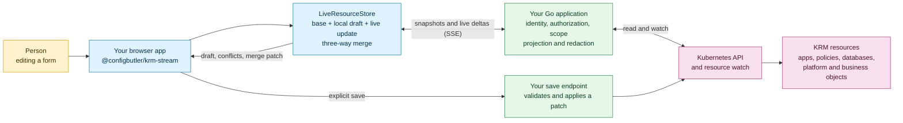

[](https://github.com/ConfigButler/krm-stream/actions/workflows/ci.yml)
[](https://scorecard.dev/viewer/?uri=github.com/ConfigButler/krm-stream)
[](https://github.com/ConfigButler/krm-stream/actions/workflows/codeql.yml)
[](https://www.npmjs.com/package/@configbutler/krm-stream)
[](packages/krm-stream/package.json)
[](gateway/go.mod)
[](packages/krm-stream)
[](https://www.apache.org/licenses/LICENSE-2.0)
[](https://github.com/ConfigButler/krm-stream/issues)

# krm-stream

Live Kubernetes resource updates for browser apps, with three-way merges for form edits.

`krm-stream` turns a Kubernetes watch into a small, browser-safe stream. It ships a Go gateway, a
headless TypeScript store with zero runtime dependencies, and shared conformance fixtures, so your
product can show live cluster state while people are editing it.

## Is this for you?

**Yes, if:**

- You want to consume a Kubernetes **watch from a browser**, without handing the browser a cluster
  credential or turning on CORS across your API server.
- You want to **live-edit Kubernetes resources**, where a concurrent server change is merged into
  what the user is typing rather than clobbering it, and a genuine conflict is surfaced instead of
  silently resolved. That is the [three-way merge](docs/glossary.md).
- You want to **bound the number of real watches** on your API server. Ten tabs on one namespace
  should be one upstream watch, not ten.
- You are building a **product**, not a Kubernetes dashboard. The store is headless and picks no UI
  framework.

**Probably not, if:**

- You just want a **generic three-way merge library**. This one knows what a `resourceVersion` is,
  that `spec.containers` is keyed by `name` and not by index, and that a redacted field must never be
  written back. That knowledge is the whole point; if you do not want it, it is weight.
- You want a **ready-made Kubernetes dashboard**. Use [Headlamp](https://headlamp.dev/). See
  [alternatives](docs/alternatives.md).
- You want to **write to the cluster from the browser**. krm-stream is the read-and-edit half: it
  hands your application a validated merge patch, and your application performs the write. Though if
  you are doing that, you probably want this library anyway, because it is the thing that tells you
  the patch is safe to apply. See [saving edits safely](docs/saving.md).

## KRM in one line

**KRM** is the Kubernetes Resource Model: the shape every Kubernetes object has (`apiVersion`,
`kind`, `metadata`, a desired `spec`, an observed `status`). Custom resources use the same shape,
which is why this works for your product's own objects, a `Database`, a `FeatureFlag`, a `Tenant`,
and not only for cluster infrastructure.

Never touched a cluster? The [glossary for frontend developers](docs/glossary.md) is the dozen words
you need, and nothing else.

## Why a gateway

Kubernetes already has a good change feed: a watch, documented under
[efficient detection of changes](https://kubernetes.io/docs/reference/using-api/api-concepts/#efficient-detection-of-changes).
A browser cannot use it directly. Watching requires a cluster credential, the API server serves no
CORS, and a watch hands back whole objects including `Secret` data. The gateway holds the credential,
withholds what the browser should not see, and re-frames the stream as SSE that `EventSource` reads
natively. It also shares one upstream watch per scope, so ten tabs are not ten watches on the API
server.

[Why a gateway](docs/why-a-gateway.md) works through this in full.

## How it fits



The library owns the read stream and browser reconciliation. Your application owns identity,
authorization policy, Kubernetes credentials, and writes. The browser never receives a Kubernetes
credential or a raw API-server URL.

## Start here

There are two halves, and they are usually two different people.

### The browser half

No bundler, no framework, no Kubernetes client. `EventSource` is native, and the store is plain ESM:

```ts
import { LiveResourceStore, connectWithEventSource, resourceStreamURL } from "@configbutler/krm-stream";

const store = new LiveResourceStore();

connectWithEventSource(
  resourceStreamURL("/resource-stream/v1", {
    target: "production",
    version: "v1",
    resource: "configmaps",
    namespace: "app",
  }),
  store,
  {
    onChange: (change) => render(change.uid), // what moved, and which resource it moved on
  },
);

// The user edits. The server keeps changing underneath them. Neither wins by accident.
store.setValue(uid, ["spec", "replicas"], 3);
store.conflicts(uid); // paths where the server disagreed with an edit the user actually made
store.patch(uid); // an RFC 7386 merge patch of just their changes, or null
```

If you have no bundler at all and vendor the library by copying it, import
[`@configbutler/krm-stream/bundle`](packages/krm-stream/README.md): the same API in one file.

### The server half

Mount a scoped stream endpoint in an existing Go application:

```go
mux.Handle("/resource-stream/v1", gateway.Handler(gateway.Options{
	Principal:  func(r *http.Request) (gateway.Principal, error) { return userFromSession(r) },
	Authorizer: authorizeScope,
	Clients: func(_ context.Context, _ string, p gateway.Principal) (gateway.Backend, error) {
		return kube.NewBackend(dynamicClientFor(p.(*User))), nil
	},
	Scopes: gateway.ScopePolicy{
		Targets: []string{"production"},
		Resources: []gateway.GroupResource{
			{Resource: "configmaps", Scope: gateway.ResourceScopeNamespaced},
		},
	},
	Projection: gateway.ProjectionFull,
}))
```

The Go side owns identity, authorization, the Kubernetes credential, and the scope a caller is
allowed to ask for. It never lets the browser choose which cluster to talk to.

`LiveResourceStore` keeps server truth and the local draft separate, reconciles live updates with a
three-way merge, records conflicts, and builds RFC 7386 merge patches. Your application applies any
patch through its own save endpoint, which is the one place a write can happen.

## Packages

| Package | Purpose |
|---|---|
| `github.com/ConfigButler/krm-stream/gateway` | Dependency-free Go stream gateway and SSE handler. |
| `github.com/ConfigButler/krm-stream/gateway/kube` | Optional `client-go` backend and SSAR authorizer. |
| `@configbutler/krm-stream` | Official dependency-free ESM client store and transports. |
| `krm-stream@0.1.0` | Deprecated, frozen compatibility name claim. Use the scoped package instead. |
| [`spec/v1.md`](spec/v1.md) | Normative protocol contract. |
| [`conformance/`](conformance/) | Shared fixtures exercised by the Go gateway and TypeScript client. |

## Boundaries

- No browser token handling or raw API-server URLs.
- No authorization system: the host provides `Principal`, `Authorizer`, and `ClientFor`.
- No write endpoint: hosts validate and apply their own patches.
- No framework dependency in the browser client.
- No `client-go` dependency in the core gateway.

The important safety rule is simple: a projected or redacted field must never be written back by a
browser. Use [`gateway.ValidateMergePatch`](gateway/patch.go) in the host save handler.

## Guides

- [Glossary for frontend developers](docs/glossary.md): the Kubernetes vocabulary you actually need, and where each word shows up in the library.
- [Why a gateway](docs/why-a-gateway.md): why the browser cannot watch the API server, and why watches are shared.
- [Adopting krm-stream](docs/adopting.md): same-origin cookie, bearer-token, and shared-watch setups.
- [Authentication and authorization](docs/auth.md): identity and RBAC boundaries.
- [Saving edits safely](docs/saving.md): patch validation and host write responsibilities.
- [Operating krm-stream](docs/operations.md): metrics, alerts, and runtime controls.
- [Client state model](docs/client-state-model.md): drafts, conflicts, redactions, and keyed lists.
- [Alternatives and prior art](docs/alternatives.md): how this differs from Kubernetes clients, browser dashboards, and config-as-data systems.
- [Releasing](docs/releasing.md): release workflow and publication prerequisites.

## Requirements and maturity

The project is pre-1.0. Protocol and API changes may still be made before 1.0.

- Go 1.26 for the gateway.
- Node 22 for client development and tests.
- Kubernetes 1.35+ for strict resource-version ordering. `OrderingLenient` supports known
  non-conformant or aggregated APIs at the cost of per-object monotonic ordering.

## Development

```bash
task fixtures-check
task test
task lint
task build-client
```

See [CONTRIBUTING.md](CONTRIBUTING.md) for the fixture and test workflow. Licensed under
[Apache-2.0](LICENSE).
