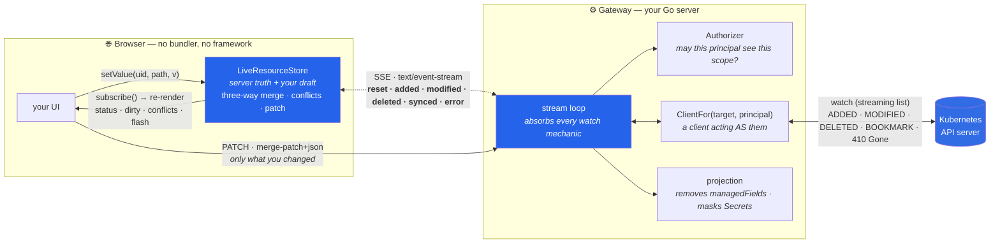
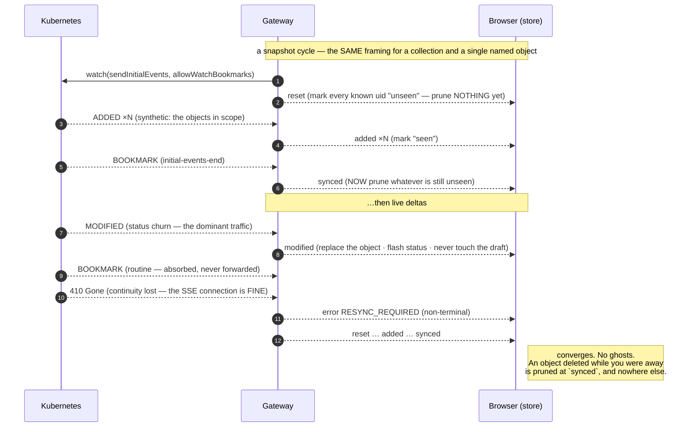

# krm-stream

**A live, honest window onto Kubernetes resources, in the browser.**

**A Go library** that turns a Kubernetes watch into a browser-friendly stream of complete **KRM**
(Kubernetes Resource Model) objects — absorbing every watch mechanic (`resourceVersion` arithmetic,
`410 Gone`, relists, bookmarks, partial objects, reconnects) behind a small, stable wire contract —
**and a small JavaScript client that ships with it**, so the browser end is solved too rather than left
as an exercise.

Go is the product. The npm package is the helper you would otherwise have had to write.

```go
import "github.com/ConfigButler/krm-stream/gateway"

// Your app answers the two questions the library must never assume:
//   who is this caller, and what may they see?
h := gateway.Handler(gateway.Options{
    Authorizer: myAuthz,                 // may this principal watch this scope?
    ClientFor:  myClientForIdentity,     // a client acting AS them — their RBAC, their attribution
})
mux.Handle("/resource-stream/v1", h)
```

...and the browser end, for free:

```js
import { LiveResourceStore, connectResourceStream } from "krm-stream";

const store = new LiveResourceStore();
connectResourceStream("/resource-stream/v1?resource=configmaps&namespace=app", store);

store.subscribe(() => render(store));       // live status, live conflicts
store.setValue(uid, ["data", "log-level"], "debug");
await save(store.patch(uid));               // a merge patch of only what you changed
```

Watch `status` reconcile in real time. Edit `spec` with a real three-way merge. Real RBAC, real
attribution — the browser sees exactly what the API server sees, and never more.

---

## How it fits together



The two boxes in blue are what this repo ships. The **wire between them** is
[a written contract](spec/v1.md) with [a conformance suite both sides run](conformance/) — which is why
they cannot drift, and why a Rust or Python gateway is a legitimate thing for someone else to write.

Everything ugly about a Kubernetes watch stops at the gateway. The browser never hears the words
`BOOKMARK`, `410 Gone`, `resourceVersion` or *relist*:



## Why this exists

Every "Kubernetes in a browser" UI reinvents the same three things, and gets at least one of them
wrong:

1. **The watch → browser bridge.** `resourceVersion` arithmetic, `410 Gone`, relists, bookmarks,
   partial objects, reconnects. Get it wrong and you show ghosts: objects deleted an hour ago that
   are still on the screen.
2. **The merge.** The server writes `status` continuously while a human is typing into `spec`. A UI
   that naively overwrites the form on every watch event destroys the edit; one that naively ignores
   the event shows stale truth. The correct answer is a **three-way merge** — previous server state,
   your draft, new server state — and almost nobody does it.
3. **The honesty.** Most consoles flatten Kubernetes into an abstracted "document" and lose the thing
   that made it worth showing. A CRD you have never heard of must round-trip **verbatim**.

`krm-stream` does those three things, once, with a written contract and a conformance suite that both
sides run.

## The three artifacts

| | what | where |
|---|---|---|
| **Gateway** (Go) — *the library* | `go get github.com/ConfigButler/krm-stream/gateway`. Produces the stream from a Kubernetes watch; absorbs every watch mechanic; applies saves as a guarded patch (it will refuse one that touches a redacted path). Your app injects the two things it must never assume: **who the caller is**, and **what they may see** | [`gateway/`](gateway/) |
| **Protocol** — *the contract* | the wire: `reset` · `added` · `modified` · `deleted` · `synced` · `error`, over SSE. Language-neutral on purpose: a Rust or Python gateway is a legitimate thing to write | [`spec/v1.md`](spec/v1.md) |
| **Client** (TS/JS) — *the helper* | `npm i krm-stream`. `LiveResourceStore`: three-way merge, derived dirtiness, conflicts, merge-patch builder. Optional — any conforming consumer works — but you would only reimplement it | [`packages/krm-stream/`](packages/krm-stream/) |

They are joined by one thing, and it is the reason they live in one repo:

> **[`conformance/`](conformance/) — shared fixtures.** KRM object bodies in YAML, plus scenarios that
> say what the gateway must *emit* and what the client must then *hold*. Both suites load them. A
> protocol change that breaks one side fails both, in the same commit, before it can ship.

## Status

**Early.** The specs are written and the conformance fixtures are the contract. The gateway and the
client are being implemented against them, test-first. Nothing is published yet.

The design record lives in [`docs/`](docs/):
[client-state-model](docs/client-state-model.md) (the merge algorithm the client implements),
[extraction-plan](docs/extraction-plan.md) (where this came from, and the order of the work), and
[naming](docs/naming.md) (why `krm-stream` — and why not `krm-live`).
[`CONTRIBUTING.md`](CONTRIBUTING.md) is how to run it.

## Quick start

```bash
task            # list everything
task test       # go test + node --test, both against the shared fixtures
task lint
task fixtures   # regenerate conformance/gen/*.json from the YAML sources
```

Open the repo in the devcontainer (VS Code: *Reopen in Container*) and everything above is already
installed: Go 1.26, Node 22, Task, k3d, kubectl.

## Provenance

Extracted from [ConfigButler/gitops-api](https://github.com/ConfigButler/gitops-api), where the
pattern was proven live: a browser editing Kubernetes objects in a kcp workspace, as the signed-in
human, with every change landing in Git attributed to them. The engine's three-way merge is a
corrected descendant of that console's — the bugs it shipped are now regression tests here.

## License

Apache-2.0
