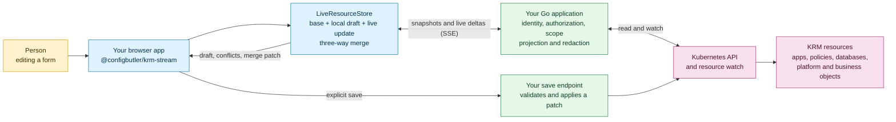

# krm-stream

Live Kubernetes resource updates for browser apps, with three-way merges for form edits.

`krm-stream` turns a Kubernetes watch into a small, browser-safe stream. It ships a Go gateway, a
headless TypeScript store, and shared conformance fixtures so your product can show live state while
people are editing it.

## KRM, briefly

KRM means **Kubernetes Resource Model**: the API objects that describe a system, such as a
`Deployment`, `Service`, `ConfigMap`, or a custom resource. Each object has identity and desired
state, and Kubernetes continuously reports observed state. Kubernetes calls these objects records
of intent; [its object model is a good starting point](https://kubernetes.io/docs/concepts/overview/working-with-objects/).

That model is useful far beyond infrastructure. A platform can model an application, an environment,
a database request, a feature rollout, access policy, or a business workflow as KRM resources. The
same live, conflict-aware editing experience should work wherever a resource expresses intent and a
controller reports what became true.

## How it fits



The library owns the read stream and browser reconciliation. Your application owns identity,
authorization policy, Kubernetes credentials, and writes. The browser never receives a Kubernetes
credential or a raw API-server URL.

## Start here

Mount a scoped stream endpoint in an existing Go application:

```go
mux.Handle("/resource-stream/v1", gateway.Handler(gateway.Options{
	Principal:  func(r *http.Request) (gateway.Principal, error) { return userFromSession(r) },
	Authorizer: authorizeScope,
	Clients: func(_ context.Context, _ string, p gateway.Principal) (gateway.Backend, error) {
		return kube.NewBackend(dynamicClientFor(p.(*User))), nil
	},
	Scopes: gateway.ScopePolicy{
		Targets: []string{"production"},
		Resources: []gateway.GroupResource{
			{Resource: "configmaps", Scope: gateway.ResourceScopeNamespaced},
		},
	},
	Projection: gateway.ProjectionFull,
}))
```

Consume the stream without choosing a UI framework:

```ts
import { LiveResourceStore, connectWithEventSource, resourceStreamURL } from "@configbutler/krm-stream";

const store = new LiveResourceStore();
connectWithEventSource(
  resourceStreamURL("/resource-stream/v1", {
    target: "production",
    version: "v1",
    resource: "configmaps",
    namespace: "app",
  }),
  store,
);
```

`LiveResourceStore` keeps server truth and a local draft separate, reconciles live updates with a
three-way merge, records conflicts, and builds RFC 7386 merge patches. The host applies any patch
through its own save endpoint.

## Packages

| Package | Purpose |
|---|---|
| `github.com/ConfigButler/krm-stream/gateway` | Dependency-free Go stream gateway and SSE handler. |
| `github.com/ConfigButler/krm-stream/gateway/kube` | Optional `client-go` backend and SSAR authorizer. |
| `@configbutler/krm-stream` | Official dependency-free ESM client store and transports. |
| `krm-stream@0.1.0` | Deprecated, frozen compatibility name claim. Use the scoped package instead. |
| [`spec/v1.md`](spec/v1.md) | Normative protocol contract. |
| [`conformance/`](conformance/) | Shared fixtures exercised by the Go gateway and TypeScript client. |

## Boundaries

- No browser token handling or raw API-server URLs.
- No authorization system: the host provides `Principal`, `Authorizer`, and `ClientFor`.
- No write endpoint: hosts validate and apply their own patches.
- No framework dependency in the browser client.
- No `client-go` dependency in the core gateway.

The important safety rule is simple: a projected or redacted field must never be written back by a
browser. Use [`gateway.ValidateMergePatch`](gateway/patch.go) in the host save handler.

## Guides

- [Adopting krm-stream](docs/adopting.md): same-origin cookie, bearer-token, and shared-watch setups.
- [Authentication and authorization](docs/auth.md): identity and RBAC boundaries.
- [Saving edits safely](docs/saving.md): patch validation and host write responsibilities.
- [Operating krm-stream](docs/operations.md): metrics, alerts, and runtime controls.
- [Client state model](docs/client-state-model.md): drafts, conflicts, redactions, and keyed lists.
- [Releasing](docs/releasing.md): release workflow and publication prerequisites.

## Requirements and maturity

The project is pre-1.0. Protocol and API changes may still be made before 1.0.

- Go 1.26 for the gateway.
- Node 22 for client development and tests.
- Kubernetes 1.35+ for strict resource-version ordering. `OrderingLenient` supports known
  non-conformant or aggregated APIs at the cost of per-object monotonic ordering.

## Development

```bash
task fixtures-check
task test
task lint
task build-client
```

See [CONTRIBUTING.md](CONTRIBUTING.md) for the fixture and test workflow. Licensed under
[Apache-2.0](LICENSE).
