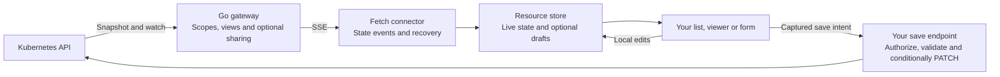

[](https://github.com/ConfigButler/krm-stream/actions/workflows/ci.yml)
[](https://scorecard.dev/viewer/?uri=github.com/ConfigButler/krm-stream)
[](https://github.com/ConfigButler/krm-stream/actions/workflows/codeql.yml)
[](https://www.npmjs.com/package/@configbutler/krm-stream)
[](packages/krm-stream/package.json)
[](gateway/go.mod)
[](packages/krm-stream)
[](https://www.apache.org/licenses/LICENSE-2.0)
[](https://github.com/ConfigButler/krm-stream/issues)

# krm-stream

Efficient live Kubernetes views for browser applications, with optional editing.

`krm-stream` helps applications watch Kubernetes resources while controllers and other users keep
changing them. Its gateway delivers a defined resource view, withholds selected values, suppresses
irrelevant updates and optionally shares upstream watches. Its headless TypeScript client maintains
live state and reconciles incoming changes with local drafts when a page needs editing.

Your application supplies authentication, authorization policy, Kubernetes credentials, UI and writes.
The browser client has zero runtime dependencies and chooses no UI framework.

## Start with the watch

Kubernetes already provides a change feed. krm-stream adds a browser lifecycle and resource-view
contract, reducing work at different points:

| Capability | Benefit | Boundary |
|---|---|---|
| Scope | Watch a resource kind, namespace, name or allowed label selector | The host authorizes the scope; a selector does not grant access |
| Projection and redaction | Deliver the fields a view needs; full/spec views withhold Kubernetes Secret values | Secret key paths and change revisions remain visible; arbitrary sensitive CRD fields are not automatically redacted |
| Update suppression | Avoid downstream events when projected content and redaction records are unchanged | The gateway still receives upstream changes; fewer events do not guarantee a current write version |
| Optional watch sharing | Use one upstream watch for matching scopes on the same shared backend | Every subscriber is authorized separately and receives its own snapshot and updates |

Choose a view explicitly:

| View | Delivered content | Updates suppressed |
|---|---|---|
| `krm-full/v1` (default) | Resource including status, with Secret values withheld | Bookkeeping-only changes |
| `krm-spec/v1` | Full view with status omitted | Bookkeeping-only and status-only changes |
| `krm-raw/v1` | Secret values included when host policy permits | Bookkeeping-only changes |

All three remove `metadata.managedFields` and the last-applied-configuration annotation.
`krm-raw/v1` is still a projection. A hidden Secret rotation produces a redaction update in full/spec.

Each browser connection starts with a complete snapshot, then follows visible changes. On reconnect,
a fresh snapshot repairs missed changes and deletes; resources are pruned only when it completes.
This is a live state feed: intermediate updates may be coalesced. See [watching resources](docs/why-a-gateway.md).

## Transport direction and current support

The preferred direction is to consume native Kubernetes watches through a host proxy using fetch,
with one frontend lifecycle for state, errors, cancellation and bounded recovery. Hosts that already
provide native API access should not need to translate it into SSE to reuse the client.
Keep gateway SSE as a compatibility path for applications choosing that protocol, and retain the
projected gateway for redaction, suppression and watch sharing.

**Today, the supported connector consumes gateway SSE through fetch.** The native watch connector
is [requested work](docs/field-reports/third-our-identity.md#native-watch-connector), not an available API.
SSE framing can carry errors; the current fetch connector handles HTTP refusals and in-stream errors,
including authentication expiry. The native direction simplifies framing and integration rather than
introducing error handling for the first time. No transport fallback may bypass a refused view.

## Watch a resource view today

```ts
import {
  LiveResourceStore, readOnlyPolicy, applyStreamEvent,
  connectResourceStream, resourceStreamURL,
} from "@configbutler/krm-stream";

const store = new LiveResourceStore(readOnlyPolicy);
const stopRendering = store.subscribe(() => renderResources(store));
const connection = connectResourceStream(
  resourceStreamURL("/resource-stream/v1", {
    target: "production", version: "v1", resource: "configmaps", namespace: "app",
  }),
  event => applyStreamEvent(store, event),
);
renderConnection(connection.state.status);
const stopConnection = connection.subscribe(state => renderConnection(state.status));
connection.closed.catch(reportApplicationError);

// On view disposal:
stopRendering();
stopConnection();
connection.close();
```

The current viewer uses `LiveResourceStore(readOnlyPolicy)`; a dedicated read-only store is deferred.
The connector delivers state events independently of editing. It uses same-origin cookies by default,
exposes connection state and bounded retries, and stops on terminal refusals. Apply each event
synchronously. The [client README](packages/krm-stream/README.md) explains lifecycle and errors.
For a browser without a bundler, the same API is available in one file through
`@configbutler/krm-stream/bundle`.

## Add editing when the page needs it

Use `new LiveResourceStore()` for an editor. It keeps the last delivered server object separate from
the person's draft. Incoming changes update untouched fields, preserve local edits and record
conflicts when both sides changed the same editable field differently.

For example, someone changes a Deployment's image while an autoscaler changes its replicas. The
replicas follow the server and the image edit stays. If another person changes that image to a
different value, the editor keeps the local value and exposes the disagreement for review.

```ts
const store = new LiveResourceStore(); // use this store in the connection setup for an editor
store.setValue(uid, ["data", "message"], "hello"); // ConfigMap field edit
store.conflicts(uid); // disagreements to resolve before Save
const intent = store.captureSave(uid); // detached { uid, resourceVersion, patch }
// Your save controller submits this intent after review while the connection is live.
```

The default policy allows `spec`, labels, annotations, `data` and `stringData`; status, immutable
metadata and redacted paths remain read-only. A host can narrow the policy for its form.

The intended Save flow is explicit: capture the patch, UID and resource version together; have the
host authorize and validate it; apply a conditional merge PATCH; then observe the projected result
through the stream or a guarded projected read. Preserve typing made after Save. A version rejection
can occur without any field conflict, because suppressed updates still advance Kubernetes versions.
The current recovery is a guarded read, review and another deliberate Save.

**A dirty draft, an accepted write and application progress are separate states.** A successful PATCH
can precede its watch observation, and neither proves a workload has finished rolling out.

Use [the editor state model](docs/client-state-model.md) for reconciliation, conflict resolution and
arrays, and [saving edits safely](docs/saving.md) for the complete host-owned write contract. The
[conditional-save example](examples/conditional-save/README.md) executes that contract.

## How it fits today


```mermaid
flowchart LR
  api["Kubernetes API"]
  gateway["Go gateway<br/>Scopes, views and optional sharing"]
  connector["Fetch connector<br/>State events and recovery"]
  store["Resource store<br/>Live state and optional drafts"]
  ui["Your list, viewer or form"]
  save["Your save endpoint<br/>Authorize, validate and conditionally PATCH"]
  api -->|"Snapshot and watch"| gateway
  gateway -->|"SSE"| connector
  connector --> store
  store --> ui
  ui -->|"Local edits"| store
  ui -->|"Captured save intent"| save
  save --> api
```

The gateway runs inside your Go application. Per-user backends let Kubernetes authorize the caller's
reads; a shared backend uses a service identity and requires checks for each subscriber. Sharing
reduces duplicate upstream work; access controls and host limits govern who can consume it.
Gateway upstream continuation and improved save progress during suppressed churn are proposed work.
New browser connections receive a fresh snapshot under the current protocol.

## Start here

If you already have a Go host, follow [adopting krm-stream](docs/adopting.md). For a ready-made host,
[krm-foyer](https://github.com/ConfigButler/krm-foyer) integrates sign-in, sessions, native API proxying
and krm-stream gateway hosting. The host's dependency version determines which APIs are available.

KRM means the Kubernetes Resource Model: `apiVersion`, `kind`, `metadata` and kind-specific fields
such as `spec`, `status` or ConfigMap `data`. Custom resources follow the same conventions. See the
[frontend glossary](docs/glossary.md) and [alternatives](docs/alternatives.md) for context.

| Package | Purpose |
|---|---|
| `github.com/ConfigButler/krm-stream/gateway` | Dependency-free Go stream gateway and SSE handler |
| `github.com/ConfigButler/krm-stream/gateway/kube` | Optional client-go backend and SubjectAccessReview authorizer |
| `@configbutler/krm-stream` | Dependency-free ESM connector and resource/editor store |
| [spec/v1.md](spec/v1.md) and [conformance](conformance/README.md) | Shared normative contract and executable fixtures |

## Guides

- [Watching resources](docs/why-a-gateway.md): scopes, views, suppression, sharing and recovery.
- [Adoption](docs/adopting.md): host and browser wiring.
- [Editor state model](docs/client-state-model.md): drafts, conflicts, redactions and arrays.
- [Saving](docs/saving.md): conditional writes, recovery and user-facing outcomes.
- [Authorization](docs/auth.md) and [operations](docs/operations.md): identity, revocation and runtime limits.
- [Examples](examples/README.md): browser, conditional editor, recovery recipes and Vue integration.
- [Delivery plan](docs/proposals/0006-stream-and-save-implementation-plan.md): completed work, open work, ordering and dependencies.
- [Upgrading from 0.7](docs/migrating.md) and [releasing](docs/releasing.md).

## Requirements and development

The project is pre-1.0; protocol and API changes may still be made before 1.0.
Go 1.27.1 and Node 24 are required for development. Kubernetes 1.35+ supports strict resource-version
ordering; `OrderingLenient` accommodates known non-conformant or aggregated APIs with a reduced
per-object monotonicity guarantee.

```bash
task fixtures-check
task test
task lint
task build-client
```

See [CONTRIBUTING.md](CONTRIBUTING.md). Licensed under [Apache-2.0](LICENSE).
