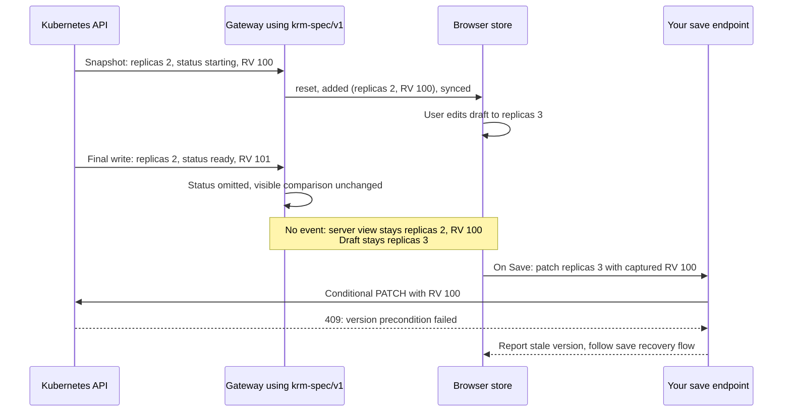

# Adopting krm-stream

This is the shortest safe route from an existing Go application to a browser KRM stream. The library
owns the read path. Your application owns identity, authorization policy, Kubernetes credentials, and
writes.

## 1. Declare scopes precisely

An empty namespace has two Kubernetes meanings: a cluster-scoped resource, or every namespace for a
namespaced resource. `ScopePolicy` makes the host choose explicitly.

| Resource kind | `GroupResource` | Caller namespace | Result |
|---|---|---|---|
| one namespace of ConfigMaps | `Scope: ResourceScopeNamespaced` | `app` | watches only `app` |
| all namespaces of ConfigMaps | `Scope: ResourceScopeNamespaced, AllowAllNamespaces: true` | empty | watches all namespaces |
| Namespaces | `Scope: ResourceScopeCluster` | empty | watches cluster-scoped objects |
| Namespaces with `namespace=app` | `Scope: ResourceScopeCluster` | `app` | refused |

Keep all-namespaces access rare. It changes the size, disclosure risk, and operating cost of a stream.
Use an `Authorizer` to pin a user to a namespace or target before any watch opens.

### Errors from the exported surface are `error`

`ScopeFromQuery` and `ScopePolicy.Validate` return `error`, and the concrete value is a
`*StreamError`. Reach the wire code with `errors.As`:

```go
var serr *gateway.StreamError
if errors.As(err, &serr) {
	log.Printf("refused with %s: %s", serr.Code, serr.Message)
}
```

They return the interface rather than `*StreamError` on purpose. A fallible function returning a
concrete pointer type is the Go typed-nil trap: assign its result into a variable already declared as
`error` and a *successful* call comes back non-nil, because an interface holding a typed nil is not
nil. In a scope check that is a refusal you cannot explain. In an authorization check written the
same way, with the condition inverted, it is an admission you never see.

## 1b. Targets, and hosts that carry a path

A `rest.Config` whose `Host` includes a path prefix works. A kcp workspace URL
(`https://kcp.example/clusters/root:org:ws`) is an ordinary host as far as client-go is concerned, and
the dynamic client appends `/apis/...` to it correctly. Nothing in the gateway parses, rewrites or
second-guesses that URL: the host resolves a target to a backend, and the backend is whatever
`rest.Config` you built.

Build that URL with `kube.NewBackendForConfig(cfg)` rather than `kube.NewBackend(dynamicClient)` when
you can. Both work, but only the former knows the address it dialed, so an upstream failure can name
it. That matters most exactly here: get a path-prefixed URL subtly wrong (two `/clusters/` segments,
say) and the API server answers `the server could not find the requested resource`, which is
indistinguishable from "that CRD is not installed" until the error says which URL it asked.

## 2. Mount the same-origin cookie endpoint

```go
import (
    "net/http"

    "github.com/ConfigButler/krm-stream/gateway"
    "github.com/ConfigButler/krm-stream/gateway/kube"
)

func mount(mux *http.ServeMux, dynamicClientFor func(*User) dynamic.Interface) {
    mux.Handle("/resource-stream/v1", gateway.Handler(gateway.Options{
        // Your session cookie -> your application user. krm-stream never sees a token.
        Principal: func(r *http.Request) (gateway.Principal, error) {
            return userFromSession(r)
        },
        // Deny before opening a watch; also rechecked on every recovery cycle.
        Authorizer: gateway.AuthorizerFunc(func(ctx context.Context, p gateway.Principal, s gateway.Scope) error {
            user := p.(*User)
            if s.Target != user.Target || s.Namespace != user.Namespace {
                return gateway.Forbidden("scope is not available to this user")
            }
            return nil
        }),
        // Build a dynamic client acting as this user. Kubernetes RBAC remains the boundary.
        Clients: func(_ context.Context, _ string, p gateway.Principal) (gateway.Backend, error) {
            return kube.NewBackend(dynamicClientFor(p.(*User))), nil
        },
        Scopes: gateway.ScopePolicy{
            Targets: []string{"production"},
            Resources: []gateway.GroupResource{
                {Group: "", Resource: "configmaps", Scope: gateway.ResourceScopeNamespaced},
                {Group: "apps", Resource: "deployments", Scope: gateway.ResourceScopeNamespaced},
            },
        },
        Projection: gateway.ProjectionFull,
    }))
}
```

The browser uses `connectManagedResourceStream` for this route. Fetch sends its same-origin session
cookie and the managed connection provides bounded recovery after network failures and sequence gaps.

## 3. Browser client

```ts
import {
  defaultPolicy,
  LiveResourceStore,
  connectManagedResourceStream,
  resourceStreamURL,
  withOpenAPIKeyedLists,
} from "@configbutler/krm-stream";

const store = new LiveResourceStore();
const url = resourceStreamURL("/resource-stream/v1", {
  target: "production",
  version: "v1",
  resource: "configmaps",
  namespace: "app",
  projection: "krm-full/v1",
});

const connection = connectManagedResourceStream(url, store, {
  onStateChange: state => renderConnection(state.status), // gaps recover with a fresh snapshot
});
store.subscribe(() => render(store));
```

For a bearer-token client, use `connectManagedResourceStream(url, store, { headers: { Authorization: ... } })`.
That is useful for a non-browser client or an intentionally token-bearing browser application; the
same-origin cookie route is the safer browser default. The host must enforce HTTPS for bearer-token
requests, including the resolved destination of relative URLs and any redirects. Validate the
trusted endpoint before supplying credentials and enforce the same policy in a custom fetch wrapper.
The stream connectors delegate transport to fetch; they do not enforce a credential transport policy.

For Deployment or CRD editing, a host may opt into OpenAPI-declared associative-list merging without
exposing schemas to the browser:

```ts
const store = new LiveResourceStore(withOpenAPIKeyedLists(defaultPolicy, deploymentSchema));
```

`deploymentSchema` is the structural schema for that exact GroupVersionKind. Only lists marked
`x-kubernetes-list-type: map` with `x-kubernetes-list-map-keys` are merged by key; every other list
stays safely atomic.

### Why a quiet stream can still reject a save

The gateway sends the fields your view needs. It suppresses updates that change only ignored fields
or `metadata.resourceVersion`. The browser keeps the version of the revision it actually received.
That version is still a valid conditional-write precondition, but it may already be out of date.



The displayed server content is right even though the held version is older. The local draft is the
person's proposed change; it is not part of stream convergence. A failed version precondition does
not by itself mean the person and server disagree about an editable field. Follow the
[saving guide](saving.md) to refresh, reconcile and capture a newly reviewed intent.

| Final upstream change | What the gateway delivers | What the browser holds |
|---|---|---|
| Bookkeeping metadata only | No event in any built-in projection | Same visible content, older RV |
| Status only | No event under `krm-spec/v1`; an update under `krm-full/v1` | Spec view can keep an older RV; full view receives live status |
| Secret token rotates | Under `krm-full/v1` or `krm-spec/v1`, an update with a higher redaction revision | The token remains withheld; its change is visible |

The RV labels above are illustrative opaque strings. Neither RV nor event `seq` provides downstream
resume: a new connection starts a complete snapshot. The
[normative contract](../spec/v1.md#6-ordering-delivery--the-state-guarantee) defines the exact comparison
and its guarantee at each delivered stream position; it does not promise zero transport latency.

## 4. Share watches only with Kubernetes-backed authorization

`SharedBackend` saves upstream watches but runs as one service identity. Pair it with
`kube.SubjectAccessReviewAuthorizer` so Kubernetes still decides whether each caller may list and watch the scope.

```go
shared := gateway.NewSharedBackendWithOptions(serviceAccountBackend, gateway.SharedOptions{
    QueueDepth: 512,
    Observer: metrics,
})

options.Authorizer = kube.SubjectAccessReviewAuthorizer(clientset, subjectFromUser)
options.Clients = func(context.Context, string, gateway.Principal) (gateway.Backend, error) { return shared, nil }
```

Read [auth.md](auth.md) before using this configuration. The shared-cache authorizer is a security
boundary; a per-user backend keeps Kubernetes RBAC as the direct boundary by construction.

Next: [saving.md](saving.md) for the host-owned write path and [operations.md](operations.md) for
stream monitoring and limits.
