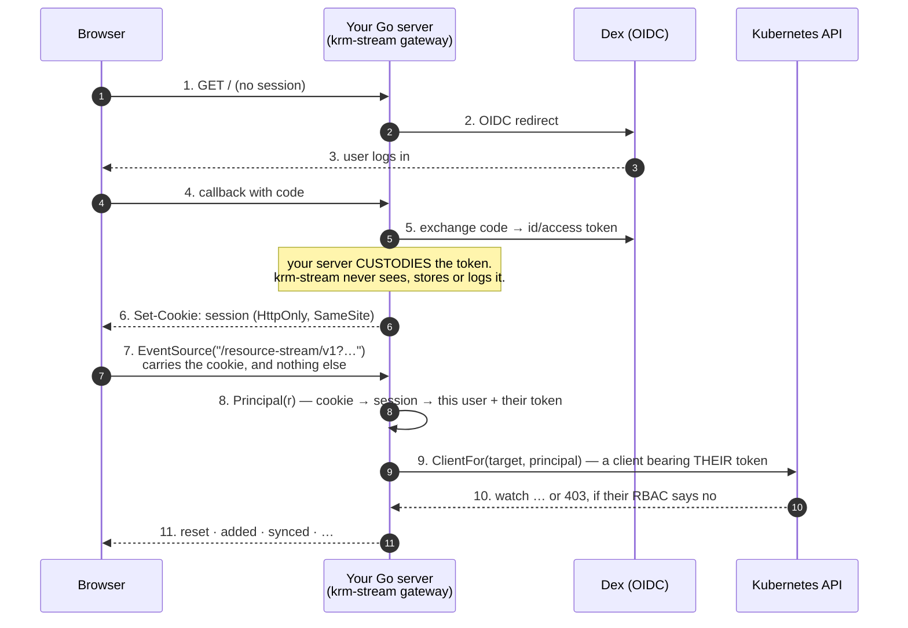

# Authentication & authorization

**krm-stream never holds a credential, and it is not an authorization boundary. Kubernetes is.**

That is the whole stance. Everything below is a consequence of it, plus the one physical constraint
that decides how a browser can authenticate at all.

---

## The constraint that decides everything

**A browser's `EventSource` cannot send an `Authorization` header.** It is not an oversight we can
work around; it is what the API is. So a browser holding an OIDC access token *cannot put it on a
native SSE request*.

Everything else follows from that one sentence.

## Recommended browser route: OIDC via Dex, with a same-origin cookie

For browser applications, use the same-origin route that native `EventSource` permits:



The browser authenticates to **your** server. Your server custodies the token. The SSE request
carries **nothing but a same-origin `HttpOnly` cookie** — no token in JavaScript, no token in a URL,
nothing an XSS can read.

Then step 9 is the one that matters: **the upstream watch is opened as the user.** If they may not
watch Secrets in that namespace, the API server refuses. No bug in this library can change that.

> A fetch-based reader (`connectResourceStream`) can send an `Authorization` header for a deliberate
> token-bearing client. The cookie route above is the safer default for browser applications.

## The three seams, and what each is for

```go
gateway.Handler(gateway.Options{
    // WHO is calling? Your cookie → your session → your user. Opaque to us.
    Principal: func(r *http.Request) (gateway.Principal, error) { return sessionUser(r) },

    // MAY they? Checked BEFORE any watch opens, and again on every snapshot cycle.
    Authorizer: myAuthz,

    // Reach the cluster AS them — their token, their RBAC, their audit trail.
    Clients: func(target string, p gateway.Principal) (gateway.Backend, error) {
        return kube.NewBackend(dynamicClientBearing(p.(*User).Token)), nil
    },
    Scopes: myScopePolicy,
})
```

| seam | what it is | what it is **not** |
|---|---|---|
| `Principal` | whatever your session says the caller is. The library treats it as opaque (`any`), and never inspects, persists or logs it | not a credential *we* manage |
| `Authorizer` | **fail-fast, defence in depth.** Denies *before* the watch opens, so the existence of an object is never leaked to someone who may not see it | **not the boundary** — see below |
| `ClientFor` | the boundary. It hands back a client acting **as the caller**, so Kubernetes' own RBAC enforces | not a place to put a privileged god-client (unless you have read the sharing section) |

The gateway holds **no privileged client of its own**. It therefore cannot bypass RBAC even if it had
a bug that wanted to — authorization is not something this library *does*, it is something it
structurally *cannot avoid delegating*.

### Bearer token or impersonation?

`ClientFor` supports both, and it is a real choice:

- **The user's bearer token** — the blast radius is exactly that user's. Preferred.
- **Impersonation** (a service account sending `Impersonate-User`) — keeps Kubernetes as the boundary
  just as well, but requires your server to hold impersonate rights, which is a large privilege whose
  compromise is total.

## Long streams, short tokens

An SSE stream lives as long as an open dashboard tab — **hours**. An OIDC access token lives 5–60
minutes. So the credential you captured when the stream opened is *not* one you may keep using.

The gateway therefore **re-authorizes on every snapshot cycle**, and re-invokes `ClientFor` there
too:

- **Revocation is noticed.** Take a user's access away and their open stream ends with a **terminal
  `FORBIDDEN`**. Terminal matters: `EventSource` reconnects on its own, so a non-terminal refusal
  would leave a revoked user hammering a forbidden scope forever.
- **`ClientFor` is your refresh point.** It is called again each cycle, so you can hand back a client
  bearing a *fresh* token.

**The gap:** a perfectly quiet stream may not cycle for a long time, so revocation is
noticed at the *next cycle*, not instantly. The credential half of that is solved properly on your
side of the seam — give the client a **refreshing token source** (Dex issues a refresh token; the
standard `oauth2.TokenSource` wraps it), and it never hands us a dead token in the first place.

## Two things that are easy to confuse

**A projection is not authorization.** Redaction is a *tighter disclosure layer on top of* RBAC: a
user who is fully entitled to read a Secret still does not get its value in a browser. It must
**never** be relied on to hide something the caller could not have read anyway — that is Kubernetes'
job. Confusing the two is how you end up with a "secure" viewer whose only protection is a mask.

**Sharing a watch moves the boundary — so give it back.** `SharedBackend` opens one upstream watch per
scope, so it opens it **once**, so it opens it as **one identity** — your service account. At that
moment your `Authorizer` stops being defence in depth and becomes *the only thing* between a caller
and the objects. That is why it is opt-in, and why it is not the default.

If you turn it on, use **`kube.SSARAuthorizer`**, and Kubernetes is the boundary again:

```go
shared := gateway.NewSharedBackend(serviceAccountBackend)     // one watch, one identity…
opts.Authorizer = kube.SSARAuthorizer(clientset, subjectOf)   // …but RBAC still decides
opts.Clients = func(string, gateway.Principal) (gateway.Backend, error) { return shared, nil }
```

Before a subscriber is served from the shared cache, it asks the API server — with a
`SubjectAccessReview` — *"may this user `list` and `watch` this resource, in this namespace?"* — and
lets it answer. `subjectOf` is yours: it maps your opaque `Principal` onto the Kubernetes user and
groups that RBAC binds against (the OIDC `username` and `groups` claims).

Three things it does that are easy to get accidentally permissive, all tested:

- it asks about **both `list` and `watch`**. A snapshot cycle is a list *then* a watch — literally so
  on the list-then-watch path — so a caller who may watch but not list could otherwise be handed, in
  the snapshot, exactly the objects RBAC refused to let them enumerate;
- a review it could not **complete** is not an allow. If the API server cannot say whether you may
  look, the answer is no;
- an explicit `Denied` wins over an `Allowed`.

It needs your server's service account to hold `create` on `subjectaccessreviews` (the standard
`system:auth-delegator` role). It does **not** need impersonate rights: it asks a question *about* a
user, it does not act *as* one. And because the gateway re-authorizes every snapshot cycle, this is
also how a revocation reaches a stream that is already open.

## What this library never does

- It never **mints, refreshes, stores, inspects or logs** a credential.
- It never accepts an API-server address, endpoint or credential **from the caller** — such a query
  parameter is *refused*, not ignored (spec §8.1).
- It never **writes**. Saves go through the Kubernetes API from your own handler ([spec §3](../spec/v1.md)) —
  and *your* save endpoint carries the duty to refuse a patch touching a redacted path, because a
  mask written back would overwrite the real Secret.

## Save boundary

Projection is not authorization, and it is not a write policy. The host owns its save endpoint and
must validate the active projection before sending a Kubernetes patch. Use
`gateway.ValidateMergePatch` to reject redacted and projection-removed paths, then apply a narrow
merge patch as the authenticated user. See [saving.md](saving.md).
