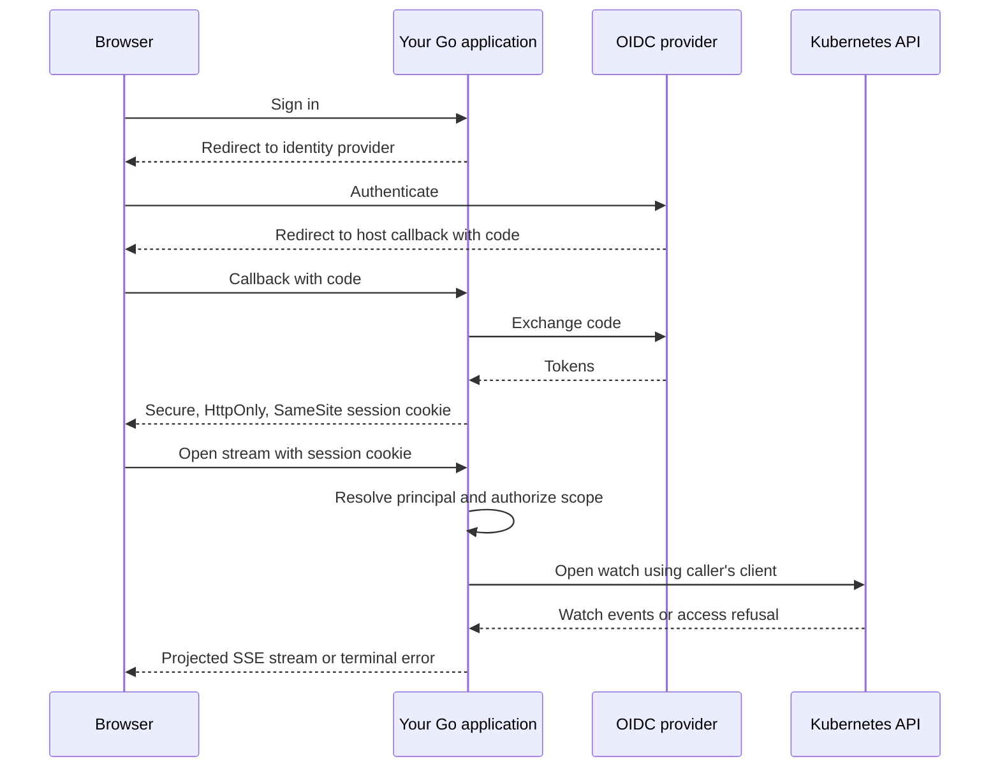

# Authentication and authorization

The host owns sessions, Kubernetes credentials and authorization policy. The gateway enforces the
host's scope and projection decisions. How Kubernetes checks a caller depends on the backend:

| Backend | Kubernetes identity | Host responsibility |
|---|---|---|
| Per-user | The caller's token or an impersonated user | Resolve the caller, authorize the scope and supply their client. |
| Shared | One service identity | Authorize every subscriber before serving cached objects; use `kube.SubjectAccessReviewAuthorizer` for Kubernetes RBAC decisions. |

## Browser sessions

Use a same-origin session cookie for browser applications. The host handles OIDC with its identity
provider, keeps the tokens server-side and issues a secure session cookie. The managed fetch connector
sends that cookie; native `EventSource` can use the same route.


```mermaid
sequenceDiagram
    participant B as Browser
    participant S as Your Go application
    participant D as OIDC provider
    participant K as Kubernetes API
    B->>S: Sign in
    S-->>B: Redirect to identity provider
    B->>D: Authenticate
    D-->>B: Redirect to host callback with code
    B->>S: Callback with code
    S->>D: Exchange code
    D-->>S: Tokens
    S-->>B: Secure, HttpOnly, SameSite session cookie
    B->>S: Open stream with session cookie
    S->>S: Resolve principal and authorize scope
    S->>K: Open watch using caller's client
    K-->>S: Watch events or access refusal
    S-->>B: Projected SSE stream or terminal error
```

Native `EventSource` cannot send an `Authorization` header. Use `connectManagedResourceStream` with
explicit headers for an intentionally token-bearing client. The host must enforce trusted HTTPS
endpoints and redirect handling; the connector delegates those transport decisions to fetch.
See [adoption](adopting.md#3-browser-client).

## Host seams

```go
gateway.Handler(gateway.Options{
    Principal: sessionUser,
    Authorizer: authorizeScope,
    Clients: func(_ context.Context, target string, p gateway.Principal) (gateway.Backend, error) {
        return kube.NewBackend(dynamicClientFor(target, p.(*User))), nil
    },
    Scopes: scopePolicy,
})
```

- `Principal` resolves the request to an opaque application identity.
- `Authorizer` denies unauthorized scopes before a watch opens and on subsequent checks.
- `Clients` is a `ClientFor` callback supplying the backend for that identity and target.
- `Scopes` allowlists targets and resources. A browser cannot supply a raw API-server URL.

A per-user backend can use the user's bearer token or Kubernetes impersonation. Impersonation requires
explicit host credentials with impersonation rights. Scope and disclosure policy remain host-owned
in either case; a projection does not grant permission to read or write a resource.

## Long streams, short tokens

The gateway rechecks authorization and projection policy on every snapshot cycle and calls `Clients`
again so the host can provide refreshing credentials. Cycle-only checks do not bound revocation time
on a quiet stream. Set a timed recheck when the host needs that bound:

```go
options.ReauthorizationInterval = 30 * time.Second
options.ReauthorizationTimeout = 5 * time.Second
```

Timed checks run per subscriber and pause that subscriber's object delivery. Denial, timeout, policy
failure or a changed projection terminates only that stream; other subscribers continue. Zero
interval keeps cycle-only checks; zero timeout uses 10 seconds. The bound assumes callbacks honor
context cancellation and sinks do not block indefinitely.

Checks use the principal captured at stream open. Resolve current session/account validity inside the
host authorizer. Timed checks do not invoke `Clients`; credential refresh remains per snapshot cycle
or inside the supplied client.

With 200 subscribers, a 30-second interval adds roughly 13 SubjectAccessReviews per second (list and
watch per subscriber), plus opening/cycle checks. Choose intervals for the host's revocation budget
and API-server capacity; checks are not cached across identities.

## Shared-watch authorization

`SharedBackend` opens one upstream watch per scope as one service identity. Every subscriber must
be authorized independently before receiving the shared cache:

```go
shared := gateway.NewSharedBackend(serviceAccountBackend)
opts.Authorizer = kube.SubjectAccessReviewAuthorizer(clientset, subjectOf)
opts.Clients = func(context.Context, string, gateway.Principal) (gateway.Backend, error) { return shared, nil }
```

`subjectOf` maps the principal to the Kubernetes username and groups. The adapter checks both `list`
and `watch`. An incomplete review is refused, and an explicit `Denied` wins over `Allowed`.

The service account needs `create` on `subjectaccessreviews`; `system:auth-delegator` supplies that
permission. Reviews do not require impersonation rights. These are SubjectAccessReview requests,
not SelfSubjectAccessReview requests. Cycle and timed checks use the same authorizer.

## Save boundary

The host owns writes, CSRF protection, audit and write authorization. Before a merge PATCH, call
`gateway.ValidateMergePatch` with the effective projection and current object, and include the
captured UID and resourceVersion preconditions. Project any resource returned to the browser.
See [saving](saving.md) for the complete flow.
