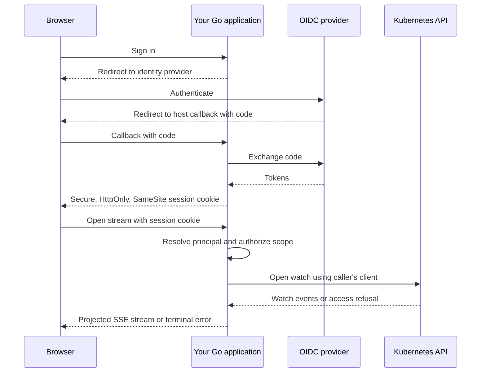

# Authentication and authorization

The host owns sessions, Kubernetes credentials and authorization policy. The gateway enforces the
host's scope and projection decisions. How Kubernetes checks a caller depends on the backend:

| Backend | Kubernetes identity | Host responsibility |
|---|---|---|
| Per-user | The caller's token or an impersonated user | Resolve the caller, authorize the scope and supply their client. |
| Shared | One service identity | Authorize every subscriber before serving cached objects; use `kube.SubjectAccessReviewAuthorizer` for Kubernetes RBAC decisions. |

## Browser sessions

Use a same-origin session cookie for browser applications. The host handles OIDC with its identity
provider, keeps the tokens server-side and issues a secure session cookie. The managed fetch connector
sends that cookie; native `EventSource` can use the same route.


```mermaid
sequenceDiagram
    participant B as Browser
    participant S as Your Go application
    participant D as OIDC provider
    participant K as Kubernetes API
    B->>S: Sign in
    S-->>B: Redirect to identity provider
    B->>D: Authenticate
    D-->>B: Redirect to host callback with code
    B->>S: Callback with code
    S->>D: Exchange code
    D-->>S: Tokens
    S-->>B: Secure, HttpOnly, SameSite session cookie
    B->>S: Open stream with session cookie
    S->>S: Resolve principal and authorize scope
    S->>K: Open watch using caller's client
    K-->>S: Watch events or access refusal
    S-->>B: Projected SSE stream or terminal error
```

Native `EventSource` cannot send an `Authorization` header. Use `connectManagedResourceStream` with
explicit headers for an intentionally token-bearing client. The host must enforce trusted HTTPS
endpoints and redirect handling; the connector delegates those transport decisions to fetch.
See [adoption](adopting.md#3-browser-client).

## Host seams

```go
gateway.Handler(gateway.Options{
    Principal: sessionUser,
    Authorizer: authorizeScope,
    Clients: func(_ context.Context, target string, p gateway.Principal) (gateway.Backend, error) {
        return kube.NewBackendForConfig(restConfigFor(target, p.(*User)))
    },
    Scopes: scopePolicy,
})
```

- `Principal` resolves the request to an opaque application identity. Return a `*StreamError` to
  choose the refusal (`UNAUTHENTICATED`, `UPSTREAM_UNAVAILABLE`); any other error is sent as
  `UNAUTHENTICATED` without its text.
- `Authorizer` denies unauthorized scopes before a watch opens and on subsequent checks.
- `Clients` is a `ClientFor` callback supplying the backend for that identity and target.
  `kube.NewBackendForConfig` builds a client that refuses redirects, since client-go would
  otherwise carry the caller's token to wherever a redirect points. A host that builds its own
  dynamic client for `kube.NewBackend` must build it on `kube.HTTPClientFor(cfg)` for the same
  reason.
- `Scopes` allowlists targets and resources, or with `AnyResource` leaves resource admission to the
  API server's RBAC for a backend that acts as the caller. A browser cannot supply a raw API-server
  URL.

A per-user backend can use the user's bearer token or Kubernetes impersonation. Impersonation
requires explicit host credentials with impersonation rights. Scope and disclosure policy remain
host-owned in either case; a projection does not grant permission to read or write a resource.
Redaction is an additional disclosure restriction for an authorized caller, never a substitute for
verifying that caller may read the resource.

## Long streams, short tokens

The gateway rechecks authorization and projection policy on every snapshot cycle and calls `Clients`
again so the host can provide refreshing credentials. Cycle-only checks do not bound revocation time
on a quiet stream. Set a timed recheck when the host needs that bound, together with a write bound:

```go
options.ReauthorizationInterval = 30 * time.Second // how often each subscriber is rechecked
options.ReauthorizationTimeout = 5 * time.Second   // budget for each periodic check's callbacks
options.WriteTimeout = 10 * time.Second            // required over HTTP with timed checks
```

Timed checks run per subscriber and share that subscriber's delivery gate: while a check runs, the
subscriber receives no objects, and a check waits for the delivery already in progress. Denial,
timeout, policy failure or a changed projection terminates only that stream; other subscribers
continue. A SubjectAccessReview that cannot reach the API server ends the stream with a non-terminal
`UPSTREAM_UNAVAILABLE`, so the client may reconnect once it is back. Zero interval keeps cycle-only
checks; zero timeout uses 10 seconds.

Library-owned HTTP serving requires a positive `WriteTimeout` with a positive
`ReauthorizationInterval`. `Handler` panics at construction without one, and direct `ServeStream` and
`ServeStreamProjection` calls panic before writing anything. A write to a browser that has stopped
reading blocks once the buffers between fill, and without a deadline it would hold the gate, and the
revocation behind it, until something else ended the request. The mounted middleware must support
flushing and write deadlines; test it with the
[capability-check recipe](../gateway/kube/examples/sharedstream/README.md#middleware-capability-test).
Transport-neutral `Stream` and `StreamProjection` keep timed checks with any sink: there the host
owns the sink and must bound its I/O.

Checks use the principal captured at stream open. Resolve current session/account validity inside the
host authorizer. Timed checks do not invoke `Clients`; credential refresh remains per snapshot cycle
or inside the supplied client.

With 200 subscribers, a 30-second interval adds roughly 13 SubjectAccessReviews per second (list and
watch per subscriber), plus opening/cycle checks. Choose intervals for the host's revocation budget
and API-server capacity; checks are not cached across identities.

### Revocation budget

The revocation budget is how long a stream keeps delivering after access is withdrawn. With timed
checks over HTTP it is made of these parts, in order:

| Part | Bounded by | What it covers |
|---|---|---|
| Decision freshness | the host | Time until the host's authorizer can see the change: session stores, identity-provider group sync, and any decision cache the host adds. The rest of the budget starts only then. |
| Timer | `ReauthorizationInterval` | Up to one interval until that subscriber's next check. Each subscriber has its own timer. |
| Gate wait | one `WriteTimeout` | The check waits for the delivery in progress, which completes or fails at its write deadline. |
| Check | `ReauthorizationTimeout` | Starts once the check holds the gate, and covers the `Authorizer` and projection-policy callbacks. |
| Termination and cleanup | one `WriteTimeout`, then the host | The refusal is written as the stream's terminal frame, a write with its own deadline. The request then returns, releasing its shared subscription. |

Interval + check timeout + write timeout is a planning figure, not an unconditional bound. Scheduling
delay, a heartbeat or terminal write competing for the same response, callbacks that ignore
cancellation, host middleware and cleanup can all add time. Declare the total for your deployment,
then measure it under the intended load.

Revocation ends three things at different times:

- **New object delivery** stops when the check holds the gate. A denied check releases the gate
  only after ending the stream, so no further object is written.
- **The request** returns after the terminal frame is written or fails, and cleanup completes.
- **The browser** receives the refusal only if the transport delivers it. A reader that stopped
  reading may never see it, and the request ends at the write deadline instead.

Bytes already written to the socket, or buffered by a proxy, cannot be recalled. Revocation stops
further disclosure; it does not retract earlier disclosure.

`ReauthorizationTimeout` covers periodic checks only. Opening and snapshot-cycle authorization run
under the request's context, so give host callbacks their own deadlines. A generic `Stream` sink
takes the place of `WriteTimeout` in the table, with whatever bound the host gives it.

## Shared-watch authorization

[`SharedBackend`](../gateway/shared.go) opens one upstream watch per scope as one service identity.
The host's `Authorizer` is then the only access check between a subscriber and the cached objects:
an overly permissive authorizer exposes the service identity's data to that subscriber. This is why
sharing is opt-in. Every subscriber must be authorized independently before receiving the cache:

```go
shared := gateway.NewSharedBackend(serviceAccountBackend)
opts.Authorizer = kube.SubjectAccessReviewAuthorizer(clientset, subjectOf)
opts.Clients = func(context.Context, string, gateway.Principal) (gateway.Backend, error) { return shared, nil }
```

The [`SubjectAccessReviewAuthorizer`](../gateway/kube/authz.go) adapter delegates the decision to
Kubernetes. `subjectOf` supplies the API-server-resolved username, groups, UID and extras. The adapter checks
both `list` and `watch`. An incomplete review is refused, and an explicit `Denied` wins over
`Allowed`.

The service account needs `create` on `subjectaccessreviews`; `system:auth-delegator` supplies that
permission. Reviews do not require impersonation rights. These are SubjectAccessReview requests,
not SelfSubjectAccessReview requests. Cycle and timed checks use the same authorizer.

## Save boundary

The host owns writes, CSRF protection, audit and write authorization. Before a merge PATCH, call
`gateway.ValidateMergePatch` with the effective projection and current object, and include the
captured UID and resourceVersion preconditions. Project any resource returned to the browser.
See [saving](saving.md) for the complete flow.

## Tested shared-host composition

The [shared ConfigMap host](../gateway/kube/examples/sharedstream/README.md) demonstrates a local
SelfSubjectReview helper using participant credentials, service-account SARs and data access,
fixed scope, session/token expiry and bounded HTTP delivery. Identity resolution is an example,
not a public library authentication API. It does not re-resolve identity on every timed check.

Do not put a short callback deadline on the entire healthy stream. Write bounds limit in-flight
HTTP I/O, not backend operations or callback work; see the [revocation budget](#revocation-budget).
For 200 allowed participants, opening can issue 400 SARs plus 200 SSRs. Timers can align, recovery
adds checks, and client-side throttling consumes callback budgets. Neither the example's rate settings
nor Voter's reported rehearsal results are production defaults or supported-version evidence.
