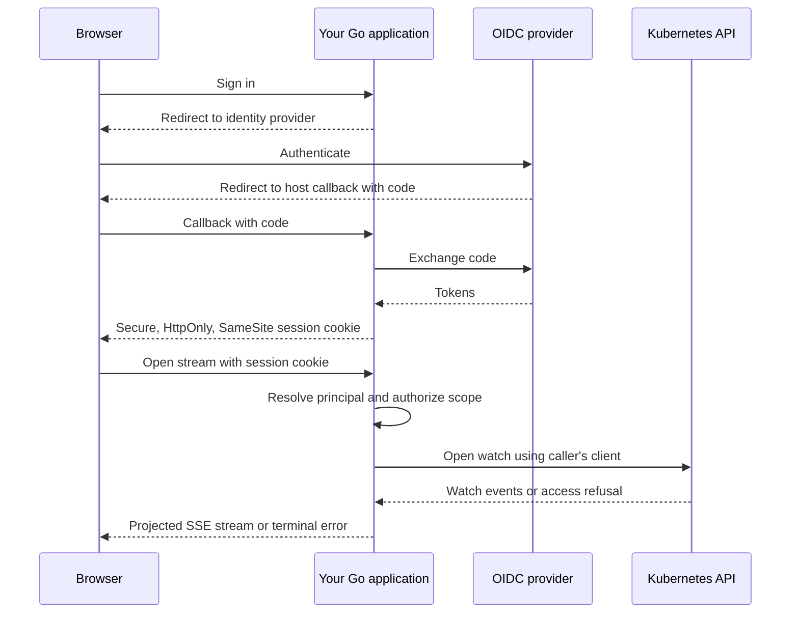

# Authentication and authorization

The host owns sessions, Kubernetes credentials and authorization policy. The gateway enforces the
host's scope and projection decisions. How Kubernetes checks a caller depends on the backend:

| Backend | Kubernetes identity | Host responsibility |
|---|---|---|
| Per-user | The caller's token or an impersonated user | Resolve the caller, authorize the scope and supply their client. |
| Shared | One service identity | Authorize every subscriber before serving cached objects; use `kube.SubjectAccessReviewAuthorizer` for Kubernetes RBAC decisions. |

Prefer a per-user backend: Kubernetes RBAC is then the boundary by construction. The wiring for both
is in [adopting](adopting.md).

## Browser sessions

Use a same-origin session cookie. The host handles OIDC with its identity provider, keeps the tokens
server-side and issues a secure session cookie. `connectResourceStream` sends that cookie over fetch;
native `EventSource` can use the same route.


```mermaid
sequenceDiagram
    participant B as Browser
    participant S as Your Go application
    participant D as OIDC provider
    participant K as Kubernetes API
    B->>S: Sign in
    S-->>B: Redirect to identity provider
    B->>D: Authenticate
    D-->>B: Redirect to host callback with code
    B->>S: Callback with code
    S->>D: Exchange code
    D-->>S: Tokens
    S-->>B: Secure, HttpOnly, SameSite session cookie
    B->>S: Open stream with session cookie
    S->>S: Resolve principal and authorize scope
    S->>K: Open watch using caller's client
    K-->>S: Watch events or access refusal
    S-->>B: Projected SSE stream or terminal error
```

A token-bearing client uses `connectResourceStream` with explicit headers, because native
`EventSource` cannot send an `Authorization` header. The host must then enforce trusted HTTPS
endpoints and redirect handling; see [adoption](adopting.md#3-connect-the-browser).

## Host seams

- `Principal` resolves the request to an opaque application identity. Return a `*StreamError` to
  choose the refusal (`UNAUTHENTICATED`, `UPSTREAM_UNAVAILABLE`); any other error is sent as
  `UNAUTHENTICATED` without its text.
- `Authorizer` denies unauthorized scopes before a watch opens and on every later check.
- `Clients` supplies the backend for that identity and target. Build it with
  `kube.NewBackendForConfig`, which refuses redirects: client-go would otherwise carry the caller's
  token to wherever a redirect points. A dynamic client for `kube.NewBackend` must be built on
  `kube.HTTPClientFor(cfg)` for the same reason.
- `Scopes` allowlists targets and resources, or with `AnyResource` leaves resource admission to the
  API server's RBAC for a backend that acts as the caller. A browser cannot supply an API-server URL.

A per-user backend can use the user's bearer token or Kubernetes impersonation; impersonation needs
host credentials with impersonation rights. A projection does not grant permission to read or write a
resource: redaction restricts disclosure to a caller who is already authorized.

## Session validity and timed checks

The gateway rechecks authorization and projection policy on every snapshot cycle, and calls `Clients`
again so the host can supply refreshed credentials. Checks use the principal captured when the stream
opened, so resolve current session and account validity inside the `Authorizer`. End the request when
the session or token expires: the [shared-host example](../gateway/kube/examples/sharedstream/handler.go)
puts the earlier of the two on the request context as a deadline.

A quiet stream may go a long time without a new cycle. To bound how long a revoked caller keeps it,
recheck on a timer:

```go
options.ReauthorizationInterval = 30 * time.Second // how often each subscriber is rechecked
options.ReauthorizationTimeout = 5 * time.Second   // budget for each periodic check's callbacks
options.WriteTimeout = 10 * time.Second            // required over HTTP with timed checks
```

Each subscriber is checked on its own timer. Denial, timeout, policy failure or a changed projection
ends only that stream. A SubjectAccessReview that cannot reach the API server ends it with a
non-terminal `UPSTREAM_UNAVAILABLE`, so the client reconnects later. Zero interval keeps cycle-only
checks; zero timeout uses 10 seconds. Timed checks do not call `Clients`.

A timed check shares the subscriber's delivery gate: while it runs, that subscriber receives no
objects, and it waits for the delivery in progress. A write to a browser that has stopped reading
blocks once the buffers fill, so HTTP serving requires a positive `WriteTimeout` with timed checks.
`Handler` panics at construction without one, and `ServeStream` and `ServeStreamProjection` panic
before writing. Test that your mounted middleware supports flushing and write deadlines with the
[capability-check recipe](../gateway/kube/examples/sharedstream/README.md#middleware-capability-test).
`Stream` and `StreamProjection` allow timed checks with any sink; the host bounds that sink's I/O.

Each check costs the host's authorizer a call. With `SubjectAccessReviewAuthorizer`, 200 subscribers
on a 30-second interval add about 13 reviews per second (list and watch each), plus opening and
cycle checks. Choose the interval for both your revocation budget and API-server capacity.

### Revocation budget

The time from withdrawing access until a stream stops delivering is made of these parts:

| Part | Bounded by | What it covers |
|---|---|---|
| Decision freshness | the host | Until the authorizer can see the change: session stores, group sync, any decision cache. |
| Timer | `ReauthorizationInterval` | Up to one interval until that subscriber's next check. |
| Gate wait | not bounded as a whole | Waits for current delivery; `WriteTimeout` bounds individual HTTP writes, not total gate waiting. |
| Check | `ReauthorizationTimeout` | Starts once the check holds the gate; covers the `Authorizer` and projection policy. |
| Termination | `WriteTimeout`, then the host | The refusal is written as the terminal frame; the request then returns and releases its subscription. |

Measure the total revocation latency for your deployment under its intended load.

Revocation ends three things at different times. New object delivery stops when a denying check holds
the gate. The request returns once the terminal frame is written or fails. The browser sees the
refusal only if the transport delivers it; a reader that stopped reading may never see it. Bytes
already written to the socket or buffered by a proxy cannot be recalled.

`ReauthorizationTimeout` covers periodic checks only. Opening and snapshot-cycle checks run under the
request's context, so give host callbacks their own deadlines, but not a short deadline on the whole
healthy stream.

## Shared-watch authorization

[`SharedBackend`](../gateway/shared.go) opens one upstream watch per scope as one service identity.
The host's `Authorizer` is then the only check between a subscriber and the cached objects, which is
why sharing is opt-in. Authorize every subscriber with `kube.SubjectAccessReviewAuthorizer`, so
Kubernetes still decides whether that caller may list and watch the scope.

The adapter refuses an incomplete review, and an explicit `Denied` wins over `Allowed`. The service
account needs `create` on `subjectaccessreviews` (`system:auth-delegator`), not impersonation rights.
These are SubjectAccessReview requests, not SelfSubjectAccessReview requests. Opening, cycle and timed
checks use the same authorizer.

### What the SubjectAccessReview asks

For each check the adapter sends one review per verb, `list` then `watch`, and stops at the first
refusal or failure:

| Field | Value |
|---|---|
| `user`, `groups`, `uid`, `extra` | The `kube.Subject` returned by the host's `SubjectFor`, unchanged. |
| `resourceAttributes.verb` | `list`, then `watch`. |
| `resourceAttributes.group`, `.version`, `.resource` | Copied from the scope. |
| `resourceAttributes.namespace`, `.name` | Copied from the scope. |

Selectors are omitted from the authorization request: the label selector, any field selector, and
the subresource are not sent, so a selector does not narrow the question. The scope's target and the
stream's projection are not review attributes; the clientset given to the adapter decides which API
server receives the review. This describes the adapter's request, not how every Kubernetes authorizer
evaluates it.

A host that caches decisions must:

- key on the complete subject (user, groups, UID and extra) and the complete request, including the
  verb;
- keep decisions from different API servers or targets apart;
- never let a reused review skip its own checks of session validity or projection policy.

Changing these inputs is a compatibility change for caching hosts, and is announced in the release
notes. The library does not provide a decision cache.

The [shared ConfigMap host](../gateway/kube/examples/sharedstream/README.md) is a tested composition
of participant identity resolution, service-account reviews, session expiry and bounded HTTP
delivery. Its identity helper is an example, not a library API.

## Save boundary

The host owns writes, CSRF protection, audit and write authorization. See [saving](saving.md).
