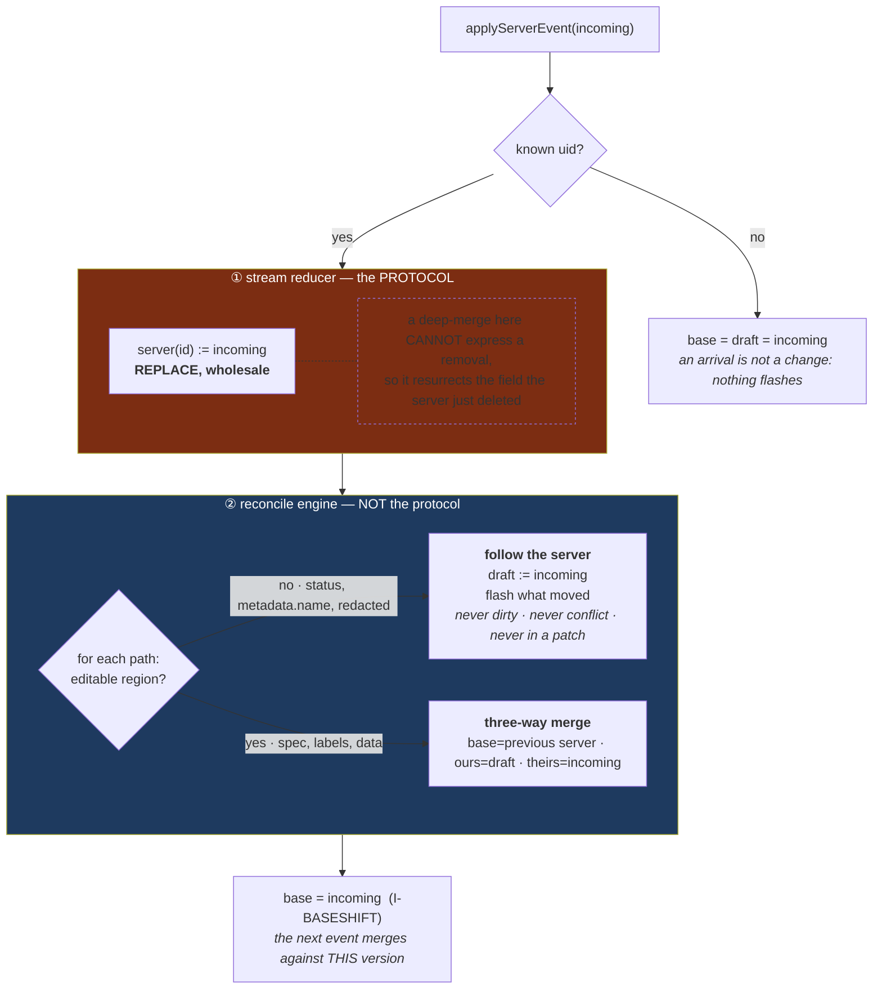
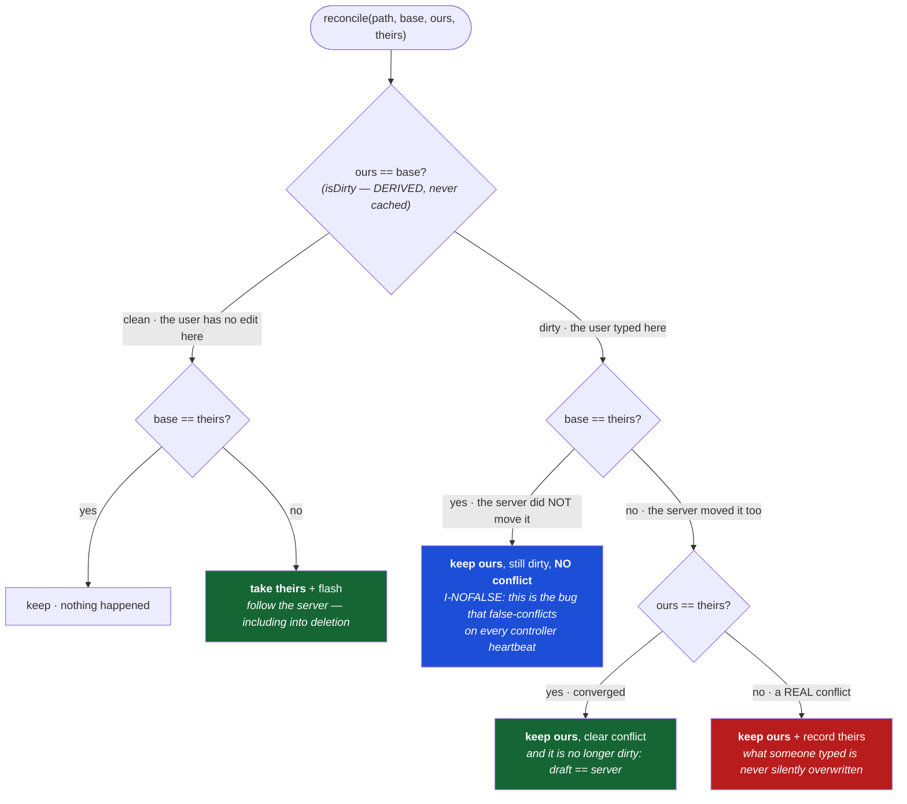

# Live KRM reconcile engine — requirements & design spec

> **Status:** specification, pre-implementation. Written to seed a **separate repository**; it lives
> here because gitops-api's console (`cmd/server/console_body.html`) is the code that motivated it and
> the first consumer. Working name: **`krm-live`** (final name TBD — Open questions).
>
> **One line:** a headless, framework-agnostic engine for **live-editing and live-watching Kubernetes
> objects in the browser** — a thin, honest layer over the **Kubernetes Resource Model (KRM)**. It
> does a **deep three-way merge** of your edits to `spec`/`metadata` against a live watch stream,
> tracks dirty state and conflicts, builds a merge patch — and streams read-only `status` so you can
> watch an object actually reconcile.
>
> **This is not domain-agnostic, on purpose.** The value is *being* a KRM UI layer. `spec`, `status`,
> `metadata`, "three-way merge" are surfaced, not hidden behind generic "sections" — that vocabulary
> is the product and the reason people find it.
>
> **Part of a family:** [resource-stream-protocol](../spec/v1.md) is the wire contract
> this engine consumes; [resource-stream-gateway](../gateway/README.md) is the server that
> produces it. This engine knows nothing about the transport — it consumes parsed KRM objects.

## The two use cases (why the read/write split is the design)

1. **Live status watch (read).** Open an object; watch its `status` — conditions, replicas,
   phase — change in real time as controllers reconcile it. `status` is controller-owned and
   **read-only**: there is no draft, no merge, no conflict; the engine just follows the server and
   **highlights what moved**. This is the headline demo — *see Kubernetes reconcile*.
2. **Live spec edit (write).** Edit desired state (`spec`, labels, annotations) while the object
   changes underneath you; the engine **deep three-way merges** so an unrelated change never clobbers
   your edit and a real one flags a **conflict**; save emits a merge patch.

Both are the same object, the same stream, the same engine — differing only in **which regions are
editable**. A pure status viewer is "everything read-only"; the console is "`spec`/`metadata`
editable, `status` read-only." One engine, configured.

---

## 1. Why this exists

A browser edits an object while a **watch stream** delivers server changes to it live. Naive
last-write-wins clobbers the user's typing; naive two-way compare (draft vs incoming) false-conflicts
every edited field on any event. The correct model is a **three-way merge**, VCS-style:

| merge term | KRM |
|---|---|
| **base** | the previous server version we last reconciled from |
| **ours** | the user's working draft of the editable regions |
| **theirs** | the incoming server version from the watch |

Only a field the server *actually* changed (base ≠ theirs) is reconciled; an untouched field is left
alone. And unlike a flat form, KRM `spec`/`status` are **arbitrarily nested JSON**, so the merge must
recurse through objects and arrays — not just compare string maps.

This engine is small but subtle. Its first inline incarnation shipped **three real bugs** in three
days, each now a hard requirement:

1. A fragile in-band string separator for composite keys was corrupted (null byte vs space), so
   conflict lookups silently never matched. → **R-ID**: field identity is collision-proof (and
   paths are segment arrays, not dot-strings — the bug voter still has).
2. A cached `dirty` set drifted out of sync after a watch event. → **R-DERIVED**: dirtiness is always
   derived from a live comparison, never stored.
3. Reconcile compared only draft vs incoming — no **base** — so it could not tell "server changed
   this" from "user edited this," and false-conflicted on every event. → **R-THREEWAY**: the base is
   mandatory.

---

## 2. The KRM object model

Every object is a **KRMObject** — the shape the [protocol](../spec/v1.md) delivers and
the save path accepts back. It is real KRM, named as such:

```jsonc
{
  "apiVersion": "apps/v1",
  "kind":       "Deployment",
  "metadata": {
    "uid":             "9f1c…",     // identity; the engine keys resources on it (per stream target)
    "name":            "web",
    "namespace":       "shop",
    "resourceVersion": "12345",
    "labels":          { "app.kubernetes.io/name": "web" },   // keys contain dots AND slashes — see R-ID
    "annotations":     { "note": "keep" }
    // creationTimestamp, generation, ownerReferences, … may be present; read-only
  },
  "spec":   { /* free-form JSON; shape depends on kind+version; desired state; EDITABLE */ },
  "status": { /* free-form JSON; shape depends on kind+version; actual state; READ-ONLY */ }
  // plus the ugly exceptions (§2.2), and any custom root field a CRD defines
}
```

It is a **complete projected object**, not a schema: a `ConfigMap` has no `spec` and no `status`, a CRD
may define custom root fields, and the gateway may have removed or redacted paths (protocol §3). The
engine must therefore never assume a member exists — and must never re-add one it never saw (§2.3).

- **`id` = `metadata.uid`.** Stable, unique; the engine keys resources on it. `name` can change
  meaning across recreations; `uid` cannot. A uid is unique **within one stream target**, so a host
  combining several streams keys on `(target, uid)` or keeps one engine per stream
  ([protocol §1](resource-stream-protocol.md#1-identity-target--uid)).
- **`spec`** — desired state, free-form nested JSON, **editable**.
- **`status`** — actual/observed state, free-form nested JSON, **controller-owned → read-only**. This
  is what the live-status-watch use case renders. (Editing `status` needs the `/status` subresource
  and is out of the default editable set; a specialized tool can opt in — §3.)
- **`metadata.labels` / `metadata.annotations`** — editable string maps. Everything else in
  `metadata` (name, uid, resourceVersion, timestamps, ownerRefs, managedFields) is read-only.

### 2.2 The ugly exceptions — named, not hidden

A few kinds carry editable payload at the **top level**, outside `spec`:

- **`ConfigMap.data`** (`map<string,string>`) and **`ConfigMap.binaryData`** (`map<string,base64>`).
- **`Secret.data`** (`map<string,base64>`), **`Secret.stringData`** (write-only convenience), and
  `type`.

The model treats these as declared **top-level editable maps** for those kinds, not as a special
case bolted onto `spec`. The engine must not assume every editable region lives under `spec`.

**Secrets need a policy (flag, not solved here).** `Secret.data` values are sensitive. The *gateway*
decides whether to stream values at all (mask / omit / require elevated auth — see gateway spec); the
engine simply renders whatever regions it is given and marks binary payloads (`binaryData`,
non-UTF-8) as "N bytes, not text-editable" rather than corrupting them through a text input.

### 2.3 Two layers: replace the server object, three-way merge the draft

The protocol says the stream reducer **replaces** the authoritative server object for a uid — never
deep-merges it — because a generic deep merge of complete objects resurrects fields the server just
removed ([protocol §4.1](resource-stream-protocol.md#41-added--modified--replacement-not-merge)). The
engine is where the *other* half lives. Both layers are inside `applyServerEvent`, and conflating them
is a bug:

| layer | operation |
|---|---|
| **server truth** (`server(id)`, the merge `base`) | **replaced wholesale** by each incoming object. A key absent from the incoming object is *gone*, not retained. |
| **draft** (`draft(id)`) | **three-way reconciled** (§4) from the previous base, the user's edits, and the new object. |

So `I-BASESHIFT` is a *replacement*, not a merge — and `prune()` in §4 exists precisely so a key the
server dropped does not survive in the draft either (unless the user is actively editing it, which is a
conflict, not a ghost).

**Redacted paths never enter a patch.** Every `added`/`modified` carries `redactedPaths` (RFC 6901
pointers — protocol §3). The engine marks those paths **read-only and non-dirtiable**: the mask is
displayed but can never become a draft value, and `patch(id)` MUST NOT contain a redacted path. A
gateway that receives one rejects the whole save, so this is a correctness requirement, not a courtesy.
Likewise, a path the projection *removed* is simply not in the object — the engine must not interpret
its absence as a deletion to be patched (`patch(id)` is built from the user's edits, never from a diff
against a full object).

---

## 3. Editable vs read-only regions

The object is partitioned by an **editability policy** (defaults below, overridable per kind):

| region | default | in the merge? |
|---|---|---|
| `metadata.labels`, `metadata.annotations` | **editable** | full three-way |
| `spec` (whole subtree) | **editable** | full three-way |
| `data` / `stringData` (CM/Secret) | **editable** | full three-way |
| `status` (whole subtree) | **read-only** | live-follow: take server, flash change, never dirty/conflict |
| rest of `metadata`, `apiVersion`, `kind`, `binaryData` | **read-only** | live-follow (display only) |

**Read-only ≠ ignored.** A read-only region still updates live and highlights what changed — that is
the entire status-watch use case. It simply never grows a draft, dirty flag, or conflict, and never
appears in a patch. The policy can also mark *parts* of `spec` read-only (e.g. immutable fields like
`spec.clusterIP`) so the UI shows them without offering to edit.

---

## 4. The deep three-way reconcile

**The two layers, and why conflating them is the ghost bug.** `applyServerEvent` does two different
things, in this order, and neither may be skipped:



**The merge decision, per path.** Everything turns on one question that the naive implementations
never ask — *did the **server** move this?* — and it is answerable only because we kept the **base**:



Arrays and scalars take the same branch (`§4.1`): an array is **one atomic value**, because a
positional merge mis-aligns the moment the server prepends an element.

`applyServerEvent(incoming)` for one resource. Let `base` be the resource's current server snapshot
(unknown resource ⇒ seed base = draft = incoming, emit `added`). Otherwise reconcile each **editable
region** with the recursive merge below, **follow the server** for each read-only region (deep-replace
+ flash changed paths), then advance `base = incoming`.

The recursive merge (this is voter's `reconcileValue`, corrected for KRM), at a `path` (a segment
array — §5), given `base`, `ours` (draft), `theirs` (incoming):

```
reconcile(path, base, ours, theirs):
  # arrays — see the associative-list caveat (§4.1)
  if isArray(base) or isArray(theirs) or isArray(ours):
    if isDirty(path) or len(base) != len(theirs) or len(ours) != len(base):
      return preserveOrConflict(path, ours, base, theirs)      # treat the whole array atomically
    return theirs.map((t,i) => reconcile(path+[i], base[i], ours[i], t))

  # objects — recurse over the union of keys
  if isObject(base) or isObject(theirs) or isObject(ours):
    result = {}
    for key in union(keys(base), keys(theirs), keys(ours)):     # key may contain '.', '/', anything
      result[key] = reconcile(path+[key], base[key], ours[key], theirs[key])
    return prune(result)                                        # drop keys that ended up undefined

  # scalars (string/number/bool/null/undefined)
  if deepEqual(base, theirs):        return clone(ours)         # server didn't move it → keep the draft
  if isDirty(path):                                             # ours diverged from base (an edit)
    if deepEqual(ours, theirs): { clearConflict(path); return clone(ours) }   # converged
    setConflict(path, theirs); return clone(ours)              # real conflict; keep the edit
  clearConflict(path); flash(path); return clone(theirs)       # untouched → follow the server

preserveOrConflict(path, ours, base, theirs):
  if deepEqual(ours, theirs): { clearConflict(path); return clone(ours) }
  setConflict(path, theirs); return clone(ours)                # user's array wins until resolved
```

- **`isDirty(path)` is DERIVED**: `!deepEqual(get(draft, path), get(base, path))`. Never a cached set.
- **`base` advances every event** (I-BASESHIFT), so the next merge is against *this* version.
- **`deepEqual`** must be **key-order-independent** (recursive structural compare) — *not*
  `JSON.stringify` equality, which voter uses and which false-negatives on reordered keys.
- **Read-only regions skip all of this**: set draft = server, flash any changed path, done.

### 4.1 The array problem (a real KRM wrinkle — flagged, not hand-waved)

Index-based array merge is fragile: an element inserted at the front shifts every index, so a
positional merge mis-aligns. The algorithm above degrades safely — **any dirty or length change makes
the whole array atomic** (voter's fallback) — which is correct but coarse (your one-element edit
conflicts with the server's unrelated append). The *right* answer for Kubernetes is a **keyed merge**
for associative lists: k8s marks them with `x-kubernetes-list-type: map` +
`x-kubernetes-list-map-keys` (e.g. containers by `name`, ports by `containerPort`), which is how
server-side apply merges lists. **Recommendation:** ship atomic-on-change first; add keyed-list merge
driven by the OpenAPI/CRD schema as a follow-up. This is the main open design question (§10). Note
that RFC 7386 merge patch also replaces arrays wholesale, so atomic arrays and the patch format agree
out of the box.

---

## 5. Field identity — segment-array paths, never dot-strings (R-ID)

A field is `(resourceId, path)` where **`path` is an array of segments**: object keys (arbitrary
strings) and array indices (integers). Examples:

```
["spec", "replicas"]
["spec", "template", "spec", "containers", 0, "image"]
["metadata", "labels", "app.kubernetes.io/name"]      # ONE key segment, containing dots and a slash
```

Dot-joining (`spec.replicas`, `metadata.labels.app.kubernetes.io/name`) is **forbidden**: label and
annotation keys contain `.` and `/`, so a dotted path is ambiguous and silently wrong — this is the
bug voter's `path.split('.')` has. Where a scalar key is needed (the `conflict`/`flash` maps), encode
the path *structurally* — `JSON.stringify(pathArray)` — never by concatenation with a magic
separator (the null-byte lesson). Prefer nested `Map`s keyed by resource → segment where practical.

---

## 6. Public API (headless, KRM-aware)

JSDoc-typed pseudocode; the new repo finalizes it. The engine holds state and exposes KRM-shaped
queries + path-addressed edits, and emits a coarse "changed" signal so the host re-renders.

```js
/** @typedef {{ apiVersion:string, kind:string,
 *   metadata:{ uid:string, name:string, namespace?:string, resourceVersion?:string,
 *              labels?:Record<string,string>, annotations?:Record<string,string> },
 *   spec?:any, status?:any, data?:Record<string,string>, stringData?:Record<string,string>,
 *   binaryData?:Record<string,string> }} KRMObject */

/** @typedef {(string|number)[]} Path */
/** @typedef {{ path:Path, kind:'add'|'update'|'delete', old:any, new:any }} Change */
/** @typedef {{ path:Path, theirs:any }} Conflict */

createEngine(policy?: EditabilityPolicy, opts?: { deepEqual?, isBinary? }): Engine

interface Engine {
  // stream in — the four protocol events, and nothing else
  applyServerEvent(obj: KRMObject, opts?: { redactedPaths?: Path[] })   // ← added / modified (REPLACES base, §2.3)
    : { added?:boolean, structural:boolean, flashed:Path[], conflicts:Path[] }
  removeResource(id): void                            // ← deleted (identity.uid; a tombstone carries no object)
  beginSnapshot(): void; endSnapshot(): void          // ← reset / synced. MAY repeat many times on one
                                                      //   connection; prune ONLY in endSnapshot (protocol §5)
  adoptSaved(obj: KRMObject): void

  // edits (editable regions only; a write to a read-only path is rejected)
  setValue(id, path: Path, value): void
  removeKey(id, path: Path): void                      // for map entries / spec object keys
  addKey(id, path: Path, key: string, value?): void
  renameKey(id, path: Path, oldKey, newKey): void      // label/annotation/data key rename
  revert(id, path: Path): void; takeTheirs = revert

  // queries (all derived)
  ids(): string[]
  server(id): KRMObject                                // truth (incl. live status)
  draft(id): KRMObject                                 // editable regions merged over server
  status(id): any                                      // read-only convenience for the watch UI
  changes(id): Change[]
  isDirty(id, path: Path): boolean
  conflicts(id): Conflict[]
  isEditable(id, path: Path): boolean                  // from the policy
  patch(id): object | null                             // JSON merge patch of editable changes
  subscribe(cb): () => void
}
```

**Patch** (`patch(id)`): a JSON merge patch (RFC 7386) over the *editable* regions only — nested
`spec` subtrees merge recursively, deleted keys are `null`, changed arrays are sent whole (§4.1).
`status` and read-only metadata never appear. For k8s, the host `PATCH`es with
`application/merge-patch+json`; a future strategic-merge / SSA mode is an option for better list
handling.

---

## 7. Invariants (property-test targets)

- **I-REPLACE** — the server object (`server(id)`, the merge base) is **replaced** by each incoming
  object, never merged into: a key the server removed must not survive in `server(id)` (§2.3).
- **I-REDACT** — a path in `redactedPaths` is read-only, never dirty, never conflicted, and never
  appears in `patch(id)`; the placeholder can never become a draft value (§2.3).
- **I-DERIVED** — `isDirty(f)` ⟺ `!deepEqual(get(server,f), get(draft,f))`; no cached dirty state.
- **I-THREEWAY** — reconcile uses base = previous server; removing the base term must fail a test.
- **I-DEEP** — the merge recurses through nested objects and arrays; a change deep in `spec` reconciles
  field-precisely, not by replacing the whole `spec`.
- **I-READONLY** — a read-only region (`status`, immutable metadata) always equals the server, always
  flashes on change, and *never* becomes dirty, conflicted, or part of a patch. Edits to it are refused.
- **I-NONINTERFERE** — a server change to path X never disturbs or conflicts an edit at a disjoint path Y.
- **I-NOFALSE** — if an event does not change path X, an edit at X stays dirty but not conflicted.
- **I-CONVERGE** — if the draft equals the incoming server value at a path, it ends clean and unconflicted.
- **I-IDEMPOTENT** — `apply(v); apply(v)` ≡ `apply(v)` (harmless watch redelivery / own-save echo).
- **I-BASESHIFT** — `apply(v1); apply(v2)` reconciles v2 against v1.
- **I-KEYSAFE** — paths whose segments contain `.`, `/`, array-index-looking strings, or the map's
  encoding separator behave correctly (segment arrays, structural key encoding).
- **I-ORDER-EQ** — `deepEqual` is key-order-independent (a reordered-but-equal object is not a change).
- **I-PATCH-ROUNDTRIP** — applying `patch(id)` (RFC 7386) to the server object yields the draft's
  editable regions; unchanged fields absent; deletions `null`; arrays whole.
- **I-RESYNC** — `beginSnapshot()` → replay `applyServerEvent` → `endSnapshot()` prunes resources
  absent from the snapshot and three-way-reconciles survivors (preserving in-flight drafts). This is
  the consumer side of the protocol's
  [`reset`…`synced`](resource-stream-protocol.md#5-snapshot-cycles--reset--synced). Two corollaries the
  protocol makes explicit and the engine must honour: a snapshot cycle **may occur many times on one
  connection** (an upstream relist, not just a reconnect), and a cycle that never reaches
  `endSnapshot()` **prunes nothing** — an abandoned `beginSnapshot()` must leave prior state intact.

---

## 8. Behavioral requirements — the test matrix

`{…}` is JSON; `L/A` = labels/annotations. Assert resulting draft, dirty, conflict, flash.

| # | Given (base, draft) | When (incoming / action) | Then |
|---|---|---|---|
| 1 | status `{replicas:1}` (read-only) | server → status `{replicas:3}` | draft.status `{replicas:3}`, **flash**, not dirty, not conflicted (I-READONLY) |
| 2 | spec `{replicas:1,image:"a"}`, user edits `replicas→5` | server → spec `{replicas:1,image:"b"}` (image changed) | draft `{replicas:5,image:"b"}`; replicas dirty, no conflict; image flashed (I-NONINTERFERE) |
| 3 | spec `{replicas:1}`, edited `replicas→5` | server → spec `{replicas:1}` (unchanged) | replicas dirty, **no conflict** (I-NOFALSE) |
| 4 | spec `{replicas:1}`, edited `replicas→5` | server → spec `{replicas:9}` | replicas **conflict** theirs=9, draft keeps 5 |
| 5 | spec `{replicas:1}`, edited `replicas→9` | server → spec `{replicas:9}` | not dirty, no conflict (I-CONVERGE) |
| 6 | nested spec `{a:{b:{c:1}}}`, edited `a.b.c→2` | server → `{a:{b:{c:1,d:9}}}` (adds sibling d) | draft `{a:{b:{c:2,d:9}}}`; c dirty, no conflict; d flashed (I-DEEP, I-NONINTERFERE) |
| 7 | spec array `ports:[80]`, untouched | server → `ports:[80,443]` (append) | draft `ports:[80,443]`, flashed |
| 8 | spec array `ports:[80]`, user edited `ports[0]→8080` | server → `ports:[80,443]` (len change) | whole-array **conflict** theirs=`[80,443]`, draft keeps `[8080]` (§4.1 atomic) |
| 9 | L `{app.kubernetes.io/name:"web"}` edited `→"api"` | server unchanged | dirty on the dotted key; patch `{metadata:{labels:{"app.kubernetes.io/name":"api"}}}` (I-KEYSAFE) |
| 10 | any editable | user edits a `status` path | rejected (I-READONLY) |
| 11 | `apply(v)` then `apply(v)` | — | second is a no-op (I-IDEMPOTENT) |
| 12 | base spec `{r:1}` | `apply({r:2})` then `apply({r:3})` | reconciles 3 vs 2 (I-BASESHIFT) |
| 13 | data `{A:"1"}`, rename `A→z` | — | draft `{z:"1"}`, no dup, patch `{data:{A:null,z:"1"}}` (I-KEYSAFE, rename) |
| 14 | object `{a:1,b:2}` in draft | server sends `{b:2,a:1}` (reordered) | not a change; no flash (I-ORDER-EQ) |
| 15 | ConfigMap, no spec/status, has `data` | edit a data key | works; patch under `data`, not `spec` (exceptions) |
| 16 | binaryData / non-UTF-8 value | render + reconcile | shown as "N bytes", not text-edited/corrupted |
| 17 | two objects; snapshot replays one | begin/apply/end | the other is pruned; survivor three-way reconciled (I-RESYNC) |
| 18 | save built for edited spec | server echoes the saved spec | no phantom conflict (I-IDEMPOTENT) |
| 19 | server spec `{a:1,b:2}`, user untouched | server → spec `{a:1}` (b **removed**) | `server(id).spec` = `{a:1}`; **no ghost `b`** in server or draft (I-REPLACE) |
| 20 | Secret, `redactedPaths:["/data/password"]`, user edits a label | build `patch(id)` | patch contains the label only; `/data/password` absent; the mask never became a value (I-REDACT) |
| 21 | user tries to edit a redacted path | `setValue` on `/data/password` | rejected, like any read-only path (I-REDACT, I-READONLY) |
| 22 | `beginSnapshot()`, one `applyServerEvent`, **connection drops** (no `endSnapshot`) | — | **nothing pruned**; pre-snapshot state and in-flight drafts intact (I-RESYNC) |

Add property tests: random nested base/draft/incoming triples asserting I-DEEP, I-CONVERGE,
I-IDEMPOTENT, I-NONINTERFERE, I-ORDER-EQ, I-PATCH-ROUNDTRIP.

---

## 9. Implementation hints

- **Headless & framework-agnostic** (UI-wise): no DOM/fetch/SSE. Feed KRM objects in, read state +
  `patch` out, re-render on `subscribe`. Unit-testable in Node with no cluster and no jsdom.
- **KRM-explicit** (domain-wise): the API speaks `spec`/`status`/`metadata`/`data`, and the
  editability policy is KRM-shaped. Don't abstract it into anonymous "sections."
- **Types without a build step:** plain ESM + JSDoc + `// @ts-check` (type-checked by `tsc --checkJs`
  or the editor; the file is what ships to the browser). Real `.ts` is fine *in the new repo* — it
  owns its build; the point of extracting is that the toolchain stops being gitops-api's problem.
- **Zero-dependency tests:** Node 18+ `node:test` + `node:assert`; `node --test`. (Verified: Node 22.)
- **Paths are segment arrays; keys encode structurally** (§5). Store per-resource state as nested
  `Map`s; if a flat key is needed, `JSON.stringify(path)`.
- **`deepEqual` recursive + order-independent**, not `JSON.stringify` (fixes voter's I-ORDER-EQ gap).
- **`flash` is an output**, not stored state — return moved paths from `applyServerEvent`.
- **Editability policy is injected** — default (labels/annotations/spec/data editable; status +
  immutable metadata read-only) plus per-kind/per-path overrides, ideally schema-driven later.

---

## 10. How gitops-api consumes it, and the two surfaces

- **Status watch** — a read-only page: open a stream for an object, engine with an all-read-only
  policy, render `spec` + `status` and flash changes. No save path. The clearest demo of "Kubernetes
  reconciling," and today under-served (voter edits spec but doesn't foreground status).
- **Spec/console edit** — today's inline logic in `cmd/server/console_body.html`
  (`applyServer`/`changesFor`/`patchFor`) becomes a thin host over the engine: SSE →
  `applyServerEvent`; input → `setValue`/`renameKey`/…; save → `POST` `engine.patch(id)`; `subscribe`
  → re-render. The server's `resourceView` ([console.go](../../cmd/server/console.go)) grows from
  ConfigMap-only to the full KRM shape (metadata + spec + status + data), matching the protocol.

---

## 11. Open questions for the new repo

- **Array/list merge** (§4.1): atomic-on-change first; schema-driven keyed-list merge
  (`x-kubernetes-list-map-keys`) as the real fix. Biggest open design item.
- **Editability policy source:** static defaults vs OpenAPI/CRD-schema-driven (immutable fields,
  associative lists, `x-kubernetes-` hints). Schema-driven unlocks keyed lists *and* read-only marking.
- **Patch format:** RFC 7386 merge patch (simple, arrays-whole) vs strategic-merge / server-side
  apply (better lists, field ownership) — decide per target API capability.
- **Status editing:** default off; expose a `/status`-subresource path for admin tools?
- **Secret value handling** on the engine side once the gateway's policy is set (mask vs omit vs
  elevated) — keep values opaque; never log.
- **Name**, and three-packages-one-repo vs three-repos.
