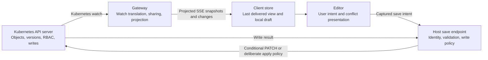
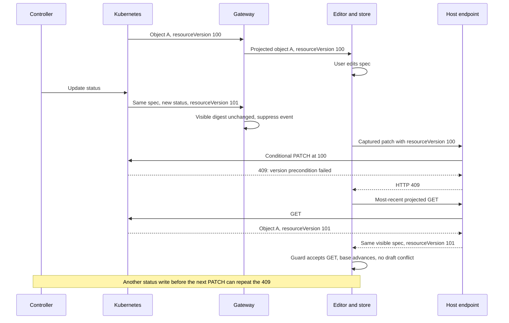
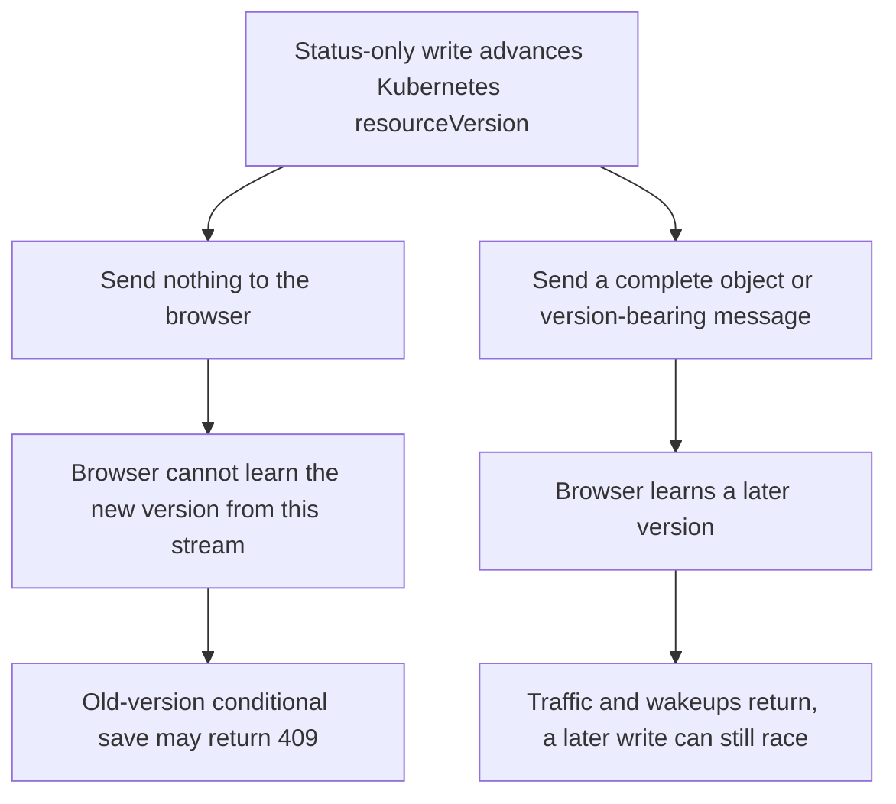
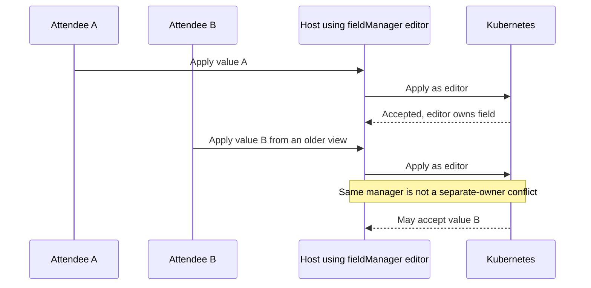
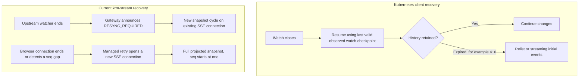
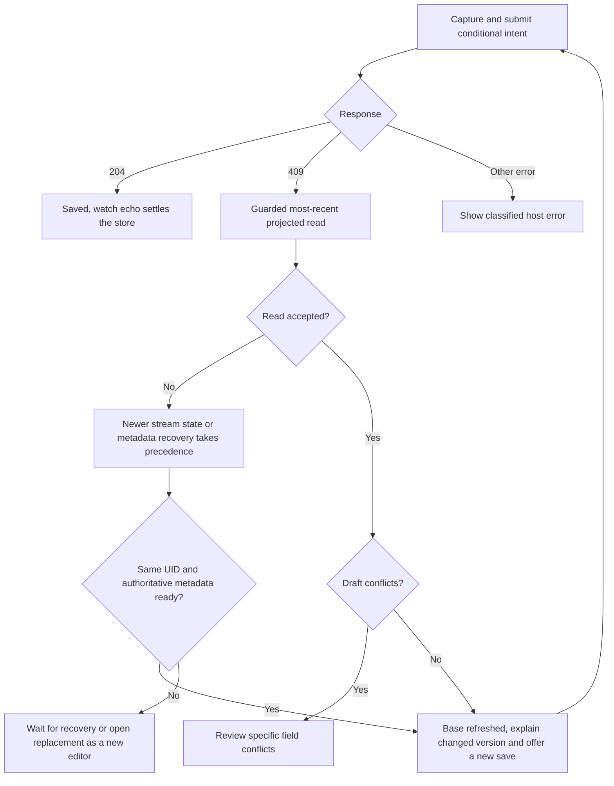

# Proposal 0005: Kubernetes stream semantics and conditional editing

**Status: discussion and implementation plan; no protocol or runtime change approved by this document.**

This follows the second review of PR #25. It distinguishes Kubernetes behavior, the contract in
[spec/v1.md](../../spec/v1.md), the implementation, and proposed changes. The immediate recommendation
is to clarify the contract and save guidance, retain Kubernetes concurrency checks, and add focused
integration tests. Resume support, new wire events, and a general write abstraction should not be
bundled into that correction.

The original priorities remain managed recovery, bounded authorization rechecks for shared streams,
and a complete conditional-save integration. Existing watch sharing and draft reconciliation remain
in place. Credentials, writes, application policy, and field ownership stay with the host.

## 1. The boundary we should preserve

Kubernetes owns object identity, resource versions, persistence, authorization decisions and write
conflict enforcement. The gateway provides a projected read stream for a UI; the store maintains a
local draft. These are related responsibilities, not interchangeable authorities.

**Recommended boundary:** keep the projected read stream and draft helpers small. Do not make the
SSE sequence, a projection digest, or a redaction revision into a substitute for Kubernetes write
concurrency. An optional managed connection is lifecycle convenience, not a new consistency model.

Kubernetes documents version-based watch continuation, recovery when history expires, and conditional
writes. A default GET requests most-recent semantics; supported API servers may serve consistent
reads from their watch cache. “Most recent” should not be documented as a guarantee of a physical
etcd quorum read for every request. [Kubernetes API concepts](https://kubernetes.io/docs/reference/using-api/api-concepts/)

## 2. What the feedback gets right, and where I disagree

| Feedback | Assessment | Planned response |
|---|---|---|
| Healthy connections now replenish retries and reset backoff | Agree; preserve this behavior | Simplify its tests without expanding the public API |
| Cycle teardown now recovers while genuine denial remains terminal | Agree | Add one subscriber-visible test through `Gateway.Stream` |
| Suppression plus conditional saves can repeatedly produce 409s | Agree; this is a usability and progress problem | Explain it by projection and distinguish write conflicts from draft conflicts |
| resourceVersion preconditions are wrong for `krm-spec/v1` | Disagree as a safety claim | They remain safe, but can be expensive or make progress difficult under churn |
| The reversal is correct only for `krm-full/v1` | Too absolute | Full includes status but still suppresses changes to ignored metadata; any delivered version can also become stale in transit |
| Only a snapshot can refresh the held version | Incorrect for the current store | An accepted `captureReconciliation` GET updates the server object, including its version; a delivered upsert also updates it |
| Name Server-Side Apply as an alternative | Agree, with substantial qualification | Describe ownership semantics and its separate validation requirements |
| SSA is the server analogue of our three-way draft conflicts | Incomplete | Same-manager concurrent writers do not gain stale-read detection merely by using SSA |
| Unknown redaction paths require a fresh connection | Too strong | A later delivered upsert for that UID can supply authoritative revisions; a fresh snapshot is an explicit recovery option |
| Every reconnect sends a full snapshot | Agree, but distinguish two connections | Document upstream and downstream recovery costs separately |
| UID immutability may yield 422 rather than 409 | Plausible, path-dependent | Reproduce the actual endpoint race; never translate every 422 into a conflict |
| More test coverage is useful | Agree | Prioritize projection/save interaction and public stream recovery over broad new infrastructure |

The suppression mechanism predates PR #25: it is specified in
[proposal 0004](0004-views-and-bytes.md) and implemented by
[`visibleDigest`](../../gateway/stream.go). What this PR adds is the conditional-save composition and
stronger guidance, exposing the tension more directly.

## 3. Divergence map

Some differences are intentional protocol choices. Others are ambiguities in our own prose. They
should not all be described as departures from Kubernetes correctness.

| Area | Kubernetes behavior or authority | Current krm-stream behavior | Classification and consequence |
|---|---|---|---|
| Initial state | Streaming initial events or list followed by watch at the list version | Backend uses those mechanisms; gateway emits `reset`, `added`, `synced` | Translation; preserves the snapshot/watch boundary |
| Live changes | Versioned resource events | Complete projected objects; intermediate updates may be coalesced | Intentional view service, not an audit log |
| Suppression | Resource version identifies an object revision | Digest excludes resourceVersion for **all** projections | Intentional optimization; held version is from the last delivered object |
| Status omission | Status writes can advance object version | `krm-spec/v1` omits status and suppresses status-only changes | Intentional projection; systematically stale save bases under controller churn |
| Upstream reconnect | A client can resume from an observed watch checkpoint while history is retained | An ended backend watch returns `ErrWatchClosed`; gateway resnapshots | Conservative implementation choice; potentially avoidable work |
| Browser reconnect | Kubernetes does not define our SSE protocol | Every new SSE connection snapshots; no `Last-Event-ID` | Explicit v1 contract; warm cache reduces upstream cost, not browser bytes |
| Gap detection | Kubernetes watch version semantics | A per-connection `seq` checks emitted-frame continuity | Additional transport check; not a resource version or resume token |
| Redaction revisions | Kubernetes has no equivalent UI counter | Per-connection counters describe observed hidden-value changes | Deliberate disclosure feature; stateless GET cannot invent them |
| Shared authorization | Upstream watch operates as its authenticated identity | Shared watch uses host identity; subscribers get separate SAR checks | Necessary host/gateway boundary when sharing; not transparent impersonation |
| Draft reconciliation | API server enforces write semantics | Store merges user edits against delivered server views | UI assistance; cannot authorize or guarantee a write |
| Retry exhaustion | Client retry policy is not a Kubernetes wire guarantee | Managed connector bounds failures and replenishes after sustained health | Optional operational policy; preserve low-level transport access |

Code anchors: [Kubernetes backend](../../gateway/kube/backend.go),
[stream loop](../../gateway/stream.go), [shared backend](../../gateway/shared.go),
[authorization gate](../../gateway/reauthorize.go), [managed connector](../../packages/krm-stream/src/connection.ts).

## 4. The main tension: quiet views versus current write versions

Consider a Deployment editor using `krm-spec/v1`. The numbers below are illustrative labels. The
browser echoes resourceVersion strings; it must not parse them or infer ordering from them.

The accepted GET already refreshes the base. A snapshot is not required for this example to recover.
The problem is that another write can invalidate that base before the next PATCH. This is possible
with any watch-fed editor; suppression makes it especially common and less visible.

There are three different facts a UI must not collapse into one “conflict” label:

- **A version precondition failed:** the object changed since the captured base. This does not identify
  which fields changed.
- **A local draft conflict exists:** the store found a disagreement between base, draft and a newer
  delivered view at an editable path.
- **An ownership conflict exists:** an apply operation disputes another field manager's ownership.

The current example returns `"conflict"` for a 409 even when reconciliation leaves no draft conflicts.
That is a misleading result for a human editor. It should describe refresh/review state separately
from an actual field conflict, without promising automatic save success.

### Projection-specific expectations

| Projection | Updates intentionally invisible | Conditional merge-patch implications |
|---|---|---|
| `krm-full/v1` | Removed bookkeeping metadata; Secret values are withheld but their revisions are reported | Good general editor default; no guarantee that the delivered RV remains current |
| `krm-spec/v1` | The above, plus status changes | Safe optimistic concurrency, but repeated refresh/409 cycles may dominate controller-heavy resources |
| `krm-raw/v1` | Still removes managedFields and last-applied configuration | Not a raw Kubernetes watch and not a concurrency solution; it can disclose Secret values |

No projection makes a streamed resourceVersion into a lease. Calling a stale precondition “unsafe”
would reverse the safety argument: the rejection is exactly what prevents an old array replacement
or field value from silently overwriting a newer write.

### The constraint we cannot abstract away

We cannot promise zero notifications for ignored writes, always-current browser write versions, and
unconditional progress for object-version CAS writes at the same time. That is an information and
concurrency constraint, not a missing merge algorithm.

## 5. Our own spec needs a precise statement of equality

[Spec §3](../../spec/v1.md#3-projection-and-redaction--part-of-the-wire-not-an-implementation-detail)
explicitly permits status suppression. Proposal 0004 explicitly excludes resourceVersion from the
digest. But §6 says the consumer map equals the projected view and promises delivery of the final
state. Literal whole-object equality includes resourceVersion. A final suppressed metadata/status
write can leave that field behind indefinitely.

This is at least an ambiguity between the declared suppression rule and the broad invariant. We
should resolve it explicitly, not claim that current code gives exact Kubernetes-object equality at
all times. The “corresponding logical stream position” wording limits the invariant, but does not
clearly tell adopters which version remains meaningful after suppression.

**Recommended clarification, for review:**

> Convergence is over the declared visible comparison: projected object content excluding
> metadata.resourceVersion, together with the stream's redaction records. The resourceVersion in a
> delivered object is genuine and belongs to that delivered revision; suppressed updates do not
> refresh it. It can be echoed as a conditional-write precondition, but is not a current-version
> guarantee or a downstream resume checkpoint.

Keep completeness within the projection, safe snapshot pruning, and within-cycle ordering as separate
invariants. Scope redaction counters to one connection; do not equate counters from separate
connections. Do not change opaque-version handling in the browser.

This documents the implemented semantics, but it narrows how a reader might interpret the existing
invariant. Call it out in release notes. If the project instead wants exact projected-object equality
including version metadata, it needs a different emission policy; that cannot be presented as a
wording-only fix.

## 6. Write strategies: choices the host must make

The following is a design comparison, not a proposal to implement four save engines.

| Strategy | Protects | Tradeoff | Recommendation |
|---|---|---|---|
| Merge patch with captured UID and resourceVersion | Identity and object-version concurrency | Unrelated writes can reject it; arrays are replaced as units | Keep the supported baseline and demonstrate its limitations |
| Refresh, reconcile, then submit a newly reviewed conditional intent | Retains object CAS while allowing a newer base | Still races; review flow must distinguish actual field disagreements | Improve the example first; no blind version substitution |
| JSON Patch with deliberate `test` operations | Can guard specific values atomically | Paths, missing values, list indices and whole-array dependencies require care | Document as host-owned advanced work, not a new core patch compiler |
| Server-Side Apply with deliberate field ownership | Declarative ownership conflicts | Different semantics from stale-read detection; needs an apply-specific validator and intent model | Name it and scope a separate example, not a drop-in replacement |
| Merge patch with no concurrency condition | Only the patch's write scope | Deliberate last-writer-wins behavior can lose edits | Only when explicitly chosen by the host; do not silently select it by projection |

Merge-patch array replacement and JSON Patch value tests are defined by
[RFC 7386](https://www.rfc-editor.org/rfc/rfc7386) and
[RFC 6902](https://www.rfc-editor.org/rfc/rfc6902), respectively.

An eventual automatic retry must preserve the **submitted intent**, compare its relevant base values
against a fresh object, and bound retries. For RFC 7386 arrays, that comparison must protect the
replacement array, not just an item the user changed. Do not silently incorporate edits typed after
Save was clicked. `store.conflicts().length === 0` alone is not a complete host write policy.

### Why SSA is an option, not a replacement guarantee

Server-Side Apply tracks field managers. Different managers claiming changed values can conflict;
`force` can override ownership. Omission from a manager's subsequent applied configuration can remove
fields it previously managed. This means repeated “only this click's changes” payloads are not a safe
mechanical translation of merge patches. List behavior also depends on schema topology.
[Kubernetes Server-Side Apply](https://kubernetes.io/docs/reference/using-api/server-side-apply/)

This example is an inference from ownership semantics: using one manager for 200 attendees does not
provide user-to-user optimistic locking. Conversely, one manager per tab changes ownership and
managedFields growth; it is not a free concurrency fix. A manager name is not authentication or RBAC.

Spec §3 permits SSA but describes saves as constrained writes over edited paths. Clarify that SSA
needs the host's intended managed field set and omission/deletion policy. `ValidateMergePatch` and
`captureSave().patch` remain merge-patch-specific. The store's local keyed-list merge does not turn
that output into strategic merge patch or apply configuration.

The [SSA design proposal](https://github.com/kubernetes/enhancements/blob/master/keps/sig-api-machinery/555-server-side-apply/README.md)
also makes field management and schema topology central to this API.

A future SSA example must establish manager lifetime, permitted fields, deletion semantics,
create-on-apply behavior, list topology, and conflict handling. Default to no forced ownership
transfer. Preserve the existing projection boundary on both requests and responses.

## 7. Recovery has two layers, with different costs

“Relist only on 410” is shorthand, not a universal rule: initial startup, scope changes, and other
losses of trustworthy state can also require initialization. Bookmarks are useful checkpoints, not
promises of a fixed heartbeat cadence. [Watch recovery semantics](https://kubernetes.io/docs/reference/using-api/api-concepts/#efficient-detection-of-changes)

**Upstream:** today, routine watch closure can cause a new initial-state cycle even when retained
Kubernetes history could permit continuation. Prefer investigating a resumable Kubernetes backend
first. It could keep the existing `Watcher` seam and SSE protocol, returning a resync only when it
cannot establish continuity. The upstream [client-go reflector](https://github.com/kubernetes/client-go/blob/master/tools/cache/reflector.go)
is the reference to study before implementing more watch machinery. It must track the upstream checkpoint, including appropriate bookmarks,
rather than infer one from a browser's last visible resource.

**Downstream:** §7 deliberately prohibits SSE resume in v1. SharedBackend can serve a warm snapshot
without opening one upstream watch per subscriber, but serialization, network bytes and browser
reconciliation still occur for each subscriber. A downstream replay protocol would need its own
cursor, scope/identity/projection binding, retained history, expiry, authorization rechecks and
snapshot fallback. A resource UID, an object RV, and a per-connection `seq` are not such a cursor.

Illustrative scale estimate, not a benchmark: if a projected snapshot is 1 MB, reconnecting 200
subscribers transfers roughly 200 MB before compression, regardless of how few upstream watches
exist. Measure snapshot size and actual reconnect frequency before designing replay storage.

## 8. Version delivery options and the abstraction cost

| Option | Wire impact | Benefit | Cost / conflict with current contract |
|---|---|---|---|
| Clarify current semantics and improve host save outcomes | None | Smallest change; honest safety/progress story | Does not eliminate churn-induced 409s |
| Emit complete projected objects when only RV changes | No new event shape | More Kubernetes-like version delivery | Defeats status-only silence for spec projection; increases bytes |
| Add a version-only event | New consumer behavior | Smaller version notifications | More wakeups; a new metadata-update path; still races writes |
| Add a write-base/read-ticket abstraction | New host/server protocol | Could coordinate reads and intended writes | State, expiration, identity binding and replay concerns; too much core machinery now |
| Move host to SSA or targeted JSON Patch | No SSE change | Different write tradeoffs | Host policy/validation work; not interchangeable concurrency semantics |

**Recommendation:** take the first option now. Prefer complete existing event shapes over a new
version-only event if measurements later justify version delivery. If changing a named projection's
promised suppression behavior, use an explicit new contract/projection identity or a coordinated
pre-1.0 change; do not silently repurpose `krm-spec/v1`. Pre-release naming flexibility is useful,
but it does not excuse ambiguous guarantees.

Retain `krm-spec/v1` as the precise statement “status is omitted,” rather than imply that it is the
universally best editing mode. The root adoption path should keep `krm-full/v1` as the default.

## 9. UID recreation and error classification

The endpoint checks UID before patching and includes the captured UID in the patch. Deletion and
recreation between those operations must never make the old draft modify the new object. Kubernetes
validates UID immutability, but validation/storage ordering can affect the returned error.
[Metadata update validation](https://github.com/kubernetes/apimachinery/blob/master/pkg/api/validation/objectmeta.go)

The review's precise 422 claim is not established by our existing 409 test. Add a real API-server test
that forces this race, records the structured Kubernetes Status and verifies the replacement is
unchanged. If the host normalizes an identity-mismatch error to a conflict response, classify that
specific case. Keep schema/admission validation failures as validation errors; do not map every 422
to 409. Preserve useful structured error information without exposing a raw protected object.

## 10. Implementation plan and acceptance criteria

### Phase A — clarify the existing contract before adding mechanisms

1. Update saving.md with projection-specific costs and the distinction between safety and progress.
2. Amend spec §6 and proposal 0004 together to define the RV exception precisely, or explicitly choose
   to change emission behavior instead. Clarify §3's SSA wording and ownership/omission semantics.
3. Explain GET/upsert recovery for redaction metadata. A new stream is an option, not a requirement
   after every rejected read; a quiet stream may still need explicit recovery.
4. Name SSA and JSON Patch as host-owned alternatives. State which helpers do not support them.
5. Keep public naming and runtime behavior unchanged in this phase; cross-link this decision.

**Done when:** README, spec, proposal and save example make compatible claims about object versions,
projection completeness, redactions and writes. A reader cannot mistake “live” for “my save will pass.”

### Phase B — test the composition at the public boundary

1. Simplify healthy-retry tests using the existing test runner's fake timers: one budget-reset test,
   one backoff-reset test. Avoid adding a public injectable-clock API just to accommodate tests.
2. Add a `Gateway.Stream` test: recheck in flight, routine upstream close, `RESYNC_REQUIRED`, fresh
   `reset`/`synced`, no terminal error. Keep explicit-denial and timeout tests.
3. Add `krm-spec/v1` plus conditional-save coverage: status update suppressed, stale save returns a
   real 409, projected GET updates RV without a draft conflict, new reviewed intent can succeed when
   the controller is quiet. A continuing status writer must not cause an unbounded write retry loop.
4. Add a contrast case for full projection and a bookkeeping-only change showing that full is not an
   always-current-version promise either.
5. Force the UID replacement race and classify its actual response before changing error mapping.

**Done when:** tests assert observable behavior and winner preservation, not merely helper return
values. They explain normal 409s without requiring imaginary user-visible conflicts.

### Phase C — improve the host example without making the core a writer

The arrow back to Save is a new user action, not an automatic infinite retry. For unknown redaction
paths, wait for authoritative upsert metadata or deliberately request a fresh snapshot before retrying.
An identity replacement requires a new editor for the new UID, not another attempt with the old draft.

Change the example's outcomes to distinguish stale version, actual draft conflicts, missing/replaced
resource and transport/validation error. This is host presentation, not a new wire event taxonomy.
Only add automatic conflict-free retry later with frozen-intent semantics, a finite budget and tests
for arrays and edits made while saving. Avoid casually broadening `captureSave` into a save controller.

**Done when:** no user is asked to resolve nonexistent field conflicts, no replacement UID is written,
and no old patch is assigned a fresh RV without checking its intended changes.

### Phase D — measure and decide separately

Measure projected bytes, resnapshot counts, watch recycling, 409 rate by projection, and the fraction
of rejected writes that reconcile without field conflicts. Keep telemetry low-cardinality; avoid UID
or username labels.

Evaluate upstream continuation before downstream replay. Design an SSA example only for a concrete
host ownership model. Consider a version-delivery mode only if measured write usability justifies
its notification cost. Each can be a separate proposal and PR, with its own compatibility decision.

## 11. Verification and scope of this document

For implementation phases, run fixture checks, Go race tests, TypeScript tests, Vue tests, browser
and wire tests, lint and package validation. Run the projection/save and UID-race cases against a
real API server; fake clients do not establish Kubernetes conflict behavior. Push the implementation
changes to the existing PR or clearly separated follow-ups and verify CI on their actual final heads.

This document itself adds no runtime behavior, changes no named projection, and does not expand the
write API. The reviewer reports independent probes of retry and teardown recovery; those reports
are useful supporting feedback, not a substitute for the planned reproducible tests in this repo.
The UID-race status and any throughput estimates remain unverified here.

The decision proposed for the current PR is deliberately small: make our guarantees precise, explain
the projection/write interaction, and strengthen the boundary tests. Do not remove Kubernetes write
preconditions or add an ownership/replay abstraction to conceal the tradeoff.
