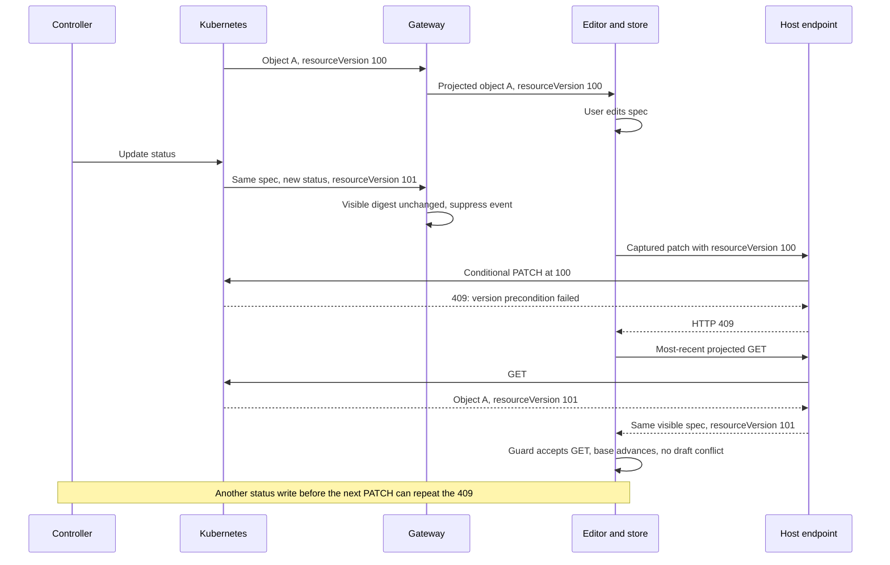
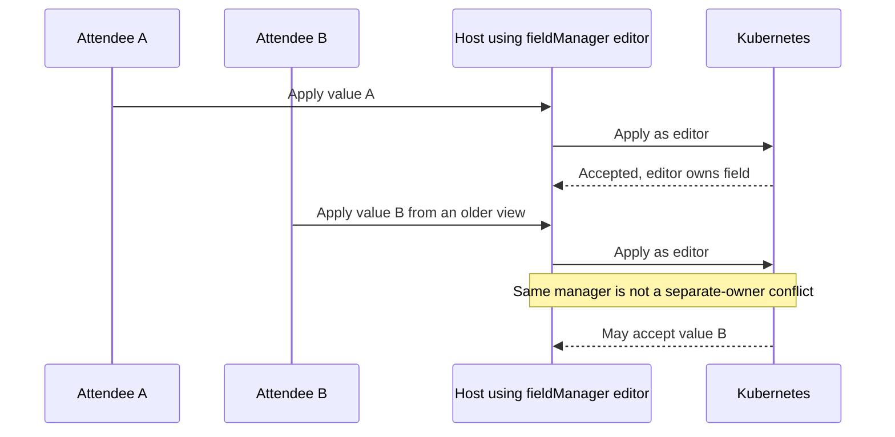
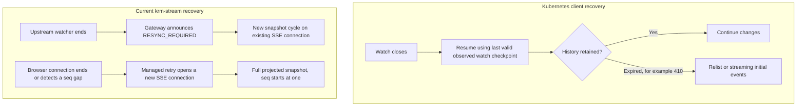

# Proposal 0005: Stream and conditional-save tradeoffs

**Status: design rationale. [Normative convergence clarification](../../spec/v1.md#6-ordering-delivery--the-state-guarantee) adopted.**

[Proposal 0006](0006-stream-and-save-implementation-plan.md) owns the remaining work and acceptance
criteria. Current adoption behavior belongs in the [saving guide](../saving.md). Managed recovery,
bounded reauthorization and the conditional editor shipped in 0.3.0; their implementation phases
are superseded by the current work plan.

Kubernetes owns identity and conditional writes. The library supplies projected reads and one draft
store; the host owns credentials, write policy and presentation. The sections below explain the
tradeoffs that still constrain the remaining work.

## Quiet views and write versions

Consider a Deployment editor using `krm-spec/v1`. The numbers below are illustrative labels. The
browser echoes resourceVersion strings; it must not parse them or infer ordering from them.

The accepted GET already refreshes the base. A snapshot is not required for this example to recover.
The problem is that another write can invalidate that base before the next PATCH. This is possible
with any watch-fed editor; suppression makes it especially common and less visible.

There are three different facts a UI must not collapse into one “conflict” label:

- **A version precondition failed:** the object changed since the captured base. This does not identify
  which fields changed.
- **A local draft conflict exists:** the store found a disagreement between base, draft and a newer
  delivered view at an editable path.
- **An ownership conflict exists:** an apply operation disputes another field manager's ownership.

The [saving guide](../saving.md#what-the-person-editing-sees) maps these distinctions to the
shipped editor outcomes. A refreshed base enables review; it cannot promise the next save succeeds.

## Convergence needs precise equality

The former §6 invariant allowed a reader to expect whole-object equality, including resourceVersion,
while the implemented suppression comparison already excluded it. A final suppressed metadata/status
write could leave the held version behind indefinitely. The “corresponding logical stream position”
wording limited when equality applied, but did not define the right comparison.

[Spec §6](../../spec/v1.md#6-ordering-delivery--the-state-guarantee) now keeps that positional guarantee
and defines its comparison explicitly. [Executable evidence](../../conformance/README.md#convergence-evidence)
covers both suppressed final writes and delivered redaction changes. Wire emissions are unchanged;
the narrowed guarantee is recorded through the conventional-commit release process.

## Host write strategies

The following is a design comparison, not a proposal to implement more save engines.

| Strategy | Protects | Tradeoff | Recommendation |
|---|---|---|---|
| Merge patch with captured UID and resourceVersion | Identity and object-version concurrency | Unrelated writes can reject it; arrays are replaced as units | Keep the supported baseline and demonstrate its limitations |
| Refresh, reconcile, then submit a newly reviewed conditional intent | Retains object CAS while allowing a newer base | Still races; review flow must distinguish actual field disagreements | Supported review flow; no blind version substitution |
| JSON Patch with deliberate `test` operations | Can guard specific values atomically | Paths, missing values, list indices and whole-array dependencies require care | Document as host-owned advanced work, not a new core patch compiler |
| Server-Side Apply with deliberate field ownership | Declarative ownership conflicts | Different semantics from stale-read detection; needs an apply-specific validator and intent model | Separate host design only for a concrete ownership model |
| Merge patch with no concurrency condition | Only the patch's write scope | Deliberate last-writer-wins behavior can lose edits | Only when explicitly chosen by the host; do not silently select it by projection |

Merge-patch array replacement and JSON Patch value tests are defined by
[RFC 7386](https://www.rfc-editor.org/rfc/rfc7386) and
[RFC 6902](https://www.rfc-editor.org/rfc/rfc6902), respectively.

An eventual automatic retry must preserve the **submitted intent**, compare its relevant base values
against a fresh object, and bound retries. For RFC 7386 arrays, that comparison must protect the
replacement array, not just an item the user changed. Do not silently incorporate edits typed after
Save was clicked. `store.conflicts().length === 0` alone is not a complete host write policy.

### Why SSA is an option, not a replacement guarantee

Server-Side Apply tracks field managers. Different managers claiming changed values can conflict;
`force` can override ownership. Omission from a manager's subsequent applied configuration can remove
fields it previously managed. This means repeated “only this click's changes” payloads are not a safe
mechanical translation of merge patches. List behavior also depends on schema topology.
[Kubernetes Server-Side Apply](https://kubernetes.io/docs/reference/using-api/server-side-apply/)

This example is an inference from ownership semantics: using one manager for 200 attendees does not
provide user-to-user optimistic locking. Conversely, one manager per tab changes ownership and
managedFields growth; it is not a free concurrency fix. A manager name is not authentication or RBAC.

Spec §3 permits SSA but describes saves as constrained writes over edited paths. Clarify that SSA
needs the host's intended managed field set and omission/deletion policy. `ValidateMergePatch` and
`captureSave().patch` remain merge-patch-specific. The store's local keyed-list merge does not turn
that output into strategic merge patch or apply configuration.

The [SSA design proposal](https://github.com/kubernetes/enhancements/blob/master/keps/sig-api-machinery/555-server-side-apply/README.md)
also makes field management and schema topology central to this API.

A future SSA example must establish manager lifetime, permitted fields, deletion semantics,
create-on-apply behavior, list topology, and conflict handling. Default to no forced ownership
transfer. Preserve the existing projection boundary on both requests and responses.

## Recovery layers and costs

“Relist only on 410” is shorthand, not a universal rule: initial startup, scope changes, and other
losses of trustworthy state can also require initialization. Bookmarks are useful checkpoints, not
promises of a fixed heartbeat cadence. [Watch recovery semantics](https://kubernetes.io/docs/reference/using-api/api-concepts/#efficient-detection-of-changes)

**Upstream:** today, routine watch closure can cause a new initial-state cycle even when retained
Kubernetes history could permit continuation. Prefer investigating a resumable Kubernetes backend
first. It could keep the existing `Watcher` seam and SSE protocol, returning a resync only when it
cannot establish continuity. The upstream [client-go reflector](https://github.com/kubernetes/client-go/blob/master/tools/cache/reflector.go)
is the reference to study before implementing more watch machinery. It must track the upstream checkpoint, including appropriate bookmarks,
rather than infer one from a browser's last visible resource.

**Downstream:** spec §7 deliberately prohibits SSE resume in v1. SharedBackend can serve a warm snapshot
without opening one upstream watch per subscriber, but serialization, network bytes and browser
reconciliation still occur for each subscriber. A downstream replay protocol would need its own
cursor, scope/identity/projection binding, retained history, expiry, authorization rechecks and
snapshot fallback. A resource UID, an object RV, and a per-connection `seq` are not such a cursor.

Illustrative scale estimate, not a benchmark: if a projected snapshot is 1 MB, reconnecting 200
subscribers transfers roughly 200 MB before compression, regardless of how few upstream watches
exist. The same fan-out occurs when a routine shared upstream watch closure triggers fresh cycles
for all subscribers, even with healthy browser connections: `sharedScope.die` ends each subscriber
with a recoverable resync. Measure reset counts by cause before calling either source dominant.
Upstream continuation is a named follow-up, ahead of any downstream replay design.

## Version delivery options

| Option | Wire impact | Benefit | Cost / conflict with current contract |
|---|---|---|---|
| Clarify current semantics and improve host save outcomes | None | Smallest change; honest safety/progress story | Does not eliminate churn-induced 409s |
| Emit complete projected objects when only RV changes | No new event shape | More Kubernetes-like version delivery | Defeats status-only silence for spec projection; increases bytes |
| Add a version-only event | New consumer behavior | Smaller version notifications | More wakeups; a new metadata-update path; still races writes |
| Add a write-base/read-ticket abstraction | New host/server protocol | Could coordinate reads and intended writes | State, expiration, identity binding and replay concerns; too much core machinery now |
| Move host to SSA or targeted JSON Patch | No SSE change | Different write tradeoffs | Host policy/validation work; not interchangeable concurrency semantics |

**Recommendation:** take the first option now. Prefer complete existing event shapes over a new
version-only event if measurements later justify version delivery. If changing a named projection's
promised suppression behavior, use an explicit new contract/projection identity or a coordinated
pre-1.0 change; do not silently repurpose `krm-spec/v1`. Pre-release naming flexibility is useful,
but it does not excuse ambiguous guarantees.

Describe `krm-spec/v1` explicitly as “status is omitted and status-only changes are suppressed,”
rather than imply that it is the universally best editing mode. The root adoption path should keep
`krm-full/v1` as the default, with client requests subject to host policy. Any future version-delivery
mode should be an explicit choice, not a global switch that restores status notifications for everyone.

## UID recreation and error classification

The endpoint checks UID before patching and includes the captured UID in the patch. Deletion and
recreation between those operations must never make the old draft modify the new object. Kubernetes
validates UID immutability, but validation/storage ordering can affect the returned error.
[Metadata update validation](https://github.com/kubernetes/apimachinery/blob/master/pkg/api/validation/objectmeta.go)

The UID-race response is not established by the existing stale-RV 409 test. Add a real API-server test
that forces this race, records the structured Kubernetes Status and verifies the replacement is
unchanged. If the host normalizes an identity-mismatch error to a conflict response, classify that
specific case. Keep schema/admission validation failures as validation errors; do not map every 422
to 409. Preserve useful structured error information without exposing a raw protected object.
