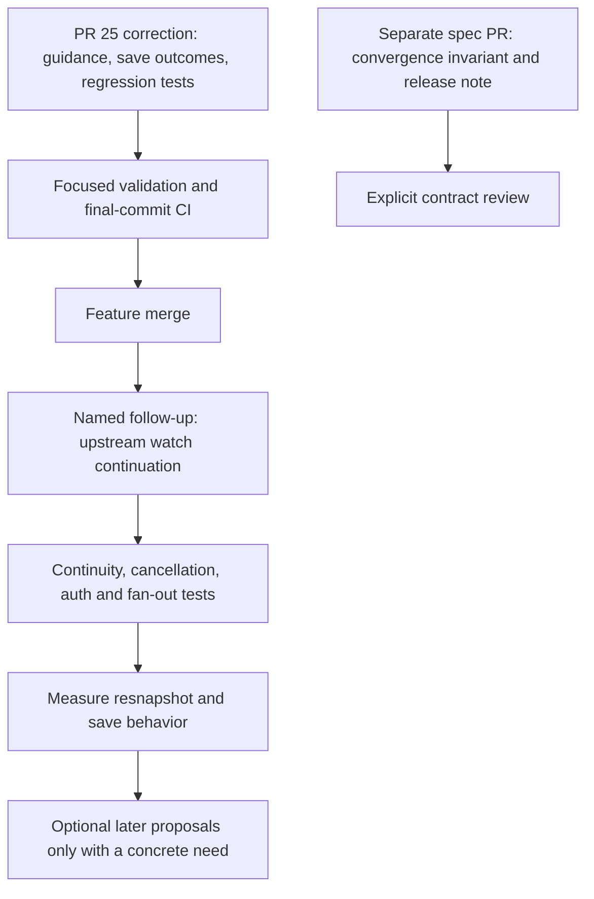
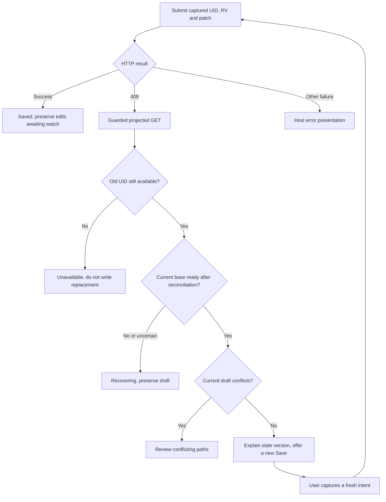
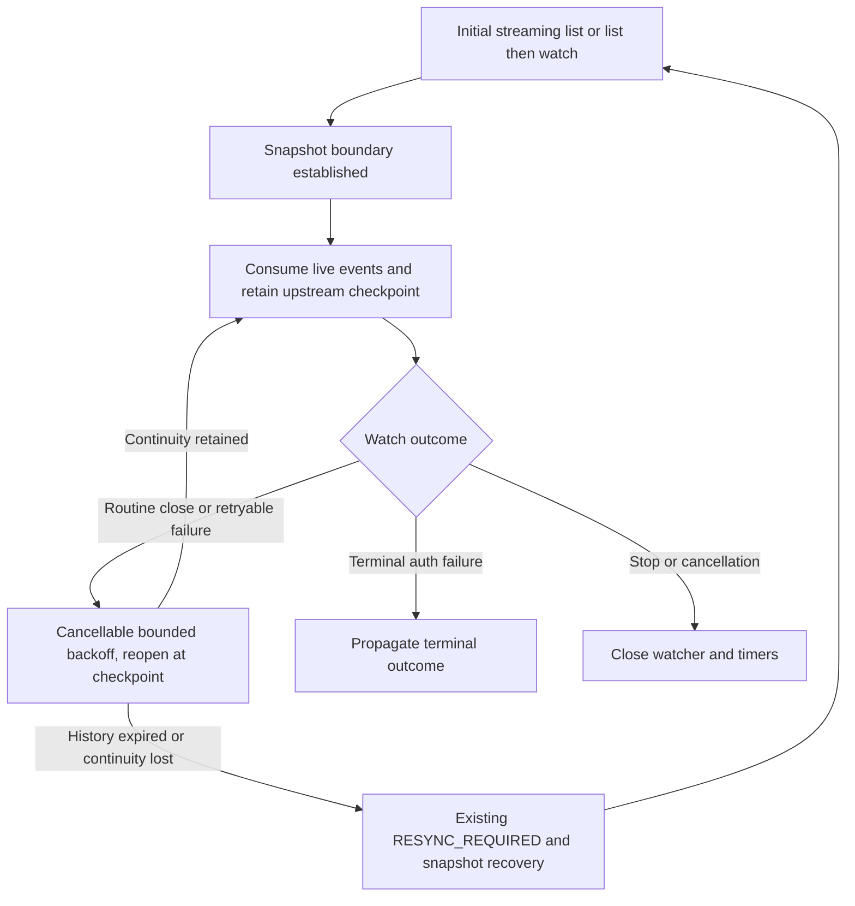

# Proposal 0006: Implementation plan for stream and save semantics

**Status: proposed work breakdown. This document does not implement or approve runtime changes.**

[Proposal 0005](0005-kubernetes-stream-and-save-semantics.md) explains the tradeoffs. This document
supersedes its phase list for sequencing, merge gates and acceptance criteria. Keep Kubernetes in
charge of identity and conditional writes, keep credentials and writes host-owned, and compose the
existing stream, shared backend and draft store. The original priorities remain managed recovery,
bounded subscriber reauthorization and a complete conditional-save example.

## 1. Review decisions

| Feedback | Decision |
|---|---|
| Separate the normative spec amendment from the feature PR | Agree. Review the convergence invariant in a dedicated PR, with release-note visibility. |
| Gate PR #25 on guidance and save outcomes | Agree, with focused regression tests included in the gate. Tests proving the corrected composition should not be deferred wholesale. |
| Copy the existing fake-timer pattern | Agree. `connection.test.ts` already demonstrates it; no public clock injection is needed. |
| Routine upstream closure resnapshots every shared subscriber | Confirmed in `sharedScope.pump` and `sharedScope.die`. Make continuation a named follow-up. |
| Upstream closure is the dominant source of resnapshots | Not established. It is a fan-out multiplier; dominance depends on closure frequency, browser reconnects and slow-consumer overflow. Measure before claiming it. |
| A snapshot can reject the post-409 GET | Confirmed. The guard also rejects responses spanning a snapshot epoch, even if that snapshot has finished. Preserve the guard and explain recovery. |
| A refused GET means the user must click again | Qualify. A newer watch may already have supplied the base. Re-read current state; wait when recovery is incomplete. Never infer the rejection reason from the boolean alone. |
| The five-second auth example disagrees with the default | No behavioral mismatch: the example explicitly overrides the timeout and the adjacent prose says zero uses ten seconds. Label the override more clearly. |

The review's example of an identical SSA reapply advancing resourceVersion is not a guaranteed
fixture: a server may treat an operation as a no-op. Tests must demonstrate an actual persisted
change and a changed RV before asserting suppression. Neither SSA nor more frequent version
notifications replaces the conditional-save behavior we need to demonstrate.

## 2. Work boundaries and merge gate

**PR #25 is ready to merge when save outcomes and guidance are corrected, the focused recovery/save
regressions below pass, and CI passes on its final commit; normative spec changes and upstream
continuation belong to separately reviewed PRs.**

This is the proposed gate, not a report that these checks have already run. If #25 has merged by
implementation time, put this same bounded correction in a follow-up PR.

The spec PR can be prepared alongside the correction. PR #25 should link the known invariant issue
and describe actual delivery behavior without silently rewriting the normative text. Resolve the
spec PR before the next release that presents this contract as settled. Separating review is not a
reason to leave contradictory guarantees indefinitely.

## 3. PR #25 correction: guidance and a small host example

### Documentation changes

| Files | Concrete change |
|---|---|
| [Saving guide](../saving.md), [conditional-save README](../../examples/conditional-save/README.md) | Describe held RV as the last delivered revision for every projection. Explain safe rejection versus progress under churn, accepted GET base advancement, and arrays as whole-value merge-patch replacements. |
| [Store API comments](../../packages/krm-stream/src/store.ts) | Explain that an authoritative same-UID upsert can restore redaction metadata; a new snapshot is one recovery route. Keep response guards explicit. |
| [Auth guide](../auth.md) | Label five seconds as an example override of the ten-second default. Do not change the default to make an example match. |
| [Examples index](../../examples/README.md) and root README | Link one complete adoption path and distinguish optional managed recovery from low-level transport access. Avoid repeating the whole save guide. |

Name SSA and deliberate JSON Patch as host-owned alternatives, with links to proposal 0005's
tradeoffs. Do not add another save engine. Explain that client-requested projections remain subject
to host policy and currently bundle content and notification behavior. Keep current projection
names and the full default in this correction.

### Save outcomes

Change [editor.ts](../../examples/conditional-save/editor.ts), with tests that exercise this exported
example directly. Keep a local result type in the example, not a new core API or wire event family.
The exact spelling may change during implementation; the following distinctions must survive:

| Outcome | Meaning and host presentation |
|---|---|
| `unchanged` / `busy` | No patch, or a save is already in flight. |
| `saved` | The write succeeded. Keep drafts and let the watch settle the store. |
| `draft-conflict` | Current store state contains conflicting editable paths. Show those paths. |
| `version-stale` | The write returned 409 and current state is ready for a newly captured intent, without draft conflicts. Explain the changed base and offer Save again. |
| `recovering` | A usable base is not established. Preserve the draft and wait for stream/metadata recovery. |
| `unavailable` | The old UID is missing or the read identifies its replacement. Open a replacement as a separate editor. |

Transport and validation failures should remain explicit host errors with useful status information;
they must not become `draft-conflict`. A successful PATCH response must never overwrite newer watch
state or clear edits typed while the request was in flight.

The example already requires a live connection. Make that requirement executable through a small
host-supplied readiness callback using the existing managed connection state. Recheck it after awaits;
being live at the first click does not imply being live when the GET returns. Do not create a second
connection controller in the example.

On 409, capture the reconciliation guard before GET, then inspect its result and current store state.
A rejected GET can mean newer data won, the resource disappeared, a snapshot intervened, or redaction
metadata is insufficient. The boolean is not an error taxonomy. If readiness cannot be established
from existing state, conservatively return `recovering`; do not add a public diagnostic API merely
to label every rejection. Clear a recovery wait only after relevant stream progress and readiness,
not because another click or a timer elapsed. Keep any temporary subscriptions scoped and cleaned up.

No automatic write retry. No replacement of an old patch's RV with the GET's RV. No GET admitted as
snapshot membership. These constraints keep the example useful without turning it into a writer
framework.

## 4. Required regression coverage

| Test location | Scenario and assertion |
|---|---|
| [Connection tests](../../packages/krm-stream/test/connection.test.ts) | Reuse `t.mock.timers` and the existing asynchronous flush pattern. Verify sustained health resets both budget and backoff, brief live periods still exhaust, and close/reset cancels the health timer. Preserve coverage while simplifying setup. |
| [Reauthorization tests](../../gateway/reauthorize_test.go) | Drive `Gateway.Stream`: recheck pending, upstream closes, subscriber sees recoverable error followed by reset/synced. Use synchronization barriers, not sleeps. Explicit denial and timeout remain terminal for only the affected subscriber. |
| Example tests, wired into the existing TypeScript test task | Exercise the actual `conditionalEditor` through a fake host request and real store: 409 with no field conflict, real draft conflict, newer watch/GET winning, edits during save, missing/replaced UID and request failure. No new test framework. |
| [Saving tests](../../packages/krm-stream/test/saving.test.ts) plus example tests | GET arriving during a snapshot and GET spanning a completed snapshot are refused. Drafts survive and snapshot pruning remains correct. A later authoritative update can restore readiness; no blind retry or endless click loop. |
| [Gateway stream tests](../../gateway/stream_test.go) | Spec suppresses a status-only RV change; full delivers that visible change. Both suppress an RV change whose only other changes are stripped bookkeeping metadata. |
| [Real API tests](../../gateway/kube/e2e_test.go) and [host handler tests](../../gateway/kube/examples/conditionalsave/handler_test.go) | Prove actual stale-RV 409 and preservation of the winning object. Combine wire/store tests with this API evidence rather than treating a fake 409 as proof of Kubernetes behavior. |

For the status/save composition, use a resource with a real status subresource and an existing host
validation pattern. Do not pretend a ConfigMap's arbitrary `status` field establishes that behavior,
and do not generalize the ConfigMap example into an unrestricted write endpoint just for testing.
Require: status update advances RV, spec update is suppressed, stale PATCH returns 409, guarded GET
advances the base without a draft conflict, and a fresh intent succeeds once churn stops.

Add one schedule combining churn and resnapshot: save starts while live, controller advances RV,
upstream closure starts a snapshot, and the post-409 GET arrives before synced. Assert recovery
presentation and later progress rather than asking the user to resolve an empty conflict list.

Force deletion/recreation between the host's preflight read and PATCH using a test-only client
wrapper/barrier. Record the structured API Status and verify the replacement UID's contents remain
unchanged. Keep exact 409/422 classification evidence-based. Only normalize a specifically proven
identity-mismatch case; ordinary validation errors retain their meaning. This safety assertion belongs
in the correction; expanding host error normalization beyond what the test proves does not.

**Acceptance:** the original winner and drafts are preserved, outcomes describe current state, and
normal version rejection never requires imaginary field conflicts. The added tests run from existing
tasks and CI rather than relying on an unrecorded manual probe.

## 5. Separate PR: define convergence precisely

Change [spec/v1.md](../../spec/v1.md), [proposal 0004](0004-views-and-bytes.md), affected conformance
wording/tests and release notes together. Adopt proposal 0005's recommended convergence over projected
content excluding `metadata.resourceVersion`, plus redaction records, unless explicit review chooses
a different emission contract.

State that delivered RV belongs to the delivered revision, suppressed updates do not refresh it,
and it is neither a freshness guarantee nor a downstream cursor. Preserve snapshot completeness,
pruning, ordering and per-connection redaction semantics. Distinguish stream quiescence from immediate
equality while updates are still in flight.

Add a contract case where the final write changes only ignored metadata: no event is emitted, visible
content converges, and held RV remains older. Add the spec-only status counterpart. Existing event
fixtures need no changes unless the reviewed decision actually changes emissions.

**Acceptance:** invariant, suppression rules, conformance assertions and save guidance agree. The
release note explicitly identifies the narrowed invariant. This is a normative correction with
unchanged intended runtime behavior, not a feature hidden in editorial cleanup.

## 6. Named follow-up: continue upstream watches without resnapshotting subscribers

Implement behind [the Kubernetes backend](../../gateway/kube/backend.go) and its existing `Watcher`
seam. Kubernetes supports continuing from a retained watch version and rebuilding state after history
expires. Use that upstream mechanism; downstream v1 remains snapshot-based on a new connection.
[Kubernetes watch semantics](https://kubernetes.io/docs/reference/using-api/api-concepts/#efficient-detection-of-changes)

First assess the client-go watch utilities available in the repository's pinned version. Prefer a
compatible upstream utility when it preserves our initial-snapshot boundary, cancellation and error
semantics. Do not introduce an informer/cache hierarchy merely to restart a watch. Document why the
chosen utility fits, or why a small internal loop is needed.

Implementation constraints:

- Retain checkpoints from upstream events and bookmarks before projection/suppression. Never derive
  them from a browser object, SSE seq or shared projected view. Do not require bookmark cadence.
- Continue only with a trustworthy checkpoint and established initial boundary. A failed partial
  snapshot must not be relabeled as live or completed by guessing.
- Preserve both streaming-list and list-then-watch paths, including aggregated APIs that reject
  streaming lists. The [recorded cluster observations](../facts/observed-v1.36.2+k3s1.md) are evidence
  for that environment, not universal claims about every Kubernetes API server.
- Reuse existing error and cancellation seams. Bound backoff and repeated failure handling so a dead
  upstream cannot leave subscribers reporting live forever. Specify the exhaustion transition before
  implementation; avoid adding public retry knobs without a demonstrated host need.
- Recheck the auth implications: fewer cycles mean fewer cycle-only authorization checks and fewer
  `ClientFor` refresh calls. Timed subscriber checks must keep running during upstream recovery.
  Document refreshing credentials and revocation expectations; do not accidentally weaken them.
- Keep single-subscriber overflow recovery and the shared cache's ownership intact. Last subscriber
  departure must cancel an in-progress reconnect. No second shared-watch implementation.

Test retained-history continuation with at least two subscribers: a routine close causes one upstream
reopen, no new downstream reset, and subsequent changes reach both. Test checkpoint progress on a
suppressed update/bookmark, deletion during the interruption, 410 fallback, partial initial snapshot,
forbidden response, repeated transient failure, cancellation and subscriber departure. Exercise both
initialization paths against the real API server where supported.

Measure baseline and changed runs with the same workload: upstream reopen count, downstream reset
count by cause, serialized bytes, recovery duration and save 409 rate. Use existing observations where
possible. A 1 MB snapshot delivered to 200 subscribers costs roughly 200 MB before compression whether
triggered by browser reconnects or a shared upstream recycle; this is an illustration, not a measured
production rate. Successful continuation avoids that particular reset, not every possible resnapshot.

**Acceptance:** retained-history recycling preserves downstream continuity, lost history still
recovers safely, retries stop correctly, and authorization/credential lifecycle expectations remain
explicit. No new SSE events or downstream replay protocol.

## 7. Verification and completion

For the correction, use the existing task definitions for client/example tests, Go tests with race
detection, wire/browser integration, lint, fixture checks and package validation. Verify any added
example test is actually discovered, not merely typechecked. Run the real API cases via
`task test-cluster`; attach the server version and results to the implementation PR.

Current CI does not execute the real-cluster suite on every PR. Add a focused real-API job for the
new save/identity cases using the existing cluster tooling, or wire them into an explicitly invoked
workflow whose successful run is part of the merge evidence. Keep the broader aggregated-API suite
available through `task test-cluster`; don't imply a fake-client job covers API behavior. Update Task
and workflow comments to match whichever coverage is implemented.

After pushing each implementation PR, inspect checks on that exact commit and report required checks,
failures and any explicitly separate integration run. A previous green commit is not evidence for the
new code. Documentation-only edits need link and Mermaid validation, not a cluster rebuild.

## 8. Deliberately deferred

Version-only wire events, independent content/delivery switches, downstream replay, write tickets,
automatic conflict-free retry and a general SSA save abstraction need separate concrete use cases.
A future “omit status, report versions” contract must be client-requestable within host policy and
must not silently change spec-only subscribers' current quiet behavior.

Keep the optional Vue adapter thin and outside core dependencies. Keep the clearer authorizer naming
already introduced; no further naming sweep is needed to solve these problems. The next useful work
is a precise contract and an example people can copy safely, followed by upstream continuation through
Kubernetes' existing watch mechanisms.
