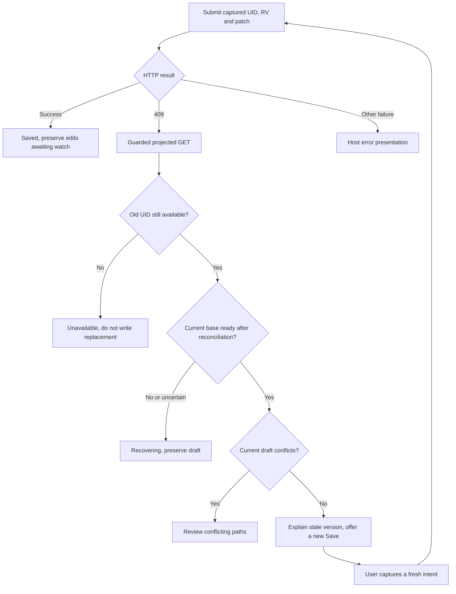
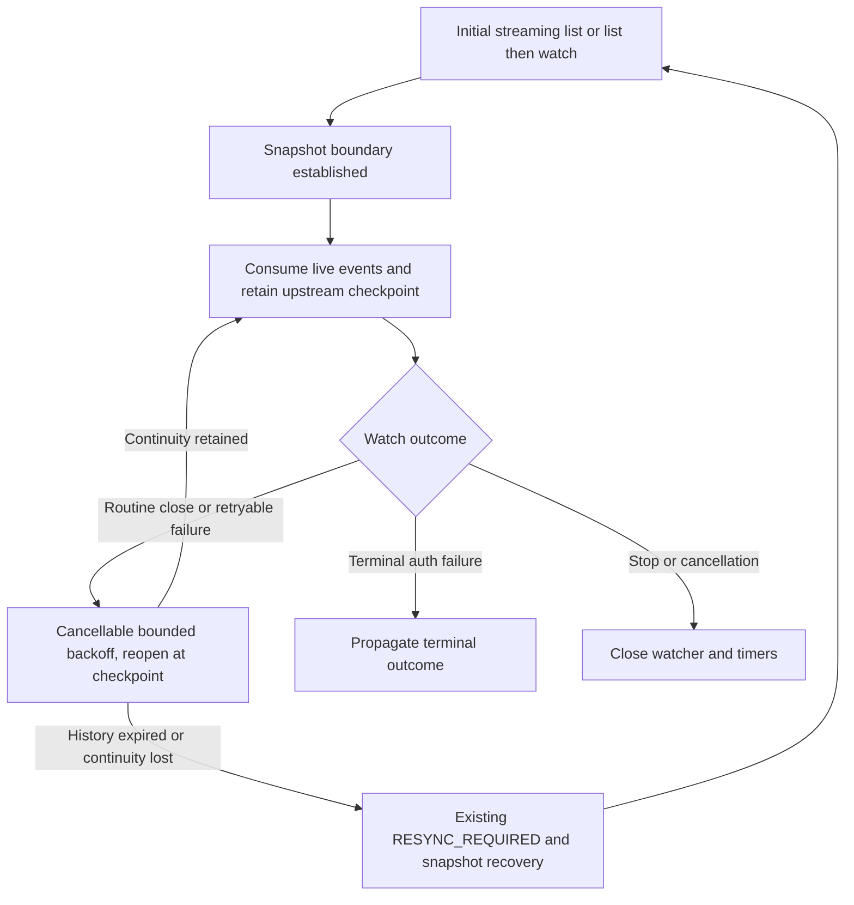

# Proposal 0006: Implementation plan for stream and save semantics

**Status: active follow-up plan, reviewed 2026-09-11 against 0.3.0 and the first adopter’s feedback.**

This document records shipped work separately from pending work. It does not approve runtime or
protocol changes. The adopter report supports migration; it does not establish application readiness
or 200-attendee capacity.

[Proposal 0005](0005-kubernetes-stream-and-save-semantics.md) explains the tradeoffs. This document
supersedes its phase list for sequencing, merge gates and acceptance criteria. Keep Kubernetes in
charge of identity and conditional writes, keep credentials and writes host-owned, and compose the
existing stream, shared backend and draft store. Managed recovery, bounded subscriber
reauthorization and the conditional-save example shipped in 0.3.0. Adopt those primitives now; the
remaining priorities are the convergence contract, adoption guidance, real-API composition hardening
and measured upstream continuation.

## Design rule: a small library with explicit guarantees

Make the library do its stated job well: projected streams, bounded recovery and authorization,
and one draft store with safe conditional-save primitives. Keep host policy and writes in the host.
Judge follow-ups by whether they close a documented guarantee or a demonstrated adoption gap.

Before 1.0, keep one current API name and remove superseded aliases and forwarding packages. This
follow-up removes `SSARAuthorizer` in favor of `SubjectAccessReviewAuthorizer` and deletes the local
unscoped npm forwarder in favor of `@configbutler/krm-stream`. Update callers, examples and release
notes together. This is an intentional source API break, not a change to downstream v1 semantics.

For each planned addition, identify the promised behavior, the smallest implementation that delivers
it, and observable acceptance evidence. Prefer documentation and composition of existing APIs when
sufficient. Retain mechanisms needed for supported behavior, including aggregated-API list/watch
fallback and guarded reconciliation. Do not add speculative options, parallel controllers or new
abstractions merely to preserve old names or hide unresolved guarantees.

## 1. Shipped baseline and remaining priorities

The local [0.3.0 changelog](../../packages/krm-stream/CHANGELOG.md) records the integration feature.
Release commit `209537c46a98bf896f162df36c09b927864119aa` is the adopter's runtime baseline; its
reviewed main was `2154f9d`. These are source/release references, not new validation runs.

| Work | Status and evidence | Remaining action |
|---|---|---|
| Managed recovery | Shipped: [connection.ts](../../packages/krm-stream/src/connection.ts), [tests](../../packages/krm-stream/test/connection.test.ts) | Hosts wire cookie transport, terminal auth UI, exhaustion and owned connection cleanup. Test simplification remains optional hardening. |
| Bounded shared authorization | Shipped: [auth guide](../auth.md), [reauthorization tests](../../gateway/reauthorize_test.go), including stream teardown/recovery | Hosts enforce session expiry and bounded callbacks/sinks; measure revocation under load. |
| Conditional save and guarded recovery | Shipped: [editor.ts](../../examples/conditional-save/editor.ts), directly executed [saving tests](../../packages/krm-stream/test/saving.test.ts) | Complete real-status-subresource composition and preflight/PATCH UID-race evidence (§4). |
| Vue adapter and authorizer naming | Shipped: copyable [Vue adapter](../vue.md), `SubjectAccessReviewAuthorizer` (0.3.0 also included the old alias) | Alias removed in this follow-up; use the current name. No Vue package needed. |
| Precise convergence contract | Pending: spec §6 still has broad equality wording | Dedicated normative amendment, conformance cases and release note (§5). |
| Deletion and keep-local guidance | Deletion behavior exists; complete resolution recipe still pending | Document recovery before pruning; add a tested resolve-and-reapply recipe (§3). |
| Upstream continuation | Pending | Baseline measurements, backend implementation and same-workload comparison (§6). |

The adopter reports 30 connection/save tests, gateway race tests, kube tests and two Vue tests passing
on its reviewed main. It did not run the real-cluster suite, consumer migration, browser acceptance or
200-user load test. Do not mark those gates complete from that report or from fake-client CI.

The review's example of an identical SSA reapply advancing resourceVersion is not a guaranteed
fixture: a server may treat an operation as a no-op. Tests must demonstrate an actual persisted
change and a changed RV before asserting suppression. Neither SSA nor more frequent version
notifications replaces the conditional-save behavior we need to demonstrate.

## 2. Work boundaries and order

PR #25's feature and bounded correction shipped in 0.3.0; its former merge gate is historical.
Sections 3–4 retain the implemented contract and identify remaining guidance and hardening work.
Do not commission a replacement recovery manager, draft store or save controller.

1. Finish the dedicated convergence amendment (§5), including conformance and release notes, before
   the next release presenting the contract as settled.
2. Keep the [adoption guide](../adopting.md) → [saving guide](../saving.md) →
   [conditional-save example](../../examples/conditional-save/README.md) route current. Complete the
   deletion/keep-local guidance and tests below. Hosts can migrate to 0.3.0 now.
3. Complete real-API save/status and identity-race hardening (§4), with exact-commit evidence (§7).
4. Measure upstream recycling, implement continuation (§6), then compare the same workload.
   Baseline collection can begin alongside the contract and hardening work.
5. Consider downstream replay or different version delivery only if those measurements justify it.

The spec amendment, API hardening and continuation have separate review scopes. No downstream v1
change or generalized write framework is required for this adoption.

## 3. Adoption contract: shipped behavior and remaining guidance

The save outcomes and core guidance shipped in 0.3.0. The table records documentation requirements
to retain and complete during follow-ups; deletion/keep-local acceptance work remains pending.

### Documentation requirements

| Files | Concrete change |
|---|---|
| [Saving guide](../saving.md), [conditional-save README](../../examples/conditional-save/README.md) | Describe held RV as the last delivered revision for every projection. Explain safe rejection versus progress under churn, accepted GET base advancement, and arrays as whole-value merge-patch replacements. |
| [Store API comments](../../packages/krm-stream/src/store.ts) | Explain that an authoritative same-UID upsert can restore redaction metadata; a new snapshot is one recovery route. Keep response guards explicit. |
| [Auth guide](../auth.md) | Label five seconds as an example override of the ten-second default. Do not change the default to make an example match. |
| [Examples index](../../examples/README.md) and root README | Link one complete adoption path and distinguish optional managed recovery from low-level transport access. Avoid repeating the whole save guide. |

Name SSA and deliberate JSON Patch as host-owned alternatives, with links to proposal 0005's
tradeoffs. Do not add another save engine. Explain that client-requested projections remain subject
to host policy and currently bundle content and notification behavior. Keep current projection
names and the full default during these follow-ups.

### Save outcomes

The copyable [editor.ts](../../examples/conditional-save/editor.ts) has tests that exercise it
directly. It is not a core package export. Keep a local result type in the example, not a new core API
or wire event family.
Preserve these existing distinctions:

| Outcome | Meaning and host presentation |
|---|---|
| `unchanged` / `busy` | No patch, or a save is already in flight. |
| `saved` | The write succeeded. Keep drafts and let the watch settle the store. |
| `draft-conflict` | Current store state contains conflicting editable paths. Show those paths. |
| `version-stale` | The write returned 409 and current state is ready for a newly captured intent, without draft conflicts. Explain the changed base and offer Save again. |
| `recovering` | A usable base is not established. Preserve the draft and wait for stream/metadata recovery. |
| `unavailable` | The old UID is missing or the read identifies its replacement. Open a replacement as a separate editor. |

Transport and validation failures should remain explicit host errors with useful status information;
they must not become `draft-conflict`. A successful PATCH response must never overwrite newer watch
state or clear edits typed while the request was in flight.

The example enforces a live connection through a small host-supplied readiness callback using the
existing managed connection state. Keep checking it after reconciliation;
being live at the first click does not imply being live when the GET returns. Do not create a second
connection controller in the example.

On 409, capture the reconciliation guard before GET, then inspect its result and current store state.
A rejected GET can mean newer data won, the resource disappeared, a snapshot intervened, or redaction
metadata is insufficient. The boolean is not an error taxonomy. If readiness cannot be established
from existing state, conservatively return `recovering`; do not add a public diagnostic API merely
to label every rejection. The example conservatively requires a later guarded GET accepted while
live before permitting a new write. A recovery click performs only that read; it does not clear the wait by itself. This
avoids subscriptions and diagnostic APIs at the cost of an extra read when a watch already won.

No automatic write retry. No replacement of an old patch's RV with the GET's RV. No GET admitted as
snapshot membership. These constraints keep the example useful without turning it into a writer
framework.

### Remaining adoption guidance and acceptance

Use one store as the editable source of truth. The host may keep a recovery copy of unsaved work,
but must not reconcile server snapshots into a second active draft or maintain a second conflict
registry. `captureSave`, `captureReconciliation` and `connectManagedResourceStream` are core APIs;
the conditional editor and Vue composable are copyable examples. Keep `krm-full/v1` as the adoption
default, without promising fresh RVs for suppressed bookkeeping changes.

- **User outcomes:** keep the [saving guide's presentation table](../saving.md#what-the-person-editing-sees)
  aligned with example outcomes. Separate Kubernetes acceptance, watch confirmation and any host Git
  workflow. A receipt-only HTTP 200 is a valid host alternative to 204; parse its explicit receipt
  schema in the host without adopting a raw write object. Add a host-example test when implementing
  receipt parsing; the current example accepts successful status and does not parse receipts.
- **Deletion:** retain a detached recovery copy while the UID exists, before `removeResource` or
  snapshot pruning can discard its draft. Explain storage lifetime and identity-scoped cleanup; offer
  copy-out, never automatic application to a replacement UID. Vue's null state is too late to read
  the removed draft. Test deletion and snapshot pruning with unsaved work and fixed-UID remounting.
- **Explicit keep-local:** add a tested recipe that captures the chosen local value (including
  absence), resolves that path with `takeTheirs`, then synchronously reapplies the choice through
  `setValue` or `removeKey`. Verify nested paths, deletion, whole-array replacement and policy/redaction
  refusal against current store behavior before publishing executable guidance. Preserve unrelated
  edits/conflicts and capture a fresh save intent only after review. Consider a small helper only if
  repeated consumer code warrants it; do not add another merge algorithm or conflict registry.
- **Consumer acceptance:** separately pin npm and both Go modules, verify their declared toolchains
  in the consumer's CI/image, and test concurrent edits, later typing during save, session expiry,
  deletion/recreation and recovery in its browser. For Voter, 30s recheck / 5s timeout and a 60s
  termination target are host acceptance settings, not a library load guarantee. Test at the actual
  200-attendee workload with bounded sinks/callbacks before claiming capacity.

**Done when:** the primary adoption route explains these boundaries, the new recipes execute in
existing tests, and consumer-specific acceptance evidence remains distinct from library CI.

## 4. Regression coverage and follow-ups

The example outcomes, guarded-read cases and `Gateway.Stream` teardown/recovery regression shipped.
The table below is the regression contract to preserve, not a wholly open backlog. Real-API
status/save composition and UID-race classification remain required follow-up hardening; the ordinary
real-API stale-RV test exists but does not establish either composition case.

| Test location | Scenario and assertion |
|---|---|
| [Connection tests](../../packages/krm-stream/test/connection.test.ts) | Reuse `t.mock.timers` and the existing asynchronous flush pattern. Verify sustained health resets both budget and backoff, brief live periods still exhaust, and close/reset cancels the health timer. Preserve coverage while simplifying setup. |
| [Reauthorization tests](../../gateway/reauthorize_test.go) | Drive `Gateway.Stream`: recheck pending, upstream closes, subscriber sees recoverable error followed by reset/synced. Use synchronization barriers, not sleeps. Explicit denial and timeout remain terminal for only the affected subscriber. |
| Example tests, wired into the existing TypeScript test task | Exercise the actual `conditionalEditor` through a fake host request and real store: 409 with no field conflict, real draft conflict, newer watch/GET winning, edits during save, missing/replaced UID and request failure. No new test framework. |
| [Saving tests](../../packages/krm-stream/test/saving.test.ts) plus example tests | GET arriving during a snapshot and GET spanning a completed snapshot are refused. Drafts survive and snapshot pruning remains correct. A later authoritative update can restore readiness; no blind retry or endless click loop. |
| [Gateway stream tests](../../gateway/stream_test.go) | Spec suppresses a status-only RV change; full delivers that visible change. Both suppress an RV change whose only other changes are stripped bookkeeping metadata. |
| [Real API tests](../../gateway/kube/e2e_test.go) and [host handler tests](../../gateway/kube/examples/conditionalsave/handler_test.go) | Prove actual stale-RV 409 and preservation of the winning object. Combine wire/store tests with this API evidence rather than treating a fake 409 as proof of Kubernetes behavior. |

For the status/save composition, use a resource with a real status subresource and an existing host
validation pattern. Do not pretend a ConfigMap's arbitrary `status` field establishes that behavior,
and do not generalize the ConfigMap example into an unrestricted write endpoint just for testing.
Require: status update advances RV, its spec-projected notification is suppressed, stale PATCH
returns 409, guarded GET advances the base without a draft conflict, and a fresh intent succeeds once churn stops.

Add one schedule combining churn and resnapshot: save starts while live, controller advances RV,
upstream closure starts a snapshot, and the post-409 GET arrives before synced. Assert recovery
presentation and later progress rather than asking the user to resolve an empty conflict list.

Force deletion/recreation between the host's preflight read and PATCH using a test-only client
wrapper/barrier. Record the structured API Status and verify the replacement UID's contents remain
unchanged. Keep exact 409/422 classification evidence-based. Only normalize a specifically proven
identity-mismatch case; ordinary validation errors retain their meaning. This race test and any
resulting classification belong in follow-up hardening; do not change normalization before the
evidence exists.

**Acceptance:** the original winner and drafts are preserved, outcomes describe current state, and
normal version rejection never requires imaginary field conflicts. The added tests run from existing
tasks and CI rather than relying on an unrecorded manual probe.

## 5. Separate PR: define convergence precisely

Change [spec/v1.md](../../spec/v1.md), [proposal 0004](0004-views-and-bytes.md), affected conformance
wording/tests and release notes together. Adopt proposal 0005's recommended convergence over projected
content excluding `metadata.resourceVersion`, plus redaction records, unless explicit review chooses
a different emission contract.

State that delivered RV belongs to the delivered revision, suppressed updates do not refresh it,
and it is neither a freshness guarantee nor a downstream cursor. Preserve snapshot completeness,
pruning, ordering and per-connection redaction semantics. Distinguish stream quiescence from immediate
equality while updates are still in flight.

Add a contract case where the final write changes only ignored metadata: no event is emitted, visible
content converges, and held RV remains older. Add the spec-only status counterpart. Existing event
fixtures need no changes unless the reviewed decision actually changes emissions.

**Acceptance:** invariant, suppression rules, conformance assertions and save guidance agree. The
release note explicitly identifies the narrowed invariant. This is a normative correction with
unchanged intended runtime behavior, not a feature hidden in editorial cleanup.

## 6. Named follow-up: continue upstream watches without resnapshotting subscribers

Implement behind [the Kubernetes backend](../../gateway/kube/backend.go) and its existing `Watcher`
seam. Kubernetes supports continuing from a retained watch version and rebuilding state after history
expires. Use that upstream mechanism; downstream v1 remains snapshot-based on a new connection.
[Kubernetes watch semantics](https://kubernetes.io/docs/reference/using-api/api-concepts/#efficient-detection-of-changes)

First assess the client-go watch utilities available in the repository's pinned version. Prefer a
compatible upstream utility when it preserves our initial-snapshot boundary, cancellation and error
semantics. Do not introduce an informer/cache hierarchy merely to restart a watch. Document why the
chosen utility fits, or why a small internal loop is needed.

Implementation constraints:

- Retain checkpoints from upstream events and bookmarks before projection/suppression. Never derive
  them from a browser object, SSE seq or shared projected view. Do not require bookmark cadence.
- Continue only with a trustworthy checkpoint and established initial boundary. A failed partial
  snapshot must not be relabeled as live or completed by guessing.
- Preserve both streaming-list and list-then-watch paths, including aggregated APIs that reject
  streaming lists. The [recorded cluster observations](../facts/observed-v1.36.2+k3s1.md) are evidence
  for that environment, not universal claims about every Kubernetes API server.
- Reuse existing error and cancellation seams. Bound backoff and repeated failure handling so a dead
  upstream cannot leave subscribers reporting live forever. Specify the exhaustion transition before
  implementation; avoid adding public retry knobs without a demonstrated host need.
- Recheck the auth implications: fewer cycles mean fewer cycle-only authorization checks and fewer
  `ClientFor` refresh calls. Timed subscriber checks must keep running during upstream recovery.
  Document refreshing credentials and revocation expectations; do not accidentally weaken them.
- Keep single-subscriber overflow recovery and the shared cache's ownership intact. Last subscriber
  departure must cancel an in-progress reconnect. No second shared-watch implementation.

Test retained-history continuation with at least two subscribers: a routine close causes one upstream
reopen, no new downstream reset, and subsequent changes reach both. Test checkpoint progress on a
suppressed update/bookmark, deletion during the interruption, 410 fallback, partial initial snapshot,
forbidden response, repeated transient failure, cancellation and subscriber departure. Exercise both
initialization paths against the real API server where supported.

Measure baseline and changed runs with the same workload: upstream reopen count, downstream reset
count by cause, snapshot bytes and duration, browser deserialization/reconciliation cost, recovery
latency, access-review rate/latency and save 409 rate. Also record the fraction of 409s with no field
conflicts and whether the next deliberately captured save succeeds once churn stops. Include routine
recycling, browser reconnects, slow subscribers and access revocation. Keep metric labels bounded;
do not label by UID, username or opaque RV. Use existing observations where possible. A 1 MB snapshot delivered to 200 subscribers costs roughly 200 MB before compression whether
triggered by browser reconnects or a shared upstream recycle; this is an illustration, not a measured
production rate. Successful continuation avoids that particular reset, not every possible resnapshot.

**Acceptance:** retained-history recycling preserves downstream continuity, lost history still
recovers safely, retries stop correctly, and authorization/credential lifecycle expectations remain
explicit. No new SSE events or downstream replay protocol.

## 7. Verification and completion

For runtime follow-ups, use the existing task definitions for client/example tests, Go tests with race
detection, wire/browser integration, lint, fixture checks and package validation. Verify any added
example test is actually discovered, not merely typechecked. Run the real API cases via
`task test-cluster`; attach the exact tested commit, server version, command, scenario and results
to the implementation PR. Record skips and unrun cases explicitly, separately from fake-client CI.

Current CI does not execute the real-cluster suite on every PR. In the follow-up hardening PR, add
a focused real-API job for the new save/identity cases using the existing cluster tooling, or wire them into an explicitly invoked
workflow whose successful run is part of the merge evidence. Keep the broader aggregated-API suite
available through `task test-cluster`; don't imply a fake-client job covers API behavior. Update Task
and workflow comments to match whichever coverage is implemented.

After pushing each implementation PR, inspect checks on that exact commit and report required checks,
failures and any explicitly separate integration run. A previous green commit is not evidence for the
new code. Documentation-only edits need link and Mermaid validation, not a cluster rebuild.

## 8. Deliberately deferred

Version-only wire events, independent content/delivery switches, downstream replay, write tickets,
automatic conflict-free retry and a general SSA save abstraction need separate concrete use cases.
A future “omit status, report versions” contract must be client-requestable within host policy and
must not silently change spec-only subscribers' current quiet behavior.

Keep the optional Vue adapter thin and outside core dependencies. Keep the clearer authorizer naming
already introduced; no further naming sweep is needed to solve these problems. The next useful work
is a precise contract, remaining adoption guidance and real-API hardening, followed by measured
upstream continuation through Kubernetes' existing watch mechanisms.
