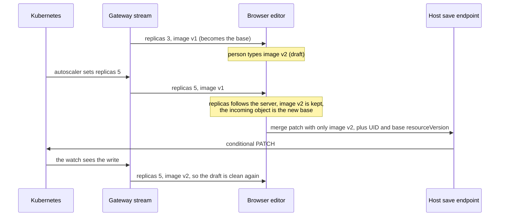
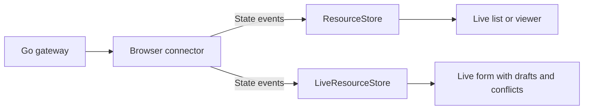

# Proposal 0009 Stream and editor separation

**Status: proposed implementation plan.** The APIs below are proposed; they are not available yet.
Source review baseline: `a8281c5`, 2026-10-04.

krm-stream should make live Kubernetes resources easy to consume, with editing available as an
additional layer. Keep one repository, one npm package and the existing lockstep release process.
Separate browser transport and authoritative resource state from local drafts, three-way
reconciliation, conflicts and patch capture. The Go gateway continues to serve the same v1 protocol.

Follow the [design rules](../../CONTRIBUTING.md#design-rules) and
[release policy](../releasing.md). This proposal owns the separation; existing behavioral follow-ups
remain in [proposal 0006](0006-stream-and-save-implementation-plan.md).

## Why live watches and three-way merge belong together

This section is background for readers new to the library. The rest of the proposal assumes it.

### A live copy of a shared object

A Kubernetes object is shared. Controllers write `status`, an autoscaler changes `spec.replicas`,
GitOps tooling and other people edit labels and spec. A browser page holds a copy of something other
parties keep changing.

The stream keeps that copy current. The gateway authorizes the user's subscription, trims each
object to what the user may see (the projection), and sends complete projected objects as visible
state changes. It may suppress bookkeeping-only changes or coalesce intermediate updates. The
browser replaces its authoritative copy with each delivered object. After a reconnect the gateway
sends a fresh snapshot (`reset` … `synced`), and the browser drops whatever was not resent only when
that snapshot completes. The copy also recovers from deletes it missed while disconnected.

A resource list or status page needs nothing more: replace the object, re-render.

### Editing an object that keeps moving

Now put a form on the same object. Someone starts changing the image tag. Meanwhile the autoscaler
raises `spec.replicas` from 3 to 5, and the stream delivers the new object. The page can do one of
three things:

| Approach | What the person sees | Result |
|---|---|---|
| Replace the form with the new object | Their typing disappears | Lost work |
| Ignore updates while the form has edits | `replicas` still shows 3 | A stale form. A guarded save fails with 409; an unguarded full-object save puts `replicas` back to 3 |
| Three-way merge | `replicas` changes to 5 and the image tag stays as typed | Both changes kept. If both sides changed the same field, the form shows a conflict |

Replacing a form on every live update destroys edits. Freezing its server state while editing leaves
it stale. Three-way reconciliation lets this editor incorporate live state while preserving the
person's draft and exposing conflicts for review.

### What the merge compares

The editor keeps two objects per resource: `server`, the last object the stream delivered, and
`draft`, that object plus the person's edits. When a new object arrives, each editable field is
compared three ways:

- **base**: the field in the current `server` object, which the draft was built against;
- **ours**: the field in the `draft`;
- **theirs**: the field in the incoming object.

If only theirs differs from base, the draft follows the server and the UI can highlight the change.
If only ours differs, the edit stays. If both changed it to the same value, they have converged. If
both changed it differently, the edit stays and the field is recorded as a conflict. The incoming
object then becomes `server`, and so the next base. The
[client state model](../client-state-model.md#editing-and-conflicts) has the full table.



### Why the editor uses the stream's guarantees

A merge is only as correct as its inputs. The stream supplies an authoritative base under a defined
identity, projection and recovery contract:

- Each resource update replaces the visible server copy, so removed fields do not linger.
- Resources are keyed by `uid`, so recreating a name never transfers an old draft to a new object.
- A completed snapshot repairs missed updates after reconnect; surviving resources keep their
  drafts.
- A captured save binds the person's patch to the identity and version they reviewed.

Projection and redaction determine what the person may see and edit. Snapshot pruning can remove a
deleted resource's draft, and merge patches replace arrays as whole values. The
[client state model](../client-state-model.md) and [saving guide](../saving.md) explain those
limits.

The live editor consumes the protocol's state; transport does not depend on the editor. The editor
can also reconcile directly supplied server objects without opening a connection. The current
connectors do not show that boundary: a list page must construct an editing store to use them. This
proposal makes transport deliver protocol events, adds a small read-only store for lists and
viewers,
and keeps the editor as the layer a live form adds. Both stores use the same stream contract.

## Current coupling and scope

The [protocol](../../spec/v1.md#10-conformance) already makes editing optional. Today all three
connectors take a concrete `LiveResourceStore`, and transport produces editor-specific
`StreamChange` results. The managed connector also detects reset through the editor's `onChange`
callback. The [root entry](../../packages/krm-stream/src/index.ts) exports transport and editing
alongside implementation utilities.

The connector imports of the store are type-only and disappear from JavaScript. The work is to
separate their contracts and state application, expose a read-only store, and simplify the public
browser API while touching these modules. Preserve merge behavior, gateway behavior and v1 wire
framing. [Proposal 0010](0010-gateway-api-cleanup.md) owns separate Go API cleanup.

## Ownership and dependencies



| Layer | Owns |
|---|---|
| Gateway | Authorization enforcement, projection, watches, framing and SSE delivery |
| Browser connector | Decoding, sequence checks, connection state, errors and bounded retries |
| Read-only store | Complete projected objects, redactions, UID membership and snapshot pruning |
| Editor store | Authoritative base, drafts, reconciliation, edit policy, conflicts and patch capture |
| Host | Credentials, identity, authorization policy, UI, writes and retention of deleted drafts |

A view chooses one active store. An editor keeps its own authoritative base; it does not mirror a
`ResourceStore`. Both stores use the same internal snapshot tracker, with a separate instance per
store. Share small value and dispatch helpers where useful. Keep framework adapters and a generic
merge library outside this work.

## One public connector

Make the existing managed fetch connector the only public connector, named `connectResourceStream`.
Move the existing single-connection fetch loop behind it as a private implementation. Remove
`connectManagedResourceStream` and `connectWithEventSource` rather than forwarding their old names.
Fetch already supports both same-origin cookies and bearer headers; a second public transport is
unnecessary for either authentication case.

The native EventSource helper closes on a sequence gap without arranging a new snapshot connection,
and leaves reconnect timing to the browser instead of enforcing the protocol's retry hints. This
is a limitation of that helper, not a reason to remove native SSE support from the gateway.

The proposed public signature is:

```ts
type ResourceEventConsumer = (event: ResourceStateEvent) => void;

function connectResourceStream(
  url: string,
  consume: ResourceEventConsumer,
  options?: ResourceStreamOptions,
): ResourceStreamHandle;
```

`ResourceStreamHandle` keeps `state`, `subscribe`, `close` and `closed`. `ResourceStreamOptions`
keeps `onError`, `signal`, injected fetch, credentials, headers and the existing retry settings.
Remove public `onOpen`, `onSynced`, `onGap`, `onStateChange` and `onChange`. Observe connection
state
through `state` plus `subscribe`, and errors through `onError`. Store results or subscriptions drive
rendering. A consumer already receives `synced` when it needs per-snapshot work.

Keep the existing statuses: `connecting`, `syncing`, `live`, `retrying`, `closed`, `terminal` and
`exhausted`. Defer opening until the handle exists so subscribers can observe the initial
transition.
Read `state` for initial presentation; `subscribe` observes subsequent publications. Preserve a
`live` publication after every completed snapshot, including when the previous status was live.
A sequence gap must remain diagnosable: add an optional `gap: { expected: number; received: number
}`
to the `retrying` state caused by that gap, clearing it on the next attempt. Keep other diagnostics
in `onError`; do not add another lifecycle callback or a general retry telemetry API.

### Delivery and completion

1. Decode and check the per-connection sequence before delivering state. On a gap, discard the
   event beyond the gap, close the connection and request a fresh snapshot through bounded retry.
2. Observe `reset` directly in transport: enter `syncing` and clear the healthy-period timer before
   state application. This must not depend on what a store returns.
3. Deliver recognized state events exactly once and synchronously, in stream order. Unknown wire
   event types still participate in sequence accounting and are then ignored. Error events go only
   to `onError`. Discard an upsert or deletion without its required object or identity; this
   preserves
   current no-op state behavior and is not comprehensive object schema validation.
4. Apply `synced` through the consumer before publishing `live` and starting the healthy-period
   timer. Pruning already precedes `live` today; rendering moves from the old `onChange`, which ran
   afterwards, into state application before `live`.
5. Preserve retry hints, exhaustion, terminal refusal and in-band `RESYNC_REQUIRED` recovery.
   A retryable error does not itself restart an open connection; reconnect when that connection
   ends.
6. After close or abort, deliver no later events from the same decoded chunk. If the consumer closes
   during `synced`, publish no later `live` transition. The existing fetch loop already checks abort
   between events; preserve this and test it.

The consumer must complete state application synchronously. Both stores expose `applyStreamEvent`
as a bound arrow field, so passing `store.applyStreamEvent` directly is safe and preserves `this`.
Verify direct method passing as well as wrapped consumers that render the returned change.

If a consumer throws, retain that exception even when the consumer first calls `close()`. The
current
fetch loop ignores errors after abort and swallows its completion rejection; neither rule may hide a
consumer exception. Capture it at invocation, finish reader/listener/timer cleanup, publish `closed`
and reject `closed` with the original exception. Do not retry it or classify it as a Kubernetes
error.
Ordinary network failure still follows the existing retry policy. Callers await `closed` or attach a
rejection handler; tests explicitly observe failure, including close-then-throw. Completion settles
only after the consumer returns and cleanup finishes. This does not authorize redesigning exceptions
from unrelated observer callbacks.

### Protocol version diagnostics

On a successful streaming response, inspect `X-KRM-Stream-Protocol` before consuming events.
A present value other than the supported version is a terminal local `INTERNAL` error with a clear
protocol-mismatch message: cancel the response body, publish `terminal` and do not retry. A missing
header is accepted because [v1 versioning](../../spec/v1.md#0-versioning) makes this diagnostic
header
optional. HTTP refusals retain their existing classification. No version negotiation or new wire
error is introduced. Keep the protocol constant internal and its Go/TypeScript consistency test.
Keep public `VERSION`: build provenance has an established use for vendored assets.

## One public stream input per store

Export `ResourceStateEvent`, a discriminated union of `reset`, `added`, `modified`, `deleted` and
`synced` state events. Upserts require `object` and may carry wire-shaped `Redaction[]`; deletion
requires `identity`. Reset keeps target, scope and projection metadata. This input does not require
`seq` and carries no transport error fields. The connector retains wire sequencing privately and
passes state events; hosts can supply the same state shapes directly without opening a connection.

Both stores expose a bound `applyStreamEvent(event)` method. In `LiveResourceStore`, make
`beginSnapshot`, `endSnapshot`, `applyServerEvent` and `removeResource` private. Remove the
standalone
`applyStreamEvent(store, event)` export and fold public `ApplyResult` into `StreamChange`. Remove
`ApplyOptions`: direct state input accepts only the wire redaction shape, while stored/read
redactions
may still use parsed path segments. Tests must use the public event input for behavior; private
helpers remain available for the editor's guarded reconciliation implementation.

### Shared snapshot tracking

Extract `#seen` and `#snapshotRevision` into one internal `SnapshotTracker` before adding
`ResourceStore`. It owns only the active membership pass, seen UIDs and generation:

- `begin()` increments generation and starts a fresh seen set, even when replacing a partial pass.
- `markSeen(uid)` records membership only during an active pass.
- `finish(currentUIDs)` returns unseen UIDs and ends the pass before removal and notification.
  Without an active pass it returns an empty list. This is the shared implementation of pruning.

Only `applyStreamEvent` upserts mark membership. Guarded reads follow a separate private update path
and never mark a UID as seen. Reconciliation captures generation and rejects while a pass is active
or after generation changed, including after a completed newer pass. Preserve per-resource revision
and UID checks in the editor. Use both stores to verify interrupted and restarted snapshots; use the
editor to verify late reads before, during and after a recovery cycle. Keep tracker internals
private.

### Read-only store

Add a read-only list to the [vanilla browser example](../../examples/vanilla-browser/README.md),
which
currently demonstrates editing. Show resource identity, status and redaction metadata without edit
controls. This is the concrete reference use case for `ResourceStore`; it is not an asserted
external
consumer request. Its public surface is:

```ts
class ResourceStore {
  applyStreamEvent: (event: ResourceStateEvent) => ResourceChange;
  ids(): string[];
  server(uid: string): KRMObject;
  redactions(uid: string): { path: Path; rev: number }[];
  subscribe(callback: () => void): () => void;
}

interface ResourceChange {
  type: ResourceStateEvent["type"];
  uid?: string;
  added: boolean;
  removed: string[];
}
```

Replace complete projected objects, never deep-merge them. Reset removes nothing, upserts mark seen,
and only synced prunes. Replayed events are idempotent. A new UID under the same name starts a
separate entry. Copy incoming objects/redactions and return detached reads using existing
missing-UID
conventions. Notify after object or membership changes; connection state comes from the handle.
Each store belongs to one target and scope. Independent streams must use independent store
instances.

`LiveResourceStore(readOnlyPolicy)` still retains a draft and runs reconciliation. Remove the named
`readOnlyPolicy` definition/export once `ResourceStore` exists. Preserve all-read-only editor policy
coverage through `regionPolicy([])`; a read-only editor policy and a resource viewer remain
different
uses. `ResourceStore` loads no merge engine and exposes no editing API.

```ts
import { ResourceStore, connectResourceStream } from "@configbutler/krm-stream/stream";

const resources = new ResourceStore();
const stopRendering = resources.subscribe(renderResources);
const connection = connectResourceStream(url, resources.applyStreamEvent);
const stopConnection = connection.subscribe(renderConnection);
void connection.closed.catch(reportApplicationError);

// On view disposal:
stopRendering();
stopConnection();
connection.close();
```

### Editor store and save results

Keep drafts, policies, conflicts, keyed-list reconciliation, changes, patch capture and guarded
reconciliation. `LiveResourceStore.applyStreamEvent` returns:

```ts
interface StreamChange extends ResourceChange {
  structural: boolean;
  flashed: Path[];
  conflicts: Path[];
}
```

Both stores report UIDs actually removed by deleted or synced events. Repetition produces no second
removal. The editor reports `structural: true` on snapshot pruning that removes resources and keeps
its current upsert/highlight/conflict results. Define common change types independently of either
store so the editor does not import `ResourceStore`.

Remove `adoptSaved`. It is unguarded and also marks membership during recovery. A baseline
reproduction
shows an old save response adopted after reset survives an empty synced snapshot, retaining a
deleted
UID. Add regression evidence while removing the unsafe input, rather than preserving that behavior
in the extracted tracker. Remove public optimistic `removeResource` alongside the other direct
inputs.

Successful edits normally return 204 and converge through the watch echo. For an existing UID, a
host
returning an object uses `captureReconciliation(uid)` captured before the request. The guard refuses
newer bases, deleted/recreated UIDs and snapshot overlap; it does not insert a new resource. Creates
wait for their added echo. A host tracks successful creates as pending confirmation so they cannot
be submitted twice, correlating an echo with server-assigned identity/receipt when available. Handle
an echo arriving before the create response as well as after it. Pending deletes likewise wait for
stream absence, rather than removing authoritative state optimistically. Snapshot completion can
confirm missed echoes. Host write status and host confirmation state are separate from store data.
Use a small host-state recipe and executed tests; this does not add create/delete endpoints to the
library or turn the replay demo into a CRUD backend.

Simplify `ReconciliationOptions` to `{ redactedPaths?: string[] }`. Omission preserves current
protections; an explicit list removes absent paths, preserves known revisions and rejects unknown
paths rather than inventing revision counters. Remove the `redacted` response branch from the
conditional editor example and revise its tests. Stream input still carries wire redaction
revisions;
a stateless GET does not. Preserve edits made while a save/read was pending.

Remove `takeTheirs`; `revert` already implements that operation. Remove the unused `status(uid)`
convenience method; read `server(uid).status`. Update the keep-local recipe in
[proposal 0006](0006-stream-and-save-implementation-plan.md) to use `revert`.

```ts
import { connectResourceStream } from "@configbutler/krm-stream/stream";
import { LiveResourceStore } from "@configbutler/krm-stream/editor";

const editor = new LiveResourceStore();
const connection = connectResourceStream(url, (event) => {
  renderEditor(editor.applyStreamEvent(event));
});
void connection.closed.catch(reportApplicationError);

editor.setValue(uid, ["spec", "replicas"], 3);
const intent = editor.captureSave(uid);
// The host validates and applies the captured intent through its save endpoint.
```

## Package boundaries and public exports

| Import | Exports |
|---|---|
| `@configbutler/krm-stream/stream` | Connector, lifecycle types, resource state/wire types, URL builder, `ResourceStore`, version stamp |
| `@configbutler/krm-stream/editor` | `LiveResourceStore`, change/save/reconciliation types, edit policies and schema helpers |
| `@configbutler/krm-stream` | Combined convenience exports from those implementations |
| `@configbutler/krm-stream/bundle` | Existing single-file combined build |

Retain stream/editor subpaths. An unbundled browser importing the combined root loads its whole
module graph; bundler tree-shaking does not solve that supported use case. The stream entry loads no
editor store, merge, edit-policy or schema implementation. Editor modules load no connector. Assert
the emitted module graph and declarations rather than claiming a bundle-size improvement. The
combined bundle still contains both layers. Defer a stream-only single-file bundle until needed.

Remove public exports of `clone`, `deepEqual`, `get`, `has`, `isPrefix`, `parsePointer`, `pathKey`,
`SSEDecoder` and `StreamSequence`; they remain internal helpers and package-test imports as needed.
Retain useful policies, schema helpers and public domain types. Verify repository and available host
imports before implementing removals; unavailable host source is not evidence of no users. Add
`sideEffects: false` only after auditing top-level effects; it can assist bundlers but does not
replace
explicit entry boundaries. Keep one npm package, zero runtime dependencies and existing ESM
emission.

## Implementation order and migration

Deliver three reviewable changes, keeping each intermediate commit buildable:

| Change | Deliver | Acceptance evidence |
|---|---|---|
| 1 | One managed connector, event consumers, consolidated lifecycle observation, consumer exceptions and version diagnostics | Plain callbacks recover on gaps, respect retry policy and expose exceptions after cleanup; all connector callers migrated |
| 2 | Store methods/state types, shared tracker, read-only store, guarded save-only reconciliation, smaller exports and entry points | Both stores converge; late-save/snapshot regression passes; published stream entry loads without editor code |
| 3 | Read-only example, revised editor/create/delete guidance, metadata and protocol wording | Browser and Go-wire checks exercise both stores and raw native SSE compatibility; docs match the public API |

Use `feat!:` and short `BREAKING CHANGE:` notes for public removals. List connector/name/options
changes, store input removals, response-redaction simplification, utility exports and completion
rejections. Remove old names and signatures without overloads or forwarding aliases. Keep the
current
lockstep release process; generated versions and changelogs remain Release Please's responsibility.

Migrate tests, conditional-save and Vue examples, browser example, READMEs,
adoption/state-model/save
and Vue guides, `url.ts` examples, and package metadata. Fix stale native EventSource descriptions
and
read-only policy/type comments. Lead with streaming and describe editing as optional; retain useful
merge keywords. A save success must not clear edits made while it was in flight.

Update [spec §7](../../spec/v1.md#7-transport--authentication) to say the reference connector uses
fetch
for cookies and headers, and [consumer rule 9](../../spec/v1.md#10-conformance) to require closing
the
connection on terminal refusal rather than naming a JavaScript class. Keep gateway native SSE/cookie
support and a raw `EventSource` browser check. That check verifies framing, cookies, fresh snapshots
on native reconnect and terminal shutdown through test-owned handling; it is not another official
connector and does not claim browser-native retry timing satisfies the reference retry policy.
These are implementation-neutral wording changes, not a new wire version. Keep documented v1 event
fields and error codes, including `SLOW_CONSUMER`; their removal is separate protocol scope.

## Verification and completion

Extend existing suites with observable outcomes:

- Plain consumer, including a bound store method: chunked framing, ignored unknown events, gap
  discard and recovery, terminal refusal, retry hints/exhaustion, abort and repeated snapshot
  cycles.
  Verify state subscriptions replace lifecycle callbacks and gap context appears on retrying state.
- Close from synced without a later live publication; close then throw without losing the original
  exception; no retries after consumer failure; no pending reader, timer or listener after cleanup.
- Matching, missing and mismatched protocol headers: mismatches apply no events and never retry.
- Both stores: replacement/field removal, detached data, redaction changes, repeated replay,
  deletion while disconnected, same-name/new-UID replacement, partial/restarted snapshots, synced
  without reset, and matching removal reports. Use authoritative-state conformance and convergence
  fixtures for both stores and keep edit/conflict fixtures specific to the editor.
- Editor: late GETs during and across completed recovery cycles, later typing during saves, refused
  replacement UIDs, redaction-path omissions/unknown paths, conflict retention and keyed lists.
  Reproduce the adopted-save ghost before removal; show that a guarded late response never counts
  as membership and an empty completed snapshot prunes the UID.
- Host examples: no synthetic adoption/deletion, create confirmation in either echo/response order,
  pending-confirmation entries cannot be resubmitted, and a failed write leaves authoritative state
  unchanged. No reconciliation guard inserts a resource it did not capture.
- Packed exports, declarations and emitted graph: stream imports run with editor modules absent;
  root and combined bundle expose the intended API. Real Go-wire and Chromium checks cover both
  stores through the public connector and direct raw EventSource compatibility.

For runtime PRs run `task fixtures-check`, `task test`, `task lint`, `task e2e-wire`,
`task e2e-browser` and `task pack-client`, and inspect final-commit CI. Existing goldens must retain
wire behavior. Real-cluster/capacity campaigns are not a browser-separation merge gate. Report the
final tested commit, results, unrun host checks and limitations.

Completion means a read-only view loads no editor modules through the stream entry, a live editor
preserves draft/save guarantees, one public connector serves both, published artifacts work and
migration guidance matches the implementation. This document alone is not implementation evidence.

## Relationship to the remaining roadmap

[Proposal 0006](0006-stream-and-save-implementation-plan.md) retains its behavioral follow-ups:
editor recovery/keep-local recipes and real-API save races, plus independently deliverable measured
upstream continuation. Align its recipes with this proposal's smaller API. Implement separation
before expanding editor public surface; it does not block gateway fixes or real-API evidence.
[Proposal 0010](0010-gateway-api-cleanup.md) owns Go cleanup and can proceed independently.
[Proposal 0008](0008-shared-watch-hardening.md) remains completed; deferred authorization triggers
and
caches are not reopened. Let demonstrated stream and editing needs drive their respective
follow-ups.
