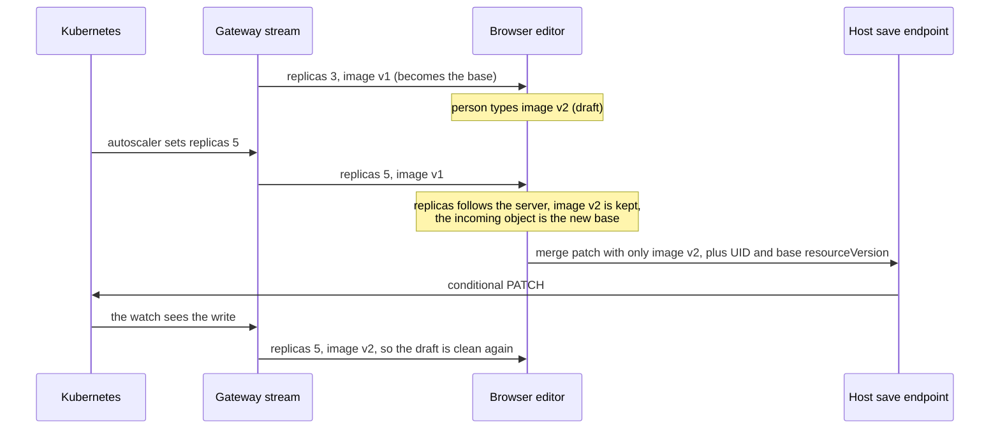
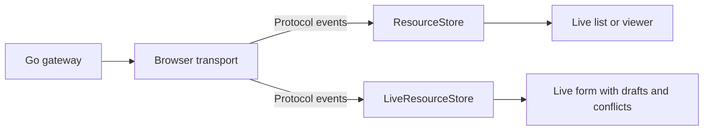

# Proposal 0009 Stream and editor separation

**Status: proposed implementation plan.** The APIs below are proposed; they are not available yet.
Source review baseline: `a8281c5`, 2026-10-04.

krm-stream should make live Kubernetes resources easy to consume, with editing available as an
additional layer. Keep one repository, one npm package and the existing lockstep release process.
Separate browser transport and authoritative resource state from local drafts, three-way
reconciliation, conflicts and patch capture. The Go gateway continues to serve the same v1 protocol.

Follow the [design rules](../../CONTRIBUTING.md#design-rules) and
[release policy](../releasing.md). This proposal owns the separation; existing behavioral follow-ups
remain in [proposal 0006](0006-stream-and-save-implementation-plan.md).

## Why live watches and three-way merge belong together

This section is background for readers new to the library. The rest of the proposal assumes it.

### A live copy of a shared object

A Kubernetes object is shared. Controllers write `status`, an autoscaler changes `spec.replicas`,
GitOps tooling and other people edit labels and spec. A browser page holds a copy of something other
parties keep changing.

The stream keeps that copy current. The gateway authorizes the user's subscription, trims each
object to what the user may see (the projection), and sends complete projected objects as visible
state changes. It may suppress bookkeeping-only changes or coalesce intermediate updates. The
browser replaces its authoritative copy with each delivered object. After a reconnect the gateway
sends a fresh snapshot (`reset` … `synced`), and the browser drops whatever was not resent only when
that snapshot completes. The copy also recovers from deletes it missed while disconnected.

A resource list or status page needs nothing more: replace the object, re-render.

### Editing an object that keeps moving

Now put a form on the same object. Someone starts changing the image tag. Meanwhile the autoscaler
raises `spec.replicas` from 3 to 5, and the stream delivers the new object. The page can do one of
three things:

| Approach | What the person sees | Result |
|---|---|---|
| Replace the form with the new object | Their typing disappears | Lost work |
| Ignore updates while the form has edits | `replicas` still shows 3 | A stale form. A guarded save fails with 409; an unguarded full-object save puts `replicas` back to 3 |
| Three-way merge | `replicas` changes to 5 and the image tag stays as typed | Both changes kept. If both sides changed the same field, the form shows a conflict |

Replacing a form on every live update destroys edits. Freezing its server state while editing leaves
it stale. Three-way reconciliation lets this editor incorporate live state while preserving the
person's draft and exposing conflicts for review.

### What the merge compares

The editor keeps two objects per resource: `server`, the last object the stream delivered, and
`draft`, that object plus the person's edits. When a new object arrives, each editable field is
compared three ways:

- **base**: the field in the current `server` object, which the draft was built against;
- **ours**: the field in the `draft`;
- **theirs**: the field in the incoming object.

If only theirs differs from base, the draft follows the server and the UI can highlight the change.
If only ours differs, the edit stays. If both changed it to the same value, they have converged. If
both changed it differently, the edit stays and the field is recorded as a conflict. The incoming
object then becomes `server`, and so the next base. The
[client state model](../client-state-model.md#editing-and-conflicts) has the full table.



### Why the editor uses the stream's guarantees

A merge is only as correct as its inputs. The stream supplies an authoritative base under a defined
identity, projection and recovery contract:

- Each `added` or `modified` event carries a complete projected object and replaces the base.
  Within the visible projection, absence can express a removed field. Projection rules and redaction
  records distinguish withheld values; they must never become inferred deletions in a save patch.
  Partial updates would require their own explicit rules for omission and deletion.
- Resources are keyed by `uid`. A delete followed by a recreate with the same name is a new
  resource, so an old draft is never merged into a different object.
- Snapshot cycles re-establish bases for resources still present after a reconnect; an interrupted
  cycle prunes nothing. Drafts of surviving resources remain in the store across reconnects. A
  completed snapshot can remove a deleted resource and its draft; retaining a copy is host-owned.
- Save capture binds an editable merge patch to the base UID and `resourceVersion`. The host
  validates the patch and adds those preconditions. A stale version can be rejected with 409 even
  when visible content has not changed. Arrays are replaced as complete values under RFC 7386;
  this is not a guarantee of writes to individual array elements. See [saving safely](../saving.md).

The live editor consumes the protocol's state; transport does not depend on the editor. The editor
can also reconcile directly supplied server objects without opening a connection. The current
connectors do not show that boundary: a list page must construct an editing store to use them. This
proposal makes transport deliver protocol events, adds a small read-only store for lists and viewers,
and keeps the editor as the layer a live form adds. Both stores use the same stream contract.

## Current coupling

The [protocol](../../spec/v1.md#41-added--modified--replacement-not-merge) already distinguishes
replacement of authoritative objects from optional reconciliation of a local draft. Its
[consumer conformance rules](../../spec/v1.md#10-conformance) do not require a merge engine.

The browser API does not yet express that boundary:

- All three connectors in [sse.ts](../../packages/krm-stream/src/sse.ts) and
  [connection.ts](../../packages/krm-stream/src/connection.ts) take a concrete `LiveResourceStore`.
- `StreamOptions.onChange` receives `StreamChange`, including editor-specific `flashed` and
  `conflicts` fields. The managed connection detects snapshot reset through this callback.
- `LiveResourceStore` owns authoritative objects, snapshot membership, drafts, edit policy,
  conflicts and save capture. A read-only policy disables editing but still loads that machinery.
- The [package entry point](../../packages/krm-stream/src/index.ts) exports transport and editing
  together, and the published single-file bundle contains both.

The connectors import `LiveResourceStore` only as a TypeScript type, so they already have no runtime
import of the editor store. The remaining coupling is their parameter and result contracts plus
event application inside transport. Separate entry files, package exports and an emitted dependency
check can preserve the runtime separation after those contracts change.

The goal is an independent stream consumer and a convenient editor composition. Do not extract a
generic three-way merge library, redesign the gateway, or change merge behavior during this work.

## Ownership and dependencies



The two store paths are alternatives for a view. Both receive the same protocol events.

| Layer | Owns | Depends on |
|---|---|---|
| Go gateway and Kubernetes adapter | Authorization enforcement, projection, upstream watches, snapshot framing and SSE delivery | Existing host callbacks and backend seams |
| Browser transport | Byte decoding, sequence checks, error reporting, connection state and reconnect policy | Wire types; no store or merge implementation |
| Read-only resource store | Latest projected objects, redaction records, UID membership and snapshot pruning | Wire types and small shared state primitives |
| Editor store | Authoritative base, local drafts, three-way reconciliation, edit policy, conflicts and patch capture | Wire types and the same small state primitives |
| Host application | Credentials, identity, authorization policy, UI, saves and draft retention after deletion | The layers it chooses |

One view uses one active store. An editor does not maintain a read-only store and copy its contents
into `LiveResourceStore`. The editor's authoritative base remains inside its own store so live events
and guarded save reconciliation use the same base. Both stores must use one internal snapshot
tracker, specified below. Keep their resource records separate and share event dispatch where useful;
do not introduce a second reconciler, mirrored cache, public inheritance hierarchy or plugin framework.

### Shared snapshot tracking

Extract the editor's `#seen` and `#snapshotRevision` behavior into one small internal `SnapshotTracker`
before adding the read-only store. Each store gets its own tracker instance. It owns the active
membership pass, seen UIDs and a generation counter; it never owns objects, drafts or notifications.
Its proposed operations are `begin()`, `markSeen(uid)` and `finish(currentUIDs)`, with read access to
`active` and `generation`:

- `begin` increments the generation and starts a fresh seen set, including when it replaces a
  partial pass. It removes no resources.
- `markSeen` records a UID only during an active pass. Authoritative stream upserts use it.
- `finish` returns unseen current UIDs and closes the pass before the store removes those resources
  and notifies subscribers. Without an active pass it returns an empty list. This is the only
  implementation of the rule that selects snapshot removals for either store.

Guarded editor reconciliation captures the generation and refuses a response while a pass is active
or when the generation has changed, even if the newer pass has already completed. Keep per-resource
revision and UID checks in the editor. A reconciliation GET must never mark snapshot membership.
Preserve direct `beginSnapshot`/`endSnapshot` callers and existing save-adoption behavior through
this helper; this extraction does not redefine their semantics.

Verify snapshot membership and restarted partial passes through both stores. In the editor, also
test a GET captured before reset and returned after synced, and a GET returned during a snapshot.
The tracker remains internal; its representation and naming are implementation choices, not a new
public abstraction.

## Proposed transport API

Retain the existing connector names and handles. Change their second argument from a store to a
synchronous event consumer:

```ts
type ResourceEventConsumer = (event: StreamEvent) => void;

connectResourceStream(url, consume, options?): StreamHandle;
connectManagedResourceStream(url, consume, options?): ManagedStreamHandle;
connectWithEventSource(url, consume, options?): StreamHandle;
```

`StreamOptions` retains `onOpen`, `onError`, `onGap`, `onSynced`, `signal`, fetch injection,
credentials and headers where supported. Managed options retain retry controls and `onStateChange`.
Remove `onChange` from transport options. Store changes are produced by the selected consumer.
Give both stores an `applyStreamEvent(event)` method. Move the existing editor event switch and
`StreamChange` out of transport into the editor module. Remove the standalone
`applyStreamEvent(store, event)` export and migrate its callers to the method. No separate adapter
API is needed.

The consumer receives recognized state events: `reset`, `added`, `modified`, `deleted` and `synced`.
Wire and HTTP errors go through `onError`; they are not delivered twice through the state consumer.
Unknown event types remain ignored after sequence accounting. Preserve existing decoding and
payload acceptance behavior; this refactor does not promise comprehensive runtime schema validation.

### Delivery and callback ordering

Specify and test the following ordering across fetch and native EventSource:

1. Check the event sequence before delivering a state event. A gap calls `onGap` and closes that
   connection; the event beyond the gap is never applied.
2. For `reset`, the managed handle enters `syncing` and clears its healthy-period timer before
   calling the consumer. It observes the wire event directly, independently of store output.
3. Call the consumer exactly once, synchronously, for each accepted state event, in stream order.
4. For `synced`, complete consumer application before the managed handle enters `live`, starts its
   healthy-period timer and calls `onSynced`. Observers of `live` must see completed pruning.
5. A terminal error calls `onError`, ends the connection and prevents managed retries. Preserve
   retry hints, retry exhaustion, in-band `RESYNC_REQUIRED`, and native EventSource's existing
   automatic reconnect behavior for ordinary transport interruptions.
6. Closing or aborting from a consumer prevents later events in the same decoded chunk from being
   delivered. If it closes while processing `synced`, do not publish a later `live` transition.

The current store already applies `synced` and prunes before `onSynced` and the managed `live`
notification. What moves is rendering: the old `onChange` callback runs after those notifications;
rendering inside the new consumer runs before them. Keep pruning-before-live behavior. The fetch
loop also already stops later events in a chunk after an abort; preserve and test that behavior.

Consumers must finish state application synchronously; asynchronous UI work can follow separately.
Document this on the callback type. If a consumer throws, close the connection and reject `closed`
with that exception. The managed connector must clean up and stop with status `closed`, preserving
the rejection; it must not turn an application exception into a network retry or an authorization
error. Implement this separately at each transport's callback boundary:

- Fetch currently swallows failures through `closed.catch(() => {})`. Track consumer exceptions
  separately so they reject `closed` without changing the existing network-retry behavior.
- Native EventSource currently invokes the consumer inside `es.onmessage`, outside a promise chain.
  Catch consumer exceptions there, close EventSource, remove its abort listener and reject `closed`.
  The exception must not escape solely to the browser's global error handler. Give the handle a
  rejection path as well as its existing resolution path. Settle completion after the consumer
  returns so a callback that closes the handle and then throws still exposes its failure.

Callers must await `closed` or attach a rejection handler when using a consumer that can throw. An
unhandled rejection is an application error and can fail `node --test`; tests must observe the
rejection and cleanup explicitly. This rule concerns the new consumer callback, not a general
rewrite of other callback failures.

## Read-only resource store

Add `ResourceStore` for the concrete read-only resource list in the
[vanilla browser example](../../examples/vanilla-browser/README.md). Extend that example with a
viewer of live resource identities, status and redaction metadata that offers no editing controls.
This is the reference use case and executed adoption evidence, not a claim that an external viewer
has requested the API. Its proposed public surface is deliberately limited:

```ts
class ResourceStore {
  applyStreamEvent(event: StreamEvent): ResourceChange;
  ids(): string[];
  server(uid: string): KRMObject;
  redactions(uid: string): { path: Path; rev: number }[];
  subscribe(callback: () => void): () => void;
}

interface ResourceChange {
  type: EventType;
  uid?: string;
  added: boolean;
  removed: string[]; // includes UIDs pruned by synced
}
```

`LiveResourceStore(readOnlyPolicy)` still retains a draft copy, runs reconciliation on incoming
objects and exposes edit methods that refuse changes. `ResourceStore` holds only authoritative
objects and redactions and has no editor runtime dependency. Once it exists, remove the named
`readOnlyPolicy` export and definition, and migrate the read-only invariant test. Preserve coverage
that a custom editor policy can refuse all edits through the existing `regionPolicy([])` primitive;
an editor policy and a read-only resource store serve different purposes.

Use the existing store's conventions for detached reads and missing UIDs. Incoming objects and
redaction records must also be copied so caller mutation cannot change stored state. Notifications
occur after applied object or membership changes; a no-op may omit notification. Connection state
continues to come from the connection handle.

Authoritative objects are replaced completely, never deep-merged. `reset` starts a membership pass,
upserts mark UIDs seen, and `synced` prunes unseen UIDs. An interrupted pass prunes nothing; a later
`reset` starts a new pass. Applying `synced` without an open pass prunes nothing. Same-name replacement
under a different UID creates a distinct entry. Preserve redaction metadata without interpreting it
as an editable placeholder. The store has no draft, conflict, edit-policy or write API.

As with the existing editor store, bind each instance to one target and one stream scope. Use separate
instances for separate streams; combining their independent snapshot membership would be incorrect.
Do not add a public multi-target aggregator in this increment.

### Read-only composition

```ts
import { ResourceStore, connectManagedResourceStream } from "@configbutler/krm-stream/stream";

const resources = new ResourceStore();
const stopRendering = resources.subscribe(renderResources);
const connection = connectManagedResourceStream(url, (event) => {
  resources.applyStreamEvent(event);
});
void connection.closed.catch(reportApplicationError);

// On view disposal:
stopRendering();
connection.close();
```

Frameworks with an existing resource cache can consume events directly instead. The guide must link
the snapshot and redaction requirements for such consumers; reconnect and sequence handling still
belong to the connector.

## Editor composition

Keep `LiveResourceStore` and its current editing and saving primitives. Add its
`applyStreamEvent(event): StreamChange` method so both stores consume events the same way:

```ts
import { connectManagedResourceStream } from "@configbutler/krm-stream/stream";
import { LiveResourceStore } from "@configbutler/krm-stream/editor";

const editor = new LiveResourceStore();
const connection = connectManagedResourceStream(url, (event) => {
  const change = editor.applyStreamEvent(event);
  renderEditor(change);
});
void connection.closed.catch(reportApplicationError);

editor.setValue(uid, ["spec", "replicas"], 3);
const intent = editor.captureSave(uid);
// The host validates and applies a captured intent through its own save endpoint.
```

Applications can instead subscribe to the editor store when they only need to rerender. The method
keeps `StreamChange` for highlighting, structural changes and conflicts, and extends it with the
same removal reporting as the read-only store:

```ts
interface StreamChange extends ResourceChange {
  structural: boolean;
  flashed: Path[];
  conflicts: Path[];
}
```

Define `ResourceChange` with shared protocol types so the editor does not import `ResourceStore`.
Both results report `removed: [uid]` for an existing resource deleted by an event, `removed` containing
the UIDs actually pruned by `synced`, and `removed: []` otherwise. Repeated deletion or synced events
report no second removal. The editor's `synced` result has `structural: true` when pruning removed a
resource. Keep existing highlighting, conflict and upsert results. This lets lists in editor pages
observe snapshot removals too.

Keep save capture, guarded GET reconciliation, projection restrictions, keyed-list merging and
deletion behavior unchanged. Draft retention after deletion remains a host recipe in proposal 0006.
The editor remains usable with direct server events and without a connector. The proposed method
performs state application; sequencing and transport errors remain connector responsibilities.

## Package boundaries

Add two explicit ESM entry points to the existing npm package:

| Import | Exports |
|---|---|
| `@configbutler/krm-stream/stream` | Transport, connection types, wire types, URL builder and `ResourceStore` |
| `@configbutler/krm-stream/editor` | `LiveResourceStore`, `StreamChange`, edit policies, schema helpers and editing utilities/types |
| `@configbutler/krm-stream` | Combined convenience exports using the same implementations |
| `@configbutler/krm-stream/bundle` | Existing single-file combined build using the same implementations |

The stream entry's emitted runtime module graph must not reach the editor store, `merge`, edit
policies or schema-based keyed-list code. This is a dependency guarantee, not a bundle-size claim. Shared value,
path and snapshot utilities are acceptable when they do not import editor code. Editor imports must
not open connections or import the managed connector. Keep declarations usable from each entry.

Retain the combined root and bundle as supported convenience entries, not compatibility shims for
the old connector signatures. A host that vendors the combined bundle still gets one file and loads
both layers. A host using the stream ESM entry avoids the editor module graph. A separate stream-only
single-file build is deferred until a consumer needs it; do not claim that the existing bundle shrinks.

Use existing module emission and packaging. No second npm package, release train, framework adapter,
generic merge export, store-to-store bridge or new runtime dependency is required.

## Implementation order and migration

Deliver three reviewable changes in this order. Each updates the callers and tests affected by its
own change; do not leave main with an invalid intermediate API.

| Change | Deliver | Acceptance evidence |
|---|---|---|
| 1 | Event consumers for all connectors; editor `applyStreamEvent` method and shared change types; consistent removal results | Existing editor fixtures, save tests and reconnect tests pass through the new boundary; ordering, removal and consumer-failure tests pass |
| 2 | Shared snapshot tracker, `ResourceStore`, removal of `readOnlyPolicy`, explicit stream/editor exports and packaging | Both stores use the tracker; read-only convergence and guarded editor reconciliation pass; packed stream entry loads without editor modules |
| 3 | Read-only browser view, adoption guidance and package description | Go-wire and browser checks cover both compositions, including EventSource and the combined bundle; docs and metadata describe optional editing |

This work changes the published browser API. Use `feat!:` and a `BREAKING CHANGE:` footer for API
removals, with a short release note covering callback signatures, the new store method, removal of
`readOnlyPolicy`, render ordering and rejecting `closed` on consumer failure. Keep the existing
lockstep release process. Publication means migration information remains useful even when known
callers are maintained by the same team.

The caller changes are mechanical: pass `(event) => store.applyStreamEvent(event)` to each connector;
move render code from `onChange` into that callback or a store subscription; replace standalone event
application with the store method; use `ResourceStore` for viewers; handle the `closed` rejection.
Do not retain old signatures through overloads or forwarding functions.

Update repository test callers, the conditional-save and Vue examples, browser example, root README,
package README, adoption and state-model guides. In change 3 also update `package.json`'s description
and keywords and the `index.ts` overview comment to lead with streaming and describe editing as
optional. Retain relevant merge keywords for discovery. Present read-only usage first and editor
composition second in the adoption guide.

## Verification and completion

Extend existing suites instead of duplicating the entire test setup:

- In `connection.test.ts` and `wire.test.ts`, drive a plain callback with no store. Cover chunked
  framing, sequence gaps, terminal refusal, retry hints, exhausted retries, aborts, repeated snapshot
  cycles, ignored unknown events, callback ordering and consumer exceptions. Use an injected fetch
  and explicit synchronization where possible. Cover closing and then throwing from the same
  consumer, rejection with the original exception, and disposal of pending retries and listeners.
- Add read-only store tests for complete replacement and field removal, interrupted snapshots,
  deletion during disconnection, same-name/new-UID replacement, repeated replay, redaction changes
  and detached values. Include `synced` without reset and restarted partial cycles. Assert state
  outcomes, not the internal helper structure. Verify matching `removed` results from both stores
  for explicit deletion, snapshot pruning and repeated application.
- Run authoritative-state conformance and convergence cases against both stores, using the existing
  shared fixture corpus and its visible comparison. Keep draft/conflict fixtures specific to the
  editor. Compare complete projected content and redactions; do not require a suppressed RV update.
- Preserve the existing editor and saving suites, including later typing during saves, refused late
  reads, snapshot overlap, conflict retention, and keyed-list behavior. Use an edited draft across
  reconnect to prove that the consumer boundary preserves work. Verify generation-based refusal
  of GETs across a completed or restarted snapshot after extracting shared tracking.
- Check the emitted dependency graph and packed exports, including TypeScript declarations, in the
  existing build/pack checks. A read-only application must import and run with editor modules absent.
  Import the combined bundle in the real browser and demonstrate both compositions.
- Extend existing Go-wire and Chromium examples to show a read-only list and an editor using the
  same gateway protocol. Verify native EventSource reconnect and terminal shutdown after migration,
  plus caught consumer failure, rejected completion and no later events or global callback error.

For runtime implementation PRs run `task fixtures-check`, `task test`, `task lint`, `task e2e-wire`,
`task e2e-browser` and `task pack-client`. Inspect CI on the final pushed commit. Protocol fixtures
may gain consumers but must not change wire output merely to support this separation. If a wire
change proves necessary, stop and review that as separate scope. A real-cluster campaign or capacity
benchmark is not an acceptance gate for this browser API separation.

This proposal is complete when a read-only example uses no editing API and loads no editor modules
through the stream entry, a live editor retains its existing merge and save behavior, both consume
the same v1 stream, published entries work, and migration guidance matches the implemented signatures
and callback ordering. Record tested commit, commands, outcomes and remaining limitations. A passing
planning review alone does not mark the implementation complete.

## Relationship to the remaining roadmap

Proposal 0006 keeps its existing acceptance criteria. Its work falls into two independently
deliverable tracks:

- **Editor:** deletion-recovery and keep-local recipes, plus real-API save composition and UID races.
- **Stream:** measured upstream continuation, recovery continuity and authorization lifecycle.

Implement this separation before expanding the browser editor's public API. It is not a prerequisite
for urgent gateway fixes, real-API evidence or upstream continuation. Shared-watch hardening from
[proposal 0008](0008-shared-watch-hardening.md) remains completed; its deferred authorization trigger
and caching APIs are not reopened by this plan.

The next stream improvement should follow a demonstrated consumer need. The next editor improvement
should follow a demonstrated editing need. This preserves the project's purpose while giving each
consumer a smaller starting point.
