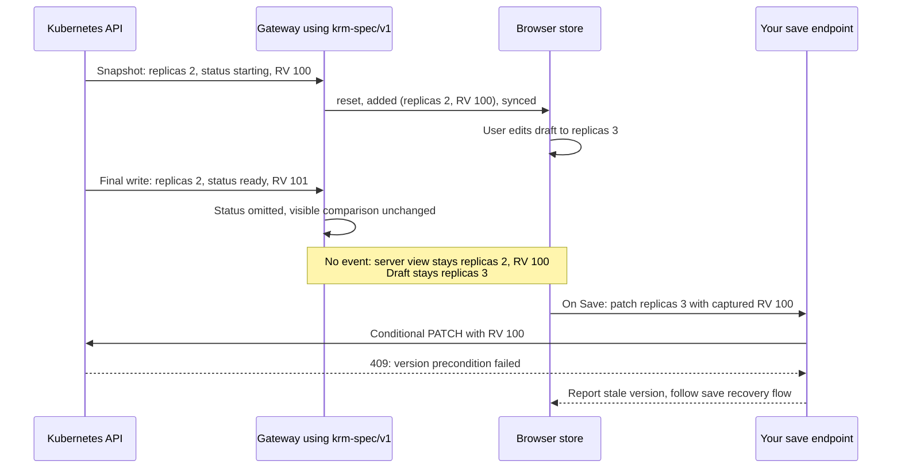

# Saving edits safely

krm-stream is a read library. Your application owns its HTTP save endpoint, audit policy, and
Kubernetes client. The client store produces a narrow RFC 7386 JSON merge patch; use
`gateway.ValidateMergePatch` immediately before sending it to Kubernetes.

Use the complete [conditional-save example](../examples/conditional-save/README.md): it includes a
compilable host endpoint, client reconciliation, race tests, and a real-cluster 409 test.

```ts
const intent = store.captureSave(uid);
// intent = { uid, resourceVersion, patch }, detached and captured together before any await.
if (intent) await hostSave(intent);
```

The host validates the patch and adds `metadata.uid` and `metadata.resourceVersion` from that intent
before sending a Kubernetes merge PATCH. It must not substitute the version from a newer GET.
Kubernetes performs the version check atomically with the write. Propagate a real Kubernetes 409
as HTTP 409; do not turn all upstream errors into 502.

A narrow patch limits which fields are written; it does **not** protect against concurrent edits.
JSON merge patch replaces arrays in full, including arrays the client reconciles by keyed items.
See Kubernetes' [conditional update guidance](https://kubernetes.io/docs/reference/using-api/api-concepts/#updates-to-existing-resources).

On 409, keep the draft and reconcile a fresh, complete **projected** GET. Capture the response guard
before starting that GET:

```ts
const reconcile = store.captureReconciliation(uid);
const { object, redactedPaths } = await hostRead();
reconcile(object, { redactedPaths });
// false can also mean snapshot recovery or unknown redaction paths. Do not force it.
```

Local edits made during the request survive reconciliation. Render the current draft and conflicts;
let the user review before capturing another save intent. Serialize saves per editor. A host GET must
be a most-recent Kubernetes read with no intermediary cache and the same projection as the stream.
Do not apply a response for a replacement UID to the old editor. Deleted-object drafts are removed by
the store; archive them outside the store if the application needs recovery after deletion.

## What the guard rejects

- a value declared in `redacted`, including deletion of a parent map such as `data: null`;
- `metadata.managedFields` and the last-applied-configuration annotation, which every projection
  removes;
- `status` under `krm-spec/v1`;
- a non-object or malformed JSON merge patch.

It does not grant write permission, choose a projection, fetch the object, issue a PATCH, or implement
optimistic concurrency. Those stay with the host. Do not use whole-object `PUT`: projected objects are
intentionally incomplete, and a `PUT` can delete fields the browser never saw.

## Why a quiet stream can still reject a save

The gateway sends the fields your view needs. It suppresses updates that change only ignored fields
or `metadata.resourceVersion`. The browser keeps the version of the revision it actually received.
That version is still a valid conditional-write precondition, but it may already be out of date.



The displayed server content is right even though the held version is older. The local draft is the
person's proposed change; it is not part of stream convergence. A failed version precondition does
not by itself mean the person and server disagree about an editable field. Follow the
[save outcomes](#what-the-person-editing-sees) to refresh, reconcile and capture a newly reviewed intent.

| Final upstream change | What the gateway delivers | What the browser holds |
|---|---|---|
| Bookkeeping metadata only | No event in any built-in projection | Same visible content, older RV |
| Status only | No event under `krm-spec/v1`; an update under `krm-full/v1` | Spec view can keep an older RV; full view receives live status |
| Secret token rotates | Under `krm-full/v1` or `krm-spec/v1`, an update with a higher redaction revision | The token remains withheld; its change is visible |

The RV labels above are illustrative opaque strings. Neither RV nor event `seq` provides downstream
resume: a new connection starts a complete snapshot. The
[normative contract](../spec/v1.md#6-ordering-delivery--the-state-guarantee) defines the exact comparison
and its guarantee at each delivered stream position; it does not promise zero transport latency.

Sustained invisible churn can prevent save progress. An accepted projected GET advances the base
without requiring a snapshot. Render actual draft conflicts separately; when none exist, explain
the refreshed base and offer a newly captured save. If reconciliation is refused, preserve the draft
and recover before writing again.
Do not remove concurrency protection or blindly retry the old patch with a newer version.

## What the person editing sees

These presentations map to the copyable conditional editor's outcomes. The host owns wording,
authentication and any receipt or Git workflow; connection state is not a save guarantee.

| Situation / outcome | Suggested presentation | Host action |
|---|---|---|
| `version-stale`, no field conflicts | “Configuration refreshed. Your edits are intact; review and save again.” | Capture a new intent on the next deliberate Save. Do not show an empty conflict panel. |
| `draft-conflict` | Show local and current values at each conflicting field. | Offer explicit resolution through store APIs; keep the rest of the form visible. |
| Connection retrying or `recovering` | “Reconnecting. Your unsaved changes are still here.” | Disable writes until live; after a refused GET, the example requires a later accepted guarded read before another write. |
| `saved`, watch confirmation pending | “Saved to Kubernetes; waiting for live confirmation.” | Preserve later typing. Track any receipt separately from draft state. |
| Session expiry or access denial | Explain sign-in or access outcome. | Handle identity-scoped recovery; do not retry terminal auth failures indefinitely or label them field conflicts. |
| `unavailable`, deleted/recreated UID | “This configuration was removed. A replacement must be opened separately.” | Offer copy-out from a previously retained recovery copy; never apply the old draft automatically to the replacement. |

“Unsaved changes are still here” applies while the UID remains in the store. `removeResource` and
snapshot pruning discard deleted-object drafts. If recovery after deletion matters, retain a detached
copy as edits change, **before** removal; observing a missing UID is too late to read its old draft.
Keep recovery copies scoped to the original identity and UID, with a host-defined lifetime and cleanup.
They are for recovery, not a second draft to reconcile against incoming snapshots. An executed
subscription recipe, including edit-time capture and pruning, remains
[planned work](proposals/0006-stream-and-save-implementation-plan.md#deletion-recovery-copy).

For explicit keep-local resolution, the planned tested recipe is tracked in
[proposal 0006](proposals/0006-stream-and-save-implementation-plan.md#explicit-keep-local-resolution).
There is currently no dedicated keep-local helper; avoid a second application conflict registry.

## Answer 204 or a receipt and let the watch echo it

The object a Kubernetes write returns is a *raw* object: `managedFields`, the last-applied annotation,
`status`, and the Secret values your projection withholds. Writing it to the response hands the
browser, through your own save endpoint, exactly what the stream is designed to refuse. The save
endpoint is not covered by the projection unless you cover it.

You do not need to. The write reaches the API server, the watch sees it, and it comes back down the
stream as an ordinary `modified` event: projected, redacted, and three-way merged into the draft the
user is still holding. Dirty state is derived from `draft` versus `server`, so there is nothing to
clear and nothing to adopt. The echo settles it.

A **receipt-only HTTP 200** is also valid: define and validate a host receipt schema containing only
intended acknowledgment fields, and keep it separate from the resource store. The copyable editor
accepts successful HTTP status but does not parse a receipt; add parsing in the host when needed.
For a Git-backed workflow, Kubernetes write acceptance, CommitRequest acceptance and an observed Git
commit are separate milestones. A receipt must not imply that all three have happened.

## If you must answer with the object

Prefer 204. If a host returns an object, capture `store.captureReconciliation(uid)` **before** the
save request and apply its projected response through that guard. This prevents a delayed response
from overwriting a newer watch event, and preserves local edits made while saving.

`store.adoptSaved(object)` remains available for synchronous adoption and newly created objects. It
is unguarded and must not receive delayed responses that can race the watch. Never adopt a raw
Kubernetes response: project it first and provide the correct redaction metadata. Hosts exposing
redacted resources can return `redactedPaths` directly from `gateway.Project`. The guard retains
known stream revisions for paths still present and removes paths absent from that list. Omitted
redaction metadata preserves existing protections. Unknown paths reject the entire response: open a
later authoritative upsert for that UID or a fresh stream snapshot before retrying reconciliation. Never invent revision counters for a GET.
An explicit `redacted` array is still supported when the host has authoritative stream revisions.

## Creating and deleting whole objects

A create and a delete are host writes exactly as a save is, and they stay host-side for the same
reasons: RBAC, attribution, and — for a create body — validation all live on the server. The client
stages the *intent*; your endpoint performs the *write*. See
[client state model](client-state-model.md#creating-and-deleting-whole-objects) for the client half —
the store keys on uid and has no merge for these, so the consumer aggregates staged create/delete with
`changes()` into one review list.

The host must:

- Authorize the operation and pin the target, resource kind, namespace and name.
- Validate create bodies against the allowed fields and schema before calling Kubernetes. A create
  has no existing object for `ValidateMergePatch` to compare; that helper validates merge patches.
- Bind a delete to the intended UID with a Kubernetes delete precondition so a replacement object
  under the same name is not removed by an old request.
- Return 204 or a receipt and let the watch reflect the result. Project any returned resource before
  sending it to the browser, and preserve meaningful Kubernetes error categories.

The host also clears its own pending-create/delete entries when a write succeeds. The store does not
own those staging lists. See the [client state model](client-state-model.md#reflecting-the-result)
for synchronous adoption and optimistic-delete caveats.
