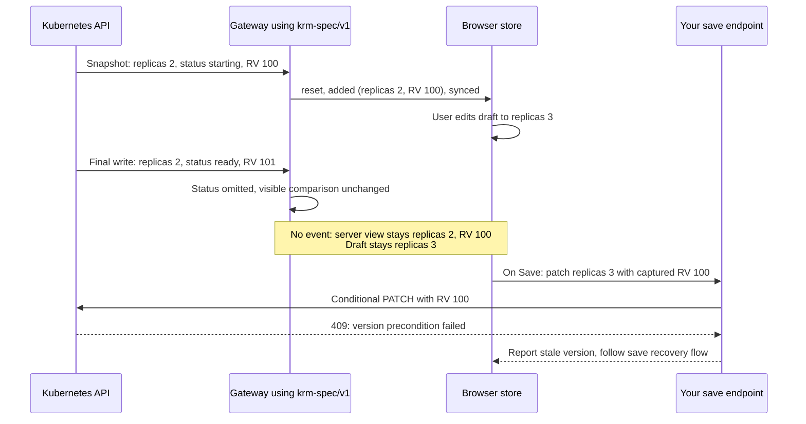

# Saving edits safely

The optional editor preserves drafts as the [live resource view](why-a-gateway.md) changes and
captures a narrow save intent. Your application owns its HTTP save endpoint, write authorization,
audit policy and Kubernetes client. Read the [editor state model](client-state-model.md) for edit
policy, three-way reconciliation and explicit conflict resolution. The supported save sequence is:

1. the browser captures a save intent;
2. the host validates it and sends a conditional Kubernetes merge PATCH;
3. the host answers 204 or a receipt; the watch normally reflects a visible change, with a guarded
   projected read when an echo cannot confirm the result;
4. on 409, the browser reconciles a guarded, projected GET, and the person reviews and saves again
   deliberately.

Serialize saves per editor, resolve field conflicts before submission and enable writes while the
connection is live. Capture intent before any await and preserve later typing. A dirty draft, an
accepted write and application progress are separate states; neither a clean form nor a watch echo
proves a rollout or Git workflow completed. A definite 409 rejection differs from a lost response
whose write outcome is unknown; do not blindly replay an ambiguous write.

This guide describes projected editing through the current gateway. The requested native connector
starts with read-only viewing. Native editing is a later slice requiring an explicit read/write and
edit-policy contract before sharing these recipes. A raw response must never be fed into a
projected editor as recovery or save confirmation.

The [conditional-save example](../examples/conditional-save/README.md) implements all of it: a
compilable host endpoint, client reconciliation, race tests and a real-cluster 409 test.

## Capture the intent

```ts
const intent = store.captureSave(uid);
// intent = { uid, resourceVersion, patch }, detached and captured together before any await.
if (intent) await hostSave(intent);
```

The patch is a narrow RFC 7386 JSON merge patch. Serialize saves per editor.

## Send a conditional PATCH

Call `gateway.ValidateMergePatch` with the effective projection and the current object immediately
before sending the patch. Add `metadata.uid` and `metadata.resourceVersion` from the intent, never the
version from a newer GET: Kubernetes checks the version atomically with the write. Propagate a real
Kubernetes 409 as HTTP 409; do not turn all upstream errors into 502.

A narrow patch limits which fields are written; it does **not** protect against concurrent edits —
the version precondition does. JSON merge patch replaces arrays in full, including arrays the client
reconciles by keyed items. See Kubernetes'
[conditional update guidance](https://kubernetes.io/docs/reference/using-api/api-concepts/#updates-to-existing-resources).
Do not use whole-object `PUT`: projected objects are intentionally incomplete, and a `PUT` can delete
fields the browser never saw.

### What ValidateMergePatch rejects

- a value declared in `redacted`, including deletion of a parent map such as `data: null`;
- `metadata.managedFields` and the last-applied-configuration annotation, which every projection
  removes;
- `status` under `krm-spec/v1`;
- a non-object or malformed JSON merge patch.

It does not grant write permission, choose a projection, fetch the object, issue a PATCH or implement
optimistic concurrency. Those stay with the host.

## Answer 204 or a receipt and let the watch echo it

The object a Kubernetes write returns is a *raw* object: `managedFields`, the last-applied annotation,
`status`, and the Secret values your projection withholds. Returning it would hand the browser,
through your save endpoint, exactly what the stream refuses to send.

Answer 204 instead. When the write changes the projected view, it comes back down the stream as an
ordinary `modified` event: projected, redacted and three-way merged into the draft the person is
still holding. Dirty state is derived from `draft` versus `server`, so there is nothing to clear or
adopt. A write that leaves the projected view unchanged (a mutating admission webhook can restore a
patched field, for example) produces no event; if no echo arrives, reconcile with a guarded projected
GET, as [on 409](#on-409-reconcile-and-save-again), before treating the draft as saved.

A **receipt-only HTTP 200** is also valid: define and validate a receipt schema containing only
acknowledgment fields, and keep it out of the resource store. The example editor accepts any
successful status but does not parse a receipt; add that parsing in the host if you need it. For a
Git-backed workflow, Kubernetes write acceptance, CommitRequest acceptance and an observed Git commit
are separate milestones; a receipt must not imply all three.

## On 409, reconcile and save again

Keep the draft and reconcile a fresh, complete **projected** GET. Capture the reconciliation guard
before starting that GET:

```ts
const reconcile = store.captureReconciliation(uid);
const { object, redactedPaths } = await hostRead();
reconcile(object, { redactedPaths });
// false can also mean snapshot recovery or unknown redaction paths. Do not force it.
```

The host GET must be a most-recent Kubernetes read, with no intermediary cache, under the same
projection as the stream. Local edits made during the request survive reconciliation. Render the
current draft and any conflicts, and let the person review before capturing a new intent. Do not
retry the old patch with a newer version, and do not apply a response for a replacement UID to the
old editor.

A 409 does not always mean a newer version of the same object. Kubernetes checks the captured
`resourceVersion` before the UID, so an object deleted and recreated under the same name since the
host's preflight read also fails as a plain conflict. The guarded read above refuses the replacement's
UID, so the editor reports it unavailable. A host can say so directly: the
[conditional-save host](../gateway/kube/examples/conditionalsave/handler.go) answers with the
Kubernetes `Status`, and after a 409 reads the object once, naming a replacement in `details.uid`.
It never turns a 422 validation error into a conflict.

## Why a quiet stream can still reject a save

The gateway sends the fields your view needs. It suppresses updates that change only ignored fields
or `metadata.resourceVersion`. The browser keeps the version of the revision it actually received.
That version is still a valid conditional-write precondition, but it may already be out of date.


```mermaid
sequenceDiagram
    participant K as Kubernetes API
    participant G as Gateway using krm-spec/v1
    participant S as Browser store
    participant H as Your save endpoint
    K->>G: Snapshot: replicas 2, status starting, RV 100
    G->>S: reset, added (replicas 2, RV 100), synced
    S->>S: User edits draft to replicas 3
    K->>G: Final write: replicas 2, status ready, RV 101
    G->>G: Status omitted, visible comparison unchanged
    Note over G,S: No event: server view stays replicas 2, RV 100<br/>Draft stays replicas 3
    S->>H: On Save: patch replicas 3 with captured RV 100
    H->>K: Conditional PATCH with RV 100
    K-->>H: 409: version precondition failed
    H-->>S: Report stale version, follow save recovery flow
```

The displayed content is right even though the held version is older. A 409 here signals a failed
version precondition, not necessarily a disagreement at an editable field.

| Final upstream change | What the gateway delivers | What the browser holds |
|---|---|---|
| Bookkeeping metadata only | No event in any built-in projection | Same visible content, older RV |
| Status only | No event under `krm-spec/v1`; an update under `krm-full/v1` | Spec view can keep an older RV; full view receives live status |
| Secret token rotates | Under `krm-full/v1` or `krm-spec/v1`, an update with a higher redaction revision | The token remains withheld; its change is visible |

The RV labels are illustrative opaque strings. Neither RV nor event `seq` provides resume: a new
connection starts a complete snapshot. The
[normative contract](../spec/v1.md#6-ordering-delivery--the-state-guarantee) defines the exact
guarantee.

Sustained invisible churn can prevent save progress. An accepted projected GET advances the base
without a snapshot. When no field conflicts exist, explain the refreshed base and offer a new save.
Bounded recovery of the originally submitted intent and optional coalesced version delivery are
[evaluation work](proposals/0006-stream-and-save-implementation-plan.md#5-save-progress-under-suppressed-churn),
not supported automatic retry policies. The default spec view stays quiet for status-only updates.

## What the person editing sees

These presentations map to the conditional editor's outcomes. The host owns wording, authentication
and any receipt or Git workflow; connection state is not a save guarantee.

| Situation / outcome | Suggested presentation | Host action |
|---|---|---|
| `version-stale`, no field conflicts | “Configuration refreshed. Your edits are intact; review and save again.” | Capture a new intent on the next deliberate Save. Do not show an empty conflict panel. |
| `draft-conflict` | Show local and current values at each conflicting field. | Offer explicit resolution: `revert` takes the server's value, the [keep-local recipe](../examples/editor-recipes/README.md#keep-the-local-value-in-a-conflict) keeps the person's. Keep the rest of the form visible. |
| Connection `retrying` / `syncing` | “Reconnecting. Your unsaved changes are still here.” | Disable writes until live. |
| Example editor outcome `recovering` | “Refreshing configuration. Your edits are still here.” | A usable base is not established; require an accepted guarded read before another write. This is not a connection status. |
| `saved`, watch confirmation pending | “Saved to Kubernetes; waiting for live confirmation.” | Preserve later typing. Track any receipt separately from draft state. |
| Session expiry or access denial | Explain sign-in or access outcome. | Handle identity-scoped recovery; do not retry terminal auth failures indefinitely or label them field conflicts. |
| `unavailable`, deleted/recreated UID | “This configuration was removed. A replacement must be opened separately.” | Offer copy-out from a retained recovery copy; never apply the old draft to the replacement. |

“Unsaved changes are still here” holds while the UID remains in the store. `removeResource` and
snapshot pruning discard a deleted object's draft, so if recovery after deletion matters, keep a
detached copy as edits change, **before** removal. Scope it to the original identity and UID, with a
host-defined lifetime; it is for recovery, not a second draft to reconcile. The tested
[recovery-copy recipe](../examples/editor-recipes/README.md#recover-work-after-a-deletion) does
this. Resolve conflicts through the store's APIs rather than a second application conflict registry.

## Creating and deleting whole objects

A create and a delete are host writes exactly as a save is: the client stages the *intent*, your
endpoint performs the *write*. See
[client state model](client-state-model.md#creating-and-deleting-whole-objects) for the client half.

The host must:

- Authorize the operation and pin the target, resource kind, namespace and name.
- Validate create bodies against the allowed fields and schema. `ValidateMergePatch` validates merge
  patches only.
- Bind a delete to the intended UID with a delete precondition, so a replacement object under the
  same name is not removed by an old request.
- Answer 204 or a receipt and let the watch reflect the result, preserving meaningful Kubernetes
  error categories.

Preserve the UID captured when the person selected the object, not a newer GET's:

```go
// metav1: k8s.io/apimachinery/pkg/apis/meta/v1
// types:  k8s.io/apimachinery/pkg/types
uid := types.UID(capturedUID)
err := client.Resource(resource).Namespace(namespace).Delete(ctx, name, metav1.DeleteOptions{
    Preconditions: &metav1.Preconditions{UID: &uid},
})
if err != nil {
    return err // The host maps the structured Kubernetes error to its HTTP response.
}
```

A host that also requires unchanged content can add a captured resourceVersion precondition. The host
clears its own pending-create/delete entries when a write succeeds; see the
[client state model](client-state-model.md#reflecting-the-result). For the complete GET/PATCH path,
use the [compiled conditional-save handler](../gateway/kube/examples/conditionalsave/handler.go).

## If you must answer with the object

Prefer 204. If a host returns an object, capture `store.captureReconciliation(uid)` **before** the
save request and apply the projected response through that guard. It keeps a delayed response from
overwriting a newer watch event, and preserves local edits made while saving.

`store.adoptSaved(object)` remains for synchronous adoption and newly created objects. It is
unguarded and must not receive delayed responses that can race the watch. Never adopt a raw
Kubernetes response: project it first and provide the redaction metadata. Hosts exposing redacted
resources can return `redactedPaths` directly from `gateway.Project`. The guard keeps known stream
revisions for paths still present and removes paths absent from that list; omitted redaction
metadata preserves existing protections. Unknown paths reject the whole response: wait for a later
authoritative upsert for that UID or a fresh snapshot before retrying. Never invent revision counters
for a GET. An explicit `redacted` array is still supported when the host has authoritative stream
revisions.
